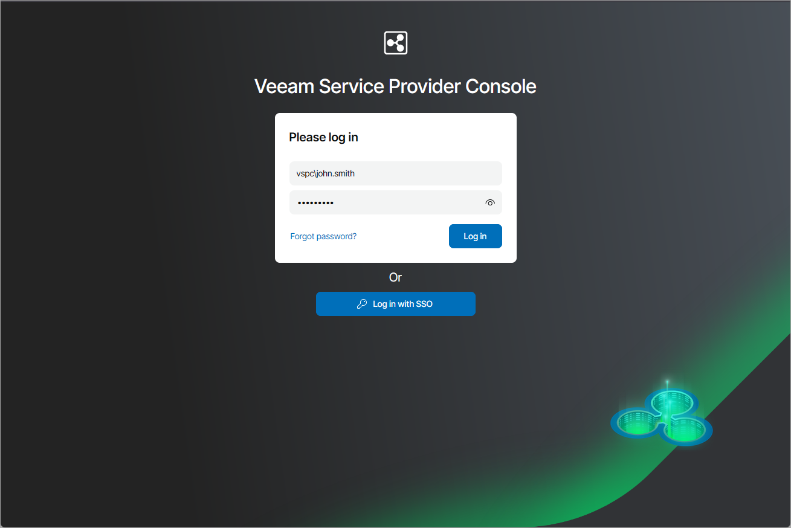
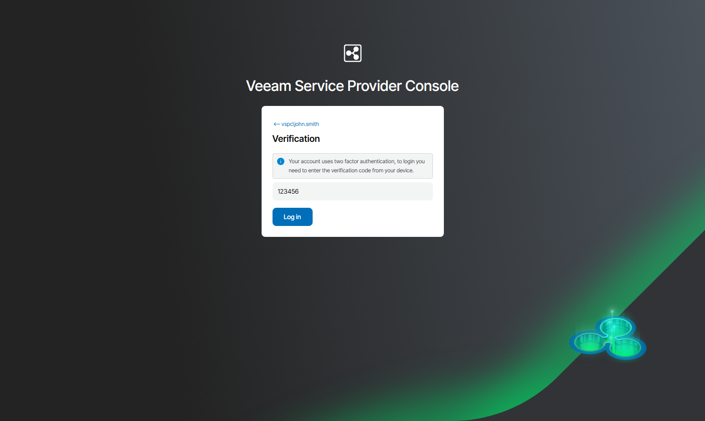

# Accessing Veeam Service Provider Console

To access Veeam Service Provider Console:

1. In a web browser, navigate to the Veeam Service Provider Console URL.

The URL consists of an FQDN or IP address of the machine where Veeam Service Provider Console is installed, and the website port specified during installation. Note that the Veeam Service Provider Console portal is available over HTTPS.

The Veeam Service Provider Console URL looks like the following one:

https://vspc.cloudprovider.com:1280

If you installed Veeam Service Provider Console using a distributed deployment scenario, the URL must include an address of the machine where the Web UI component runs.

1. In the Username and Password fields, specify credentials of a Portal Administrator, Site Administrator, Portal Operator or Read-only User. The user name must be specified in the DOMAIN\USERNAME format.

If you log in for the first time, you can use credentials of the local Administrator account on the machine where Veeam Service Provider Console is installed. For future work, you can create other users in Veeam Service Provider Console. For details, see [Managing Portal Users](manage_users.md).

If you installed Veeam Service Provider Console using a distributed deployment scenario, this must be an account on the machine where the Veeam Service Provider Console Server component runs.

If you have an SSO account, instead of specifying credentials you can click Log in with SSO. You will be forwarded to the identity provider authorization page. For details, see [Configuring Single Sign-On Authentication](sso.md).

|  |
| --- |
| Note: |
| Veeam Service Provider Console Administrator Portal uses Windows account credentials for authentication. If you forgot your password, contact your Windows administrator to reset your Windows account password. |

1. Click Log in.

1. If MFA is enabled for your account, on the next step, provide the verification code generated by the authenticator application.

1. Click Log in.

Logging Out

To log out of Veeam Service Provider Console, at the top right corner of the Veeam Service Provider Console window, click your user name and choose Log Out.

