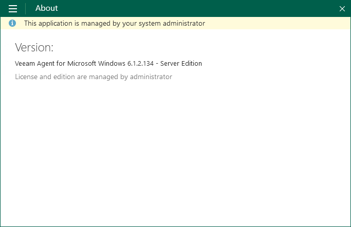

# Activating Veeam Backup Agents

Veeam backup agents can operate in two modes: unmanaged and managed.

* Unmanaged — in this mode, Veeam backup agents cannot be managed in Veeam Service Provider Console.

Unmanaged Veeam backup agents include:

* Standalone Veeam backup agents that run either a free or a paid product version.
* Veeam backup agents managed by Veeam Backup & Replication servers.

End users working with Veeam backup agents directly can access all available functions and update the product. Additionally, users working with Veeam Agent for Microsoft Windows can submit support cases to Veeam Software in the Veeam Agent for Microsoft Windows control panel.

* Managed — in this mode, Veeam backup agents can be managed in Veeam Service Provider Console. You can configure backup job settings, start and stop backup, change global settings, update and uninstall Veeam backup agents, and collect Veeam backup agent data for monitoring and billing.

End users working with managed Veeam backup agents directly can perform most operations, with the following exceptions:

* Users cannot update Veeam backup agents in the Veeam backup agent control panel. Automatic updates are also disabled. To update Veeam backup agents, users must contact their backup administrator.
* Users cannot install or change a license, and cannot switch Veeam backup agent to another edition.
* Users working with Veeam Agent for Microsoft Windows cannot submit a support case to Veeam Software in the Veeam Agent for Microsoft Windows control panel. To obtain support, users must contact their backup administrator.

In the managed mode, Veeam Agent for Microsoft Windows control panel displays the name of the service provider company at the top left corner. The About section in the Veeam Agent for Microsoft Windows control panel displays a notification saying that the license and edition are managed by the system administrator.

To manage Veeam backup agents in Veeam Service Provider Console and monitor the state of computer data protection, you must activate Veeam backup agents. Every activated Veeam backup agent requires one or more Veeam Service Provider Console licenses, depending on the computer platform and the backup job mode.

When you install Veeam backup agents using discovery rules, or initiate Veeam backup agent installation in Veeam Service Provider Console, Veeam backup agents are activated automatically. You must manually activate Veeam backup agents only if Veeam backup agents were installed outside Veeam Service Provider Console (for example, using GPO), and therefore were not registered in Veeam Service Provider Console.

|  |
| --- |
| Note: |
| To activate Veeam backup agents managed by Veeam Backup & Replication servers, do the following:   * [For jobs managed by Agent] remove these agents from Veeam Backup & Replication console first. * [For jobs managed by backup server] remove these agents from managed computers and Veeam Backup & Replication console first. Then reinstall Veeam backup agents using Veeam Service Provider Console.   For details, see [Veeam Agent Management Guide](https://helpcenter.veeam.com/docs/vbr/userguide/agents_introduction.html?ver=13). |

Required Privileges

To perform this task, a user must have one of the following roles assigned: Portal Administrator, Site Administrator, Portal Operator.

Activating Veeam Backup Agents

To activate Veeam backup agents on managed computers:

1. Log in to Veeam Service Provider Console.

For details, see [Accessing Veeam Service Provider Console](access_vac.md).

1. In the menu on the left, click Discovery.
2. Open the Backup Agents tab.
3. Select the necessary Veeam backup agents in the list.

To display all unmanaged Veeam backup agents in the list, click Filter, and in the Activation section select Not activated (Unmanaged) and click Apply.

1. Click Activation and choose Switch to Managed Mode.

Alternatively, you can right-click the necessary Veeam backup agent, choose Activation and select Switch to Managed Mode.

After you activate a Veeam backup agent, Veeam Service Provider Console will assign the required number of licensing units to it. The Veeam backup agent license status will be set to Managed. The number of used and total licensing units in the Veeam Service Provider Console license pool will be updated.

Switching Veeam Backup Agents to Unmanaged Mode

To switch Veeam backup agents to the unmanaged mode:

1. Log in to Veeam Service Provider Console.

For details, see [Accessing Veeam Service Provider Console](access_vac.md).

1. In the menu on the left, click Discovery.
2. Open the Backup Agents tab.
3. Select the necessary Veeam backup agents in the list.

To display all managed Veeam backup agents in the list, click Filter, in the Activation section select Activated (Managed) and click Apply.

1. Click Activation and choose Switch to Unmanaged Mode.

Alternatively, you can right-click the necessary Veeam backup agent, choose Activation and select Switch to Unmanaged Mode.

1. In the confirmation window, click Yes.

After you switch Veeam backup agents to the unmanaged mode, Veeam Service Provider Console will revoke licensing units from it. The number of used and total licensing units in the Veeam Service Provider Console license pool will be updated.

If the computer hosting Veeam backup agent has no other Veeam product installed, Veeam Service Provider Console management agent will be removed from the computer. If the computer was not discovered with a discovery rule, it will be removed from Veeam Service Provider Console.

