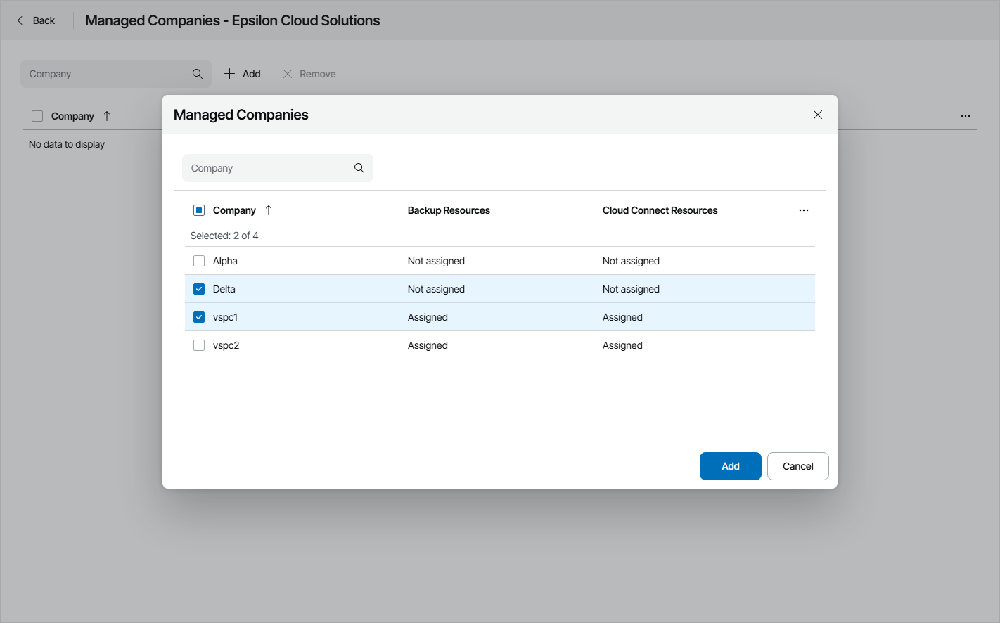

# Step 9. Assign Companies

After you create a reseller account, you can assign companies that the reseller will manage. If you delegate management of a company, you will still be able to edit the company account and perform other management tasks.

Required Privileges

To perform this task, a user must have the following role assigned: Portal Administrator.

Assigning companies

To assign companies to the reseller:

1. Log in to Veeam Service Provider Console.

For details, see [Accessing Veeam Service Provider Console](access_vac.md).

1. In the menu on the left, click Resellers.
2. From the list of resellers, select the reseller to which you want to assign companies.

To find the necessary reseller, you can use the search field at the top of the list.

1. At the top of the list, click Managed Companies.

Alternatively, right-click the necessary reseller and choose Managed Companies or click a link in the Managed Companies column.

1. In the Managed Companies window, click Add.
2. From the list of companies, select companies that you want to delegate to the reseller.

If you select a company that consumes services not allocated to the reseller, Veeam Service Provider Console will automatically update reseller account and add the necessary quota. Note that the Workstation agents and Server agents quotas will not be updated. If a company has managed Veeam backup agents, you will have to update these quotas manually.

1. Click Add, then click OK.

