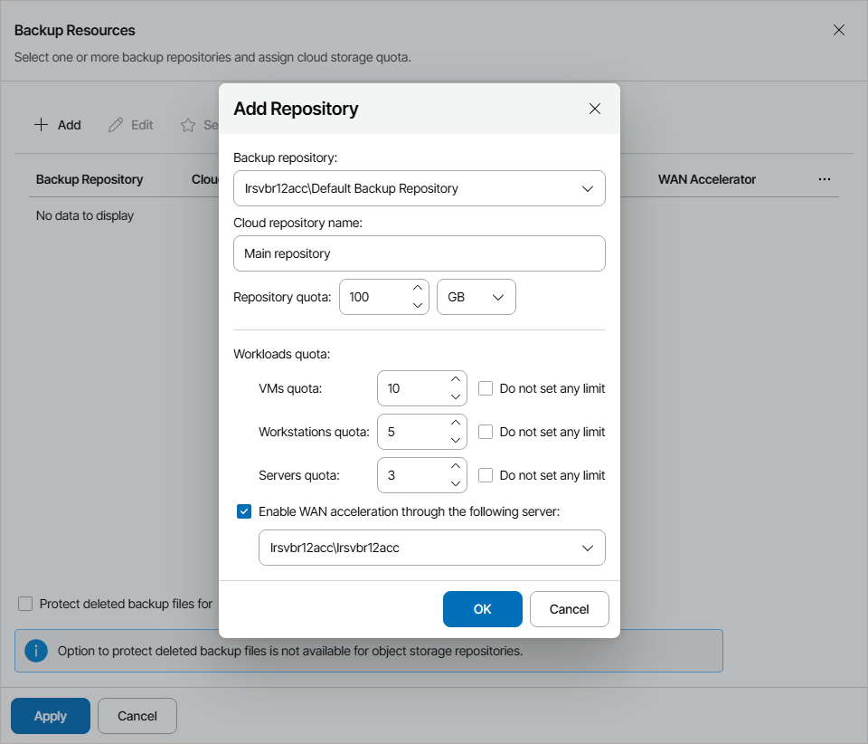

# Allocating Cloud Backup Resources

In the Backup Resources window, you can allocate cloud repository resources to the cloud tenant. A cloud tenant to which cloud repository resources are allocated will be able to store in the cloud backups created with Veeam Backup & Replication and Veeam backup agents.

Provisioning of cloud repository resources requires a license that covers storing backups in the cloud. For details, see [Licensing](licensing.md).

To allocate cloud repository resources to the cloud tenant, configure a cloud repository:

1. Click Add.
2. From the Backup repository list, select an underlying backup repository on the Veeam Cloud Connect server.
3. In the Cloud repository name field, specify a friendly name of a cloud repository.
4. In the Repository quota field, specify the amount of space to allocate to the cloud tenant on the selected backup repository.
5. To define the number of VMs and computers for the cloud repository:

1. Make sure the Do not set any limit check box is cleared.
2. In the VMs quota field, specify the maximum number of VMs that the cloud tenant is allowed to store on the cloud repository.

The VMs quota is a soft quota and puts no physical restriction on the cloud repository. When the cloud tenant reaches the specified quota, Veeam Service Provider Console triggers the VMs stored in cloud repository alarm. You can customize this alarm in accordance with your requirements. For details, see [Modifying Alarm Settings](modify_alarm_settings.md).

Company users will see this quota on the Resources dashboard. For details, see section [Resources](https://helpcenter.veeam.com/docs/vac/provider_user/resources.html?ver=9.1#backup) of the Guide for End Users.

1. In the Workstations quota field, specify the maximum number of Veeam backup agents in the Workstation mode that the cloud tenant is allowed to store on the cloud repository.

The Workstations quota is a soft quota and puts no physical restriction on the cloud repository. When the cloud tenant reaches the specified quota, Veeam Service Provider Console triggers the Workstation agent backups stored in cloud repository alarm. You can customize this alarm in accordance with your requirements. For details, see [Modifying Alarm Settings](modify_alarm_settings.md).

Company users will see this quota on the Resources dashboard. For details, see section [Resources](https://helpcenter.veeam.com/docs/vac/provider_user/resources.html?ver=9.1#backup) of the Guide for End Users.

1. In the Servers quota field, specify the maximum number of Veeam backup agents in the Server mode that the cloud tenant is allowed to store on the cloud repository.

The Servers quota is a soft quota and puts no physical restriction on the cloud repository. When the cloud tenant reaches the specified quota, Veeam Service Provider Console triggers the Server agent backups stored in cloud repository alarm. You can customize this alarm in accordance with your requirements. For details, see [Modifying Alarm Settings](modify_alarm_settings.md).

Company users will see this quota on the Resources dashboard. For details, see section [Resources](https://helpcenter.veeam.com/docs/vac/provider_user/resources.html?ver=9.1#backup) of the Guide for End Users.

1. If the company plans to use WAN accelerators for backup copy jobs that write data to the cloud, select the Enable WAN acceleration through the following server check box and choose a target WAN accelerator configured on the service provider side.

Note that you cannot enable WAN acceleration for public cloud object storage repositories and for object storage repositories with direct connection and direct access.

The source WAN accelerator must be configured on the cloud tenant side. The company must select the source WAN accelerator when configuring a backup copy job for the cloud tenant.

1. Click OK.

You can add more than one cloud repository for the cloud tenant. Repeat steps 1–7 for all cloud repositories you want to create.

1. If you want cloud backup policies configured for the cloud tenant to target to a specific repository, select the necessary repository and click Set as Default.
2. To enable additional protection for cloud tenant backup files stored on cloud repositories, select the Protect deleted backup files for N days check box and specify how long deleted backup files must be kept in the recycle bin on the Veeam Cloud Connect server.

With this option enabled, when a cloud tenant deletes a backup from the cloud repository, Veeam Cloud Connect does not immediately delete the actual backup files. Instead, Veeam Cloud Connect removes the backup from the tenant Veeam Backup & Replication console and database and moves backup files to the "recycle bin" — a dedicated folder on the service provider storage.

This functionality protects cloud tenants from both straightforward deletion of all backups from the Veeam console, as well more sophisticated attack through reducing the job retention policy and running a few incremental backups on already encrypted production servers to push the production data out of the off-site backup chain.

Note that insider protection is not available for object storage repositories.

For details on protection of deleted backups, see section [Insider Protection](https://helpcenter.veeam.com/docs/backup/cloud/cloud_connect_bin.html) of the Veeam Cloud Connect Guide.

