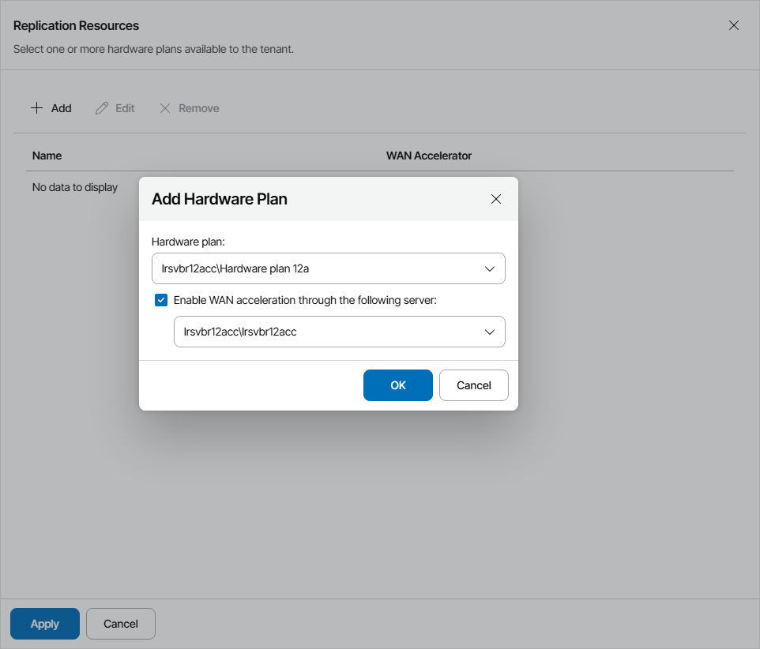
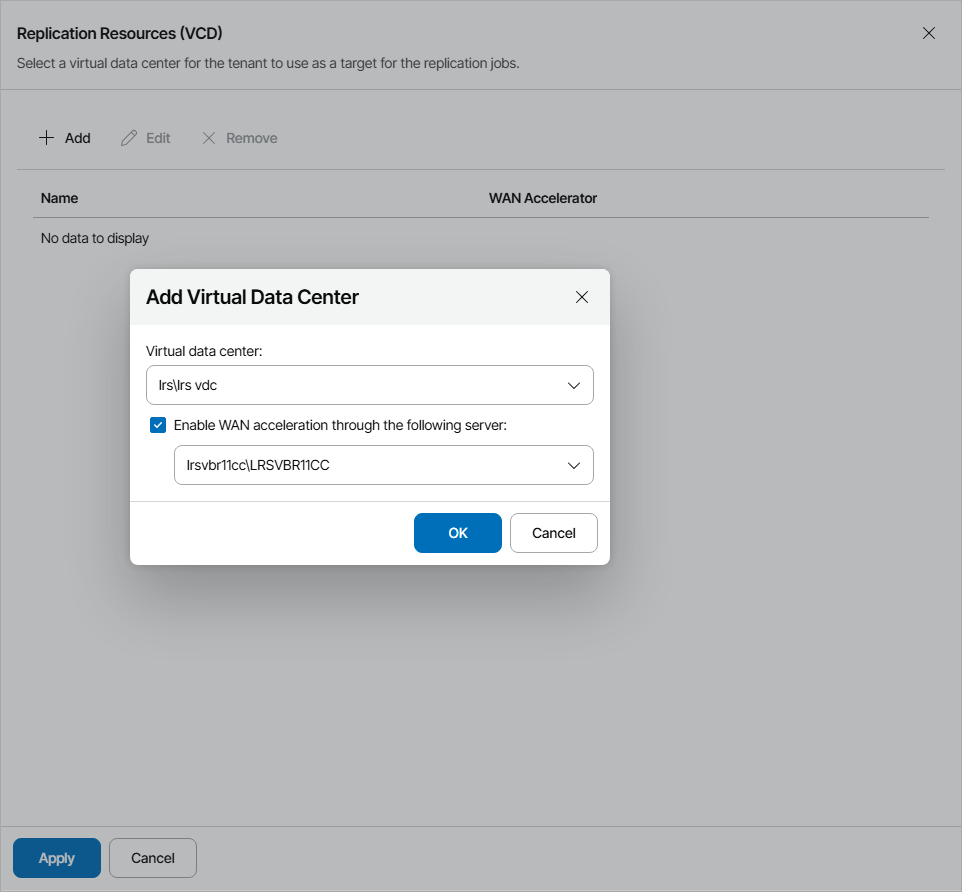

# Allocating Cloud Replication Resources

In the Replication Resources window, you can allocate replication resources to the cloud tenant:

* [For the Native Veeam Cloud Connect tenant accounts] [Subscribe the cloud tenant to one or more hardware plans](allocate_cloud_replication_resources.md#native).

* [For the VMware Cloud Director tenant accounts] [Allocate compute resources for cloud tenant VM replicas](allocate_cloud_replication_resources.md#vcd).

Allocating Veeam Cloud Connect Replication Resources

You can subscribe the cloud tenant to one or more hardware plans. A cloud tenant subscribed to a hardware plan will be able to store in the cloud VM replicas created with Veeam Backup & Replication.

Hardware plans must be configured in Veeam Cloud Connect in advance. For details, see section [Configuring Hardware Plans](https://helpcenter.veeam.com/docs/backup/cloud/cloud_connect_configure_hardware_plan.html) of the Veeam Cloud Connect Guide.

To subscribe the cloud tenant to one or more hardware plans:

1. Click Add.
2. In the Add Hardware Plan window, choose a hardware plan.
3. If the company plans to use WAN accelerators for replication jobs, select the Enable WAN acceleration through the following server check box and choose a target WAN accelerator configured on the service provider side.

The source WAN accelerator must be configured on the cloud tenant side. The company must select the source WAN accelerator when configuring a replication job for the cloud tenant.

1. Click OK.
2. Repeat steps 1–4 for all hardware plans to which you want to subscribe the cloud tenant.
3. To allocate network resources for performing failover tasks, at the Services step of the wizard, set the Use Veeam network management capabilities during partial and full site failover toggle to On.

To specify network settings for the network extension appliance, click Configure. For details, see [Configuring Network Extension Settings](specify_extension_settings.md).

Allocating VMware Cloud Director Replication Resources

You can assign to the cloud tenant an Organization VDC that will be used as a target for cloud tenant replicas and register a VMware Cloud Director tenant account in Veeam Cloud Connect.

To provide VMware Cloud Director resources as cloud hosts for client VM replicas, you must configure integration with VMware Cloud Director in Veeam Cloud Connect. For details, see section [VMware Cloud Director Support](https://helpcenter.veeam.com/docs/backup/cloud/cloud_vcloud_director.html) of the Veeam Cloud Connect Guide.

To assign an Organization VDC to the cloud tenant:

1. Click Add.
2. In the Add Virtual Data Center window, choose a virtual datacenter that will be available to the tenant as a cloud host.
3. If the cloud tenant plans to use WAN accelerators for replication jobs, select the Enable WAN acceleration through the following server check box and choose a target WAN accelerator configured on the service provider side.

The source WAN accelerator must be configured on the cloud tenant side. The company must select the source WAN accelerator when configuring a replication job for the cloud tenant.

1. Click OK.
2. Repeat steps 1–4 for all virtual datacenters which you want to assign to the cloud tenant.
3. To allocate network resources for performing failover tasks, at the Services step of the wizard, set the Use Veeam network management capabilities during partial and full site failover toggle to On.

To specify network settings for the network extension appliance, click Configure. For details, see [Configuring Network Extension Settings](specify_extension_settings.md).

If you use an NSX Edge gateway or IPsec VPN connection to enable network access to tenant VM replicas after failover, you do not need to deploy the network extension appliance in the Veeam Cloud Connect infrastructure.

