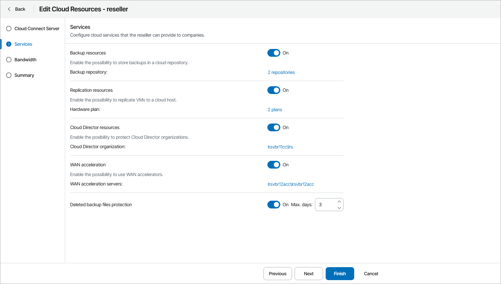

# Step 3. Allocate Cloud Services

At the Services step of the wizard, specify cloud resources that a reseller can provide to companies:

* To allow reseller companies to use cloud repository resources, set the Backup resources toggle to On.

To allocate cloud repository resources to the reseller, click Configure. For details, see [Allocating Cloud Backup Resources](reseller_backup_resources.md).

* To allow reseller companies to use cloud replication resources, set the Replication resources toggle to On.

To allocate cloud replication resources to the reseller, click Configure. For details, see [Allocating Cloud Replication Resources](reseller_replication_resources.md).

* To allow reseller companies to use VMware Cloud Director resources, set the Cloud Director resources toggle to On.

To allocate VMware Cloud Director resources to the reseller, click Configure. For details, see [Allocating VMware Cloud Director Resources](reseller_vcd_resources.md).

* To allow reseller companies to use WAN acceleration for backup and replication jobs that write data to the cloud, set the WAN Acceleration toggle to On.

To allocate WAN acceleration resources to the reseller, click Configure. For details, see [Allocating WAN Acceleration Resources](reseller_wan_acceleration.md).

* To enable additional protection for company backup files stored on cloud repositories, set the Deleted backup files protection toggle to On and specify how long deleted backup files must be kept in the recycle bin on the Veeam Cloud Connect server.

With this option enabled, when a company deletes a backup from the cloud repository, Veeam Cloud Connect does not immediately delete the actual backup files. Instead, Veeam Cloud Connect removes the backup from the tenant Veeam Backup & Replication console and database and moves backup files to the "recycle bin" — a dedicated folder on the service provider storage.

This functionality protects companies from both straightforward deletion of all backups from the Veeam Backup & Replication console, as well more sophisticated attack through reducing the job retention policy and running a few incremental backups on already encrypted production servers to push the production data out of the off-site backup chain.

For details on protection of deleted backups, see section [Insider Protection](https://helpcenter.veeam.com/docs/backup/cloud/cloud_connect_bin.html) of the Veeam Cloud Connect Guide.

