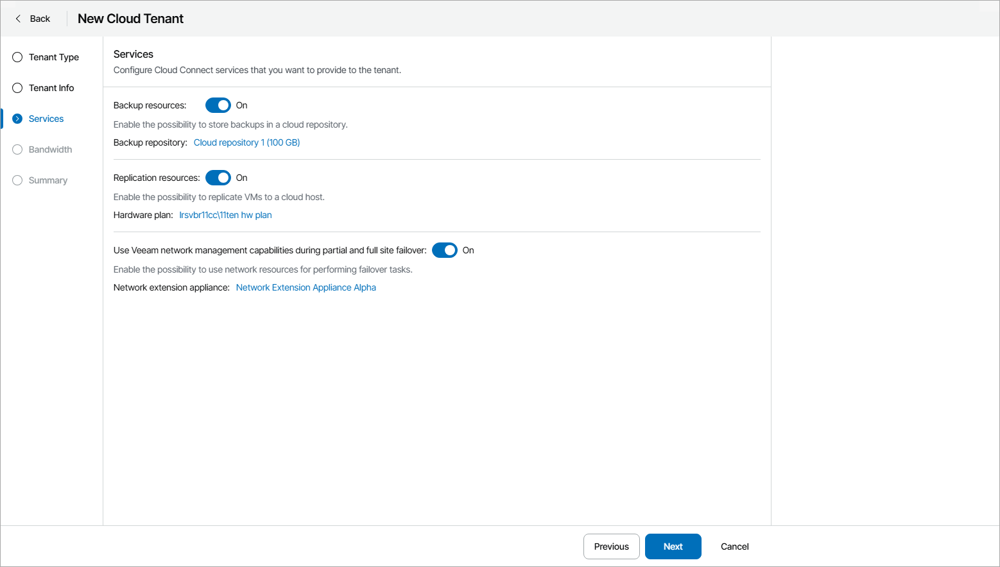

# Step 4. Allocate Cloud Services

At the Services step of the wizard, select the cloud services you want to provide to the cloud tenant:

1. To allow the cloud tenant to use cloud backup resources, set the Backup resources toggle to On.

To allocate cloud repository resources to the cloud tenant, click Configure. For details, see [Allocating Cloud Backup Resources](allocate_cloud_backup_resources.md).

1. To allow the cloud tenant to use cloud replication resources, set the Replication resources toggle to On.

To allocate cloud replication resources to the cloud tenant, click Configure. For details, see [Allocating Cloud Replication Resources](allocate_cloud_replication_resources.md).

1. To allocate network resources for performing failover tasks, set the Use Veeam network management capabilities during partial and full site failover toggle to On.

To specify network settings for the network extension appliance, click Configure. For details, see [Configuring Network Extension Settings](specify_extension_settings.md).

