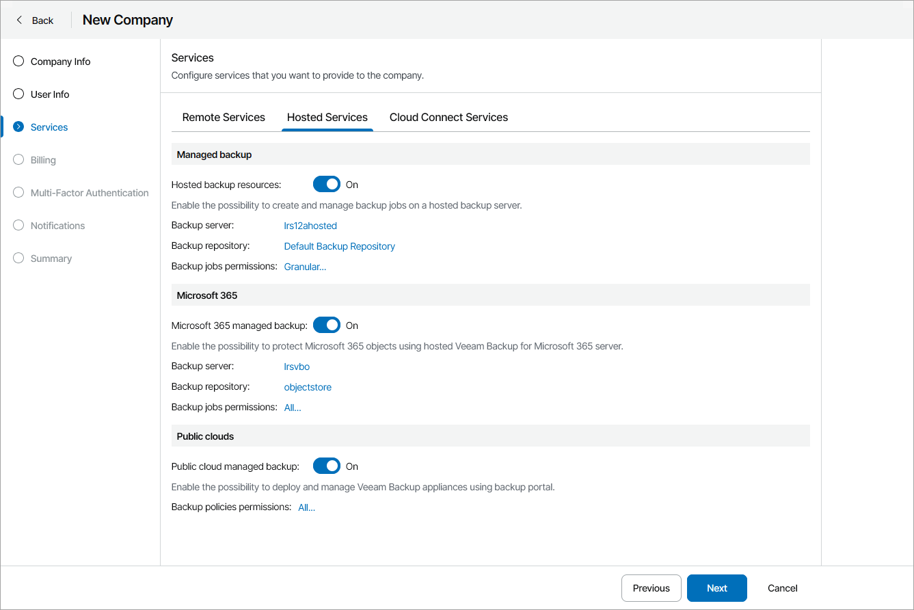

# Configure Hosted Services

On the Hosted Services tab, select which hosted services you want to provide to the company:

1. In the Managed backup section, set the Hosted backup resources toggle to On if you want to allow company to provide hosted Veeam Backup & Replication resources to the company.

To allocate Veeam Backup & Replication server resources to the company, in the Backup server field, click Configure. For details, see [Allocating Hosted Veeam Backup & Replication Server Resources](allocate_hosted_vbr_resources.md).

To allocate Veeam Backup & Replication repository resources to the company, in the Backup repository field, click Configure. For details, see [Allocating Hosted Veeam Backup & Replication Repository Resources](allocate_hosted_vbr_repository.md).

To limit the actions that the company can perform with jobs on hosted Veeam Backup & Replication servers, click a link in the Backup jobs permissions field and configure the necessary permissions (Create, Edit, Delete, Enable/Disable, Start/Stop, Manage Job Settings).

After creating a company, you must assign a VMware vSphere tag or map a VMware Cloud Director organization to the created company. For details, see sections [Assigning Tags to Companies](vbr_assign_vsphere_tag.md) and [Mapping VMware Cloud Director Organizations](vbr_map_vcd.md).

1. In the Microsoft 365 section, set the Microsoft 365 managed backup toggle to On if you want to provide hosted Microsoft 365 resources to the company.

To allocate Microsoft 365 server resources to the company, in the Backup server field, click Configure. For details, see [Allocating Microsoft 365 Server Resources](allocate_microsoft_365_resources.md).

To allocate Microsoft 365 repository resources to the company, in the Backup repository field, click Configure. For details, see [Allocating Microsoft 365 Repository Resources](allocate_microsoft_365_repository.md).

To limit the actions that the company can perform with jobs on hosted Microsoft 365 servers, click the link in the Backup jobs permissions field and configure the necessary permissions (Create, Edit, Delete, Enable/Disable, Start/Stop, Manage Job Settings).

1. In the Public clouds section, set the Public cloud managed backup toggle to On if you want to allow company users to manage Amazon Web Services, Microsoft Azure and Google Cloud public clouds.

To limit the actions that the company can perform with policies on hosted public cloud appliances, click a link in the Backup policies permissions field and configure the necessary permissions (Create, Edit, Delete, Enable/Disable, Start/Stop).

