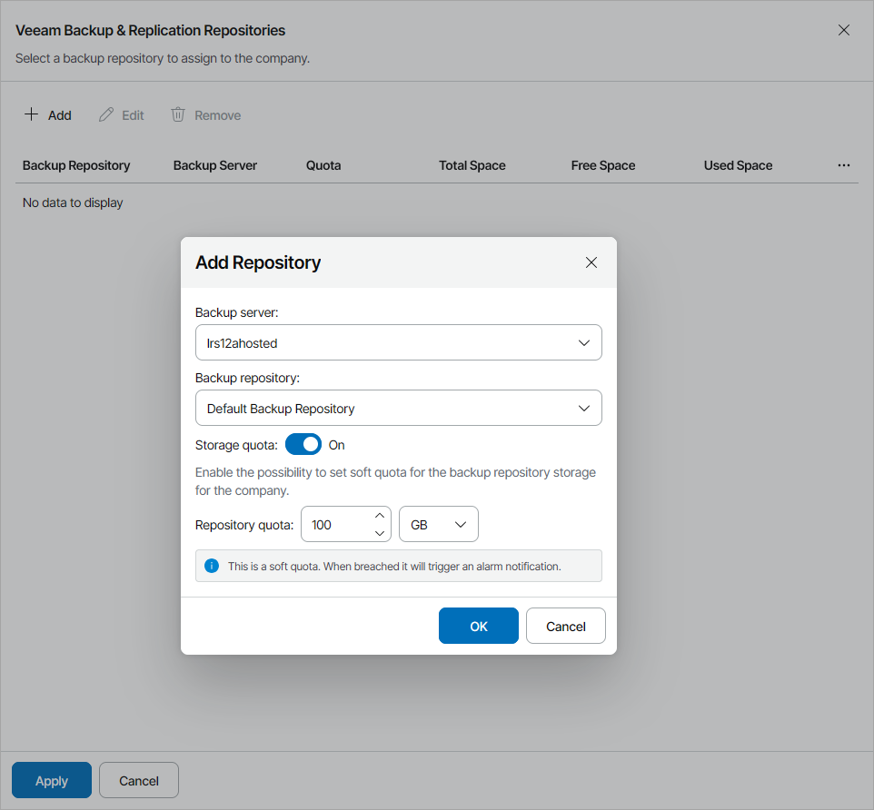

# Allocating Hosted Veeam Backup & Replication Repository Resources

In the Veeam Backup & Replication Repositories window, you can allocate Veeam Backup & Replication repository resources to the company. A company to which Veeam Backup & Replication resources are allocated will be able to store backups on Veeam Backup & Replication repositories hosted on service provider site.

To allocate Veeam Backup & Replication repository resources to the company:

1. Click Add.
2. From the Backup server list, select a Veeam Backup & Replication server.
3. From the Backup repository list, select a Veeam Backup & Replication repository.
4. To limit the amount of repository storage space:

1. Set the Storage quota toggle to On.
2. In the Repository quota field, specify the amount of storage space allocated to the company.

The Repository quota is a soft quota and puts no physical restriction on the repository. When the company reaches the specified quota, Veeam Service Provider Console triggers the Hosted backup repository storage quota alarm. You can customize this alarm in accordance with your requirements. For details, see [Modifying Alarm Settings](modify_alarm_settings.md).

1. Click OK.

You can add multiple repositories for the company. Repeat steps 1–5 for all repositories you want to allocate.

