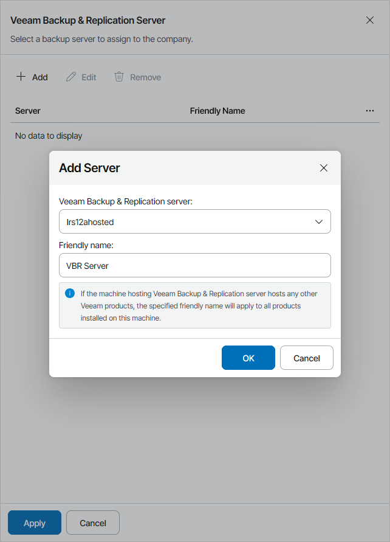

# Allocating Hosted Veeam Backup & Replication Server Resources

In the Veeam Backup & Replication Servers window, you can allocate hosted Veeam Backup & Replication server resources to the company. A client company to which Veeam Backup & Replication resources are allocated will be able to create backup jobs protecting client infrastructure with Veeam Backup & Replication hosted on service provider site.

|  |
| --- |
| Note: |
| If you allocate to the company the Veeam Backup & Replication server where a VMware Cloud Director organization is registered and assign the VMware Cloud Director cloud tenant to this company, Veeam Service Provider Console will automatically map this company to the VMware Cloud Director organization. |

To allocate Veeam Backup & Replication server resources to the company:

1. Click Add.
2. From the Veeam Backup & Replication server list, select a Veeam Backup & Replication server.
3. In the Friendly name field, specify a friendly name for the server.

If you have already allocated this server to another company, the friendly name will be filled automatically. If you change the friendly name, the change will apply to all companies to which this server is allocated.

|  |
| --- |
| Note: |
| If the machine hosting Veeam Backup & Replication server hosts other Veeam products, the specified friendly name will apply to all products installed on this machine. |

1. Click OK.

You can add only one Veeam Backup & Replication server for the company.

After you allocate a Veeam Backup & Replication server to a company, you can assign Veeam Backup & Replication repositories to the company. To allocate Veeam Backup & Replication repository resources to the company, at the Services step of the wizard, click the Configure link in the Backup repository field. For details, see [Allocating Hosted Veeam Backup & Replication Repository Resources](allocate_hosted_vbr_repository.md).

