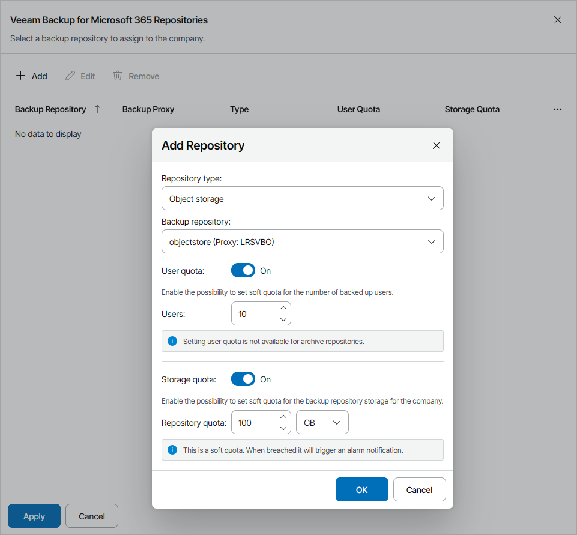

# Allocating Microsoft 365 Repository Resources

In the Microsoft 365 Repositories window, you can allocate Veeam Backup for Microsoft 365 repository resources to the company. A company to which Veeam Backup for Microsoft 365 resources are allocated will be able to store backups with Veeam Backup for Microsoft 365.

To allocate Veeam Backup for Microsoft 365 repository resources to the company:

1. Click Add.
2. From the Repository type list, select Veeam Backup for Microsoft 365 repository type (Object storage, Archive object storage, Jet database).

Note that the Jet database repository type is available only for standalone proxy servers.

1. From the Backup repository list, select a Veeam Backup for Microsoft 365 repository.
2. If you want to limit the number of users for the object storage or Jet database repositories, set the User quota toggle to On and specify the maximum number of users that the company is allowed to store on the repository in the Users field.

The Users quota is a soft quota and puts no physical restriction on the Veeam Backup for Microsoft 365 repository. When the company reaches the specified quota, Veeam Service Provider Console triggers the Protected users quota alarm. You can customize this alarm in accordance with your requirements. For details, see [Modifying Alarm Settings](modify_alarm_settings.md).

1. If you want to limit the amount of storage that is available to the company, set the Storage quota toggle to On and specify the amount of repository storage allocated to the company in the Repository quota field.

The Storage quota is a soft quota and puts no physical restriction on the Veeam Backup for Microsoft 365 repository. When the company reaches the specified quota, Veeam Service Provider Console triggers the Microsoft 365 backup repository storage quota alarm. You can customize this alarm in accordance with your requirements. For details, see [Modifying Alarm Settings](modify_alarm_settings.md).

1. Click OK.

You can add multiple repositories for the company. Repeat steps 1–6 for all repositories you want to allocate.

