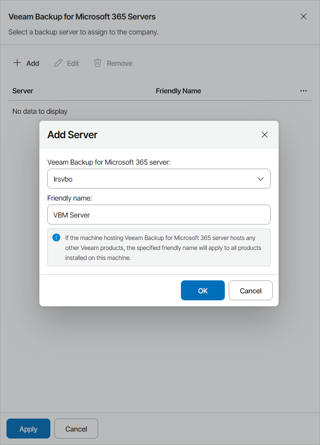

# Allocating Microsoft 365 Server Resources

In the Veeam Backup for Microsoft 365 Servers window, you can allocate Veeam Backup for Microsoft 365 server resources to the company. A company to which Veeam Backup for Microsoft 365 resources are allocated will be able to create backups with Veeam Backup for Microsoft 365.

To allocate Veeam Backup for Microsoft 365 server resources to the company:

1. Click Add.
2. From the Veeam Backup for Microsoft 365 server list, select a Veeam Backup for Microsoft 365 server.

1. In the Friendly name field, specify a friendly name for the server.

If you have already allocated this server to another company or reseller, the friendly name will be filled automatically. If you change the friendly name, the change will apply to all companies and resellers to which this server is allocated.

|  |
| --- |
| Note: |
| If the machine hosting Veeam Backup for Microsoft 365 server hosts other Veeam products, the specified friendly name will apply to all products installed on this machine. |

1. Click OK.

You can add multiple Veeam Backup for Microsoft 365 servers for the company. Repeat steps 1–4 for all servers you want to allocate.

After you allocate Veeam Backup for Microsoft 365 servers to a company, you can assign Veeam Backup for Microsoft 365 repositories to the company. To allocate Microsoft 365 repository resources to the company, at the Services step of the wizard, click the Configure link in the Backup repository field. For details, see [Allocating Microsoft 365 Repository Resources](allocate_microsoft_365_repository.md).

