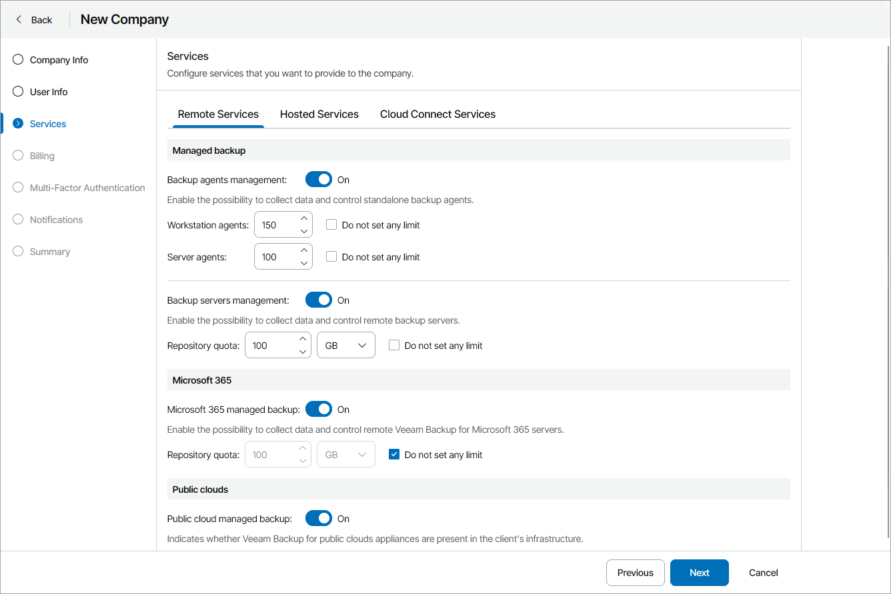

# Configure Remote Services

On the Remote Services tab, select which remote services you allow the company to manage:

1. In the Managed backup section, select which Veeam products you allow the company to manage:

* To allow company to manage Veeam backup agents, set the Backup agents management toggle to On.

To define the number of Veeam backup agents, for each Veeam backup agent running mode:

1. Clear the Do not set any limit check box.
2. Specify the maximum number of Veeam backup agents you allow a company to manage.

The agent quotas are soft quotas and put no physical restriction on the repository. When the company reaches the specified quota, Veeam Service Provider Console triggers the Company workstation agents quota or Company server agents quota alarm. You can customize these alarms in accordance with your requirements. For details, see [Modifying Alarm Settings](modify_alarm_settings.md).

To set agent quotas as hard quotas, select the Enforce hard quotas for backup agents check box.

|  |
| --- |
| Note: |
| If you use Rental license, Veeam Service Provider Console will treat Veeam backup agents registered by companies within the current calendar month as New. New Veeam backup agents consume the Workstation agents and Server agents quotas, but can be managed in Veeam Service Provider Console even if these quotas are exceeded.  The license status of Veeam backup agents that exceed the specified quota will be set to Unlicensed, and new Veeam backup agents will not receive a license when the new month starts. These agents will be excluded from management in a LIFO (last in, first out) queue: Veeam backup agents that are registered (activated) last are excluded first from the management scope. For details on the mechanism of New Veeam backup agents, see [New Veeam Backup Agents](exceeding_license_limit.md#new).  If you increase the Veeam backup agent quota after it has been exceeded, Veeam Service Provider Console will not automatically activate Veeam backup agents that were excluded from management. To start managing Veeam backup agents with the Unlicensed status, the company must activate them manually. For details on switching Veeam backup agents to managed mode, see [Activating Veeam Backup Agents](activate_backup_agents.md). |

* To allow a company to manage Veeam Backup & Replication servers, Veeam backup agents managed by Veeam Backup & Replication servers and Veeam Backup for Public Clouds appliances, set the Backup servers management toggle to On.

To limit the amount of backup repository storage space for the company, clear the Do not set any limit check box and specify the repository quota.

The Repository quota is a soft quota and puts no physical restriction on the repository. When the company reaches the specified quota, Veeam Service Provider Console triggers the Remote backup repository storage quota alarm. You can customize this alarm in accordance with your requirements. For details, see [Modifying Alarm Settings](modify_alarm_settings.md).

To limit the actions that the company can perform with jobs on remote Veeam Backup & Replication servers, click the link in the Backup jobs permissions field and configure the necessary permissions (Delete, Enable/Disable, Start/Stop).

1. In the Microsoft 365 section, set the Microsoft 365 managed backup toggle to On if you want to allow company to manage remote Microsoft 365 servers.

To limit the amount of Veeam Backup for Microsoft 365 repository storage space for the company, clear the Do not set any limit check box and specify the repository quota.

The Repository quota is a soft quota and puts no physical restriction on the repository. When the company reaches the specified quota, Veeam Service Provider Console triggers the Microsoft 365 backup repository storage quota alarm. You can customize this alarm in accordance with your requirements. For details, see [Modifying Alarm Settings](modify_alarm_settings.md).

To limit the actions that the company can perform with jobs on remote Microsoft 365 servers, click the link in the Backup jobs permissions field and configure the necessary permissions (Create, Edit, Delete, Enable/Disable, Start/Stop, Restore, Manage Job Settings).

1. In the Public clouds section, set the Public cloud managed backup toggle to On if you want to allow company users to manage remote Amazon Web Services, Microsoft Azure and Google Cloud public clouds.

To limit the actions that the company can perform with policies on remote public cloud appliances, click the link in the Backup policies permissions field and configure the necessary permissions (Enable/Disable, Start/Stop).

