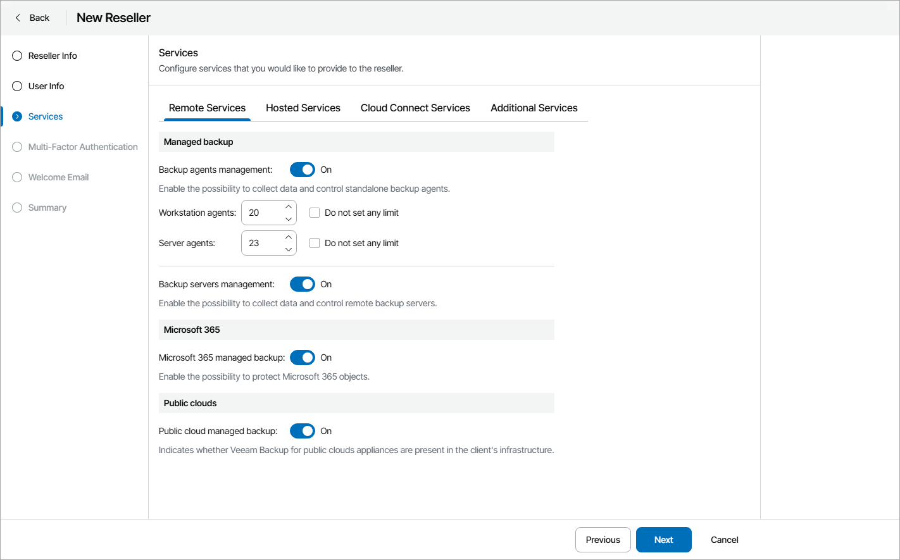

# Configure Remote Services

On the Remote Services tab, specify remote client services that the reseller can manage:

1. In the Managed backup section, select which Veeam products you allow the reseller to manage:

* To allow reseller to manage Veeam backup agents, set the Backup agents management toggle to On.

To define the number of Veeam backup agents, for each Veeam backup agent running mode:

1. Clear the Do not set any limit check box.
2. Specify the maximum number of Veeam backup agents you allow the reseller to manage.

|  |
| --- |
| Note: |
| If you use Rental license, Veeam Service Provider Console will treat Veeam backup agents registered by resellers within the current calendar month as New. New Veeam backup agents consume the Workstation agents and Server agents quotas, but can be managed in Veeam Service Provider Console even if these quotas are exceeded.  When the new month starts, a reseller has 7 days of grace period. By the end of this period, a reseller must decrease the number of managed Veeam backup agents or request for increase in agent quotas. Otherwise, the license status of Veeam backup agents that exceed the specified quotas will be set to Unlicensed. These agents will be excluded from management in a LIFO (last in, first out) queue: Veeam backup agents that are registered (activated) last are excluded first from the management scope. For details on the mechanism of New Veeam backup agents, see [New Veeam Backup Agents](exceeding_license_limit.md#new).  If you increase the Veeam backup agent quota after the grace period is over, Veeam Service Provider Console will not automatically activate Veeam backup agents that were excluded from management. To start managing Veeam backup agents with the Unlicensed status, a reseller must activate them manually. For details on switching Veeam backup agents to managed mode, see [Activating Veeam Backup Agents](activate_backup_agents.md). |

* To allow the reseller to manage Veeam Backup & Replication servers, Veeam backup agents managed by Veeam Backup & Replication servers and Veeam Backup for Public Clouds appliances, set the Backup servers management toggle to On.

1. In the Microsoft 365 section, set the Microsoft 365 managed backup toggle to On if you want to allow reseller to manage remote Microsoft 365 servers.
2. In the Public clouds section, set the Public cloud managed backup toggle to On if you want to allow reseller users to manage remote Amazon Web Services, Microsoft Azure and Google Cloud appliances.

