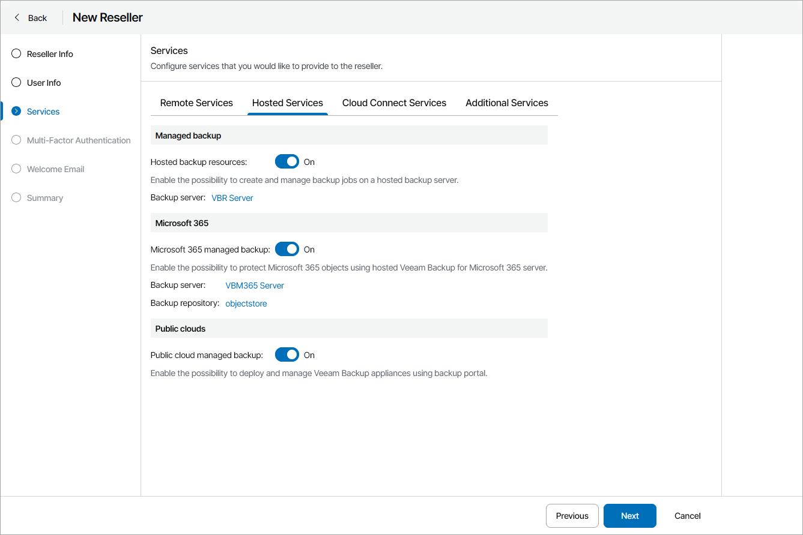
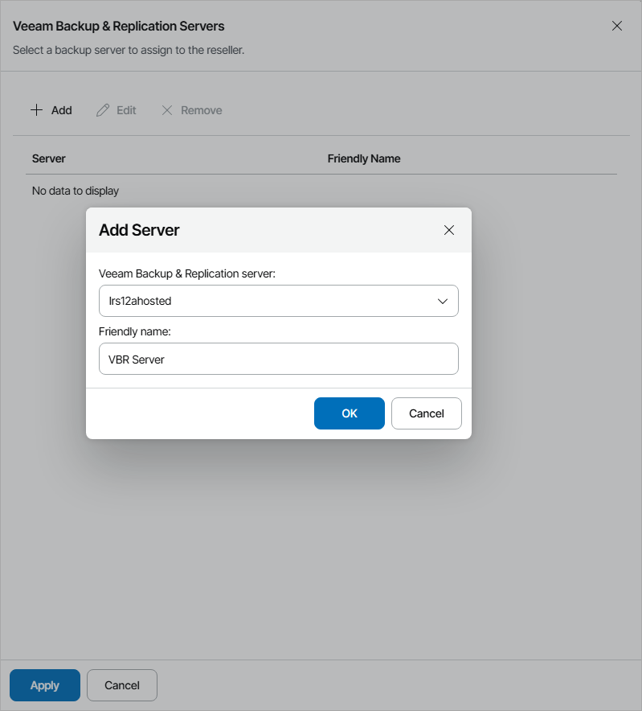
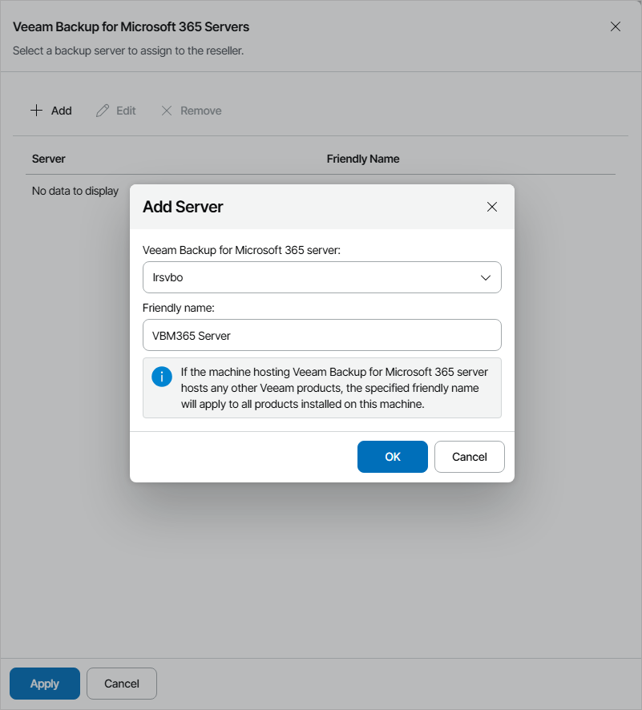
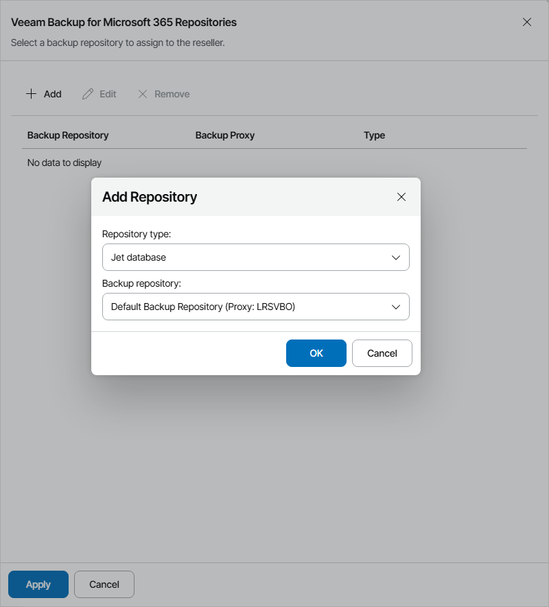

# Configure Hosted Services

On the Hosted Services tab, specify hosted services that a reseller can provide to companies:

* To allow reseller companies to create jobs on a hosted Veeam Backup & Replication server, set the Hosted backup resources toggle to On.

To allocate Veeam Backup & Replication server resources to the reseller, in the Backup server field, click Configure. For details, see [Allocating Hosted Veeam Backup & Replication Resources](#vbr).

* To allow reseller companies to use Microsoft 365 resources, set the Microsoft 365 managed backup toggle to On.

To allocate Microsoft 365 server resources to the reseller, click Configure. For details, see [Allocating Microsoft 365 Resources](#vbm).

To allocate Microsoft 365 repository resources to the reseller, in the Backup repository field, click Configure. For details, see [Allocating Microsoft 365 Repository Resources](#vbmrepo).

* To allow reseller to manage Amazon Web Services and Microsoft Azure public clouds in Veeam Backup for Public Clouds plugin, set the Public cloud managed backup toggle to On.

Allocating Hosted Veeam Backup & Replication Resources

In the Veeam Backup & Replication Servers window, you can allocate hosted Veeam Backup & Replication server resources to the reseller. A reseller to which Veeam Backup & Replication resources are allocated can allow client companies to create backup jobs with Veeam Backup & Replication hosted on service provider site.

To allocate Veeam Backup & Replication server resources to the reseller:

1. Click Add.
2. From the Veeam Backup & Replication server list, select a Veeam Backup & Replication server.
3. In the Friendly name field, specify a friendly name for the server.

If you have already allocated this server to another company, the friendly name will be filled automatically. If you change the friendly name, the change will apply to all companies and resellers to which this server is allocated.

|  |
| --- |
| Note: |
| If the machine hosting Veeam Backup & Replication server hosts other Veeam products, the specified friendly name will apply to all products installed on this machine. |

1. Click OK.

You can add more than one Veeam Backup & Replication server for the reseller. Repeat steps 1–4 for all servers you want to allocate.

Allocating Microsoft 365 Resources

In the Veeam Backup for Microsoft 365 Servers window, you can allocate Veeam Backup for Microsoft 365 server resources to the reseller. A reseller to which Veeam Backup for Microsoft 365 resources are allocated can allow client companies to create backups with Veeam Backup for Microsoft 365.

To allocate Veeam Backup for Microsoft 365 server resources to the reseller:

1. Click Add.
2. From the Veeam Backup for Microsoft 365 server list, select a Veeam Backup for Microsoft 365 server.
3. In the Friendly name field, specify a friendly name for the server.

If you have already allocated this server to another company or reseller, the friendly name will be filled automatically. If you change the friendly name, the change will apply to all companies and resellers to which this server is allocated.

|  |
| --- |
| Note: |
| If the machine hosting Veeam Backup for Microsoft 365 server hosts other Veeam products, the specified friendly name will apply to all products installed on this machine. |

1. Click OK.

You can add more than one Veeam Backup for Microsoft 365 server for the reseller. Repeat steps 1–4 for all servers you want to allocate.

Allocating Microsoft 365 Repository Resources

In the Microsoft 365 Repositories window, you can allocate Veeam Backup for Microsoft 365 repository resources to the reseller. A reseller to which Veeam Backup for Microsoft 365 resources are allocated will be able to provide Veeam Backup for Microsoft 365 resources to their client companies.

To allocate Veeam Backup for Microsoft 365 repository resources to the reseller:

1. Click Add.
2. From the Repository type list, select type of the repository (Object storage, Archive object storage, Jet database).

Note that the Jet database repository type is available only for standalone proxy servers.

1. From the Backup repository list, select a Veeam Backup for Microsoft 365 repository.
2. Click OK.

You can add more than one repository for the reseller. Repeat steps 1–4 for all repositories you want to allocate.

