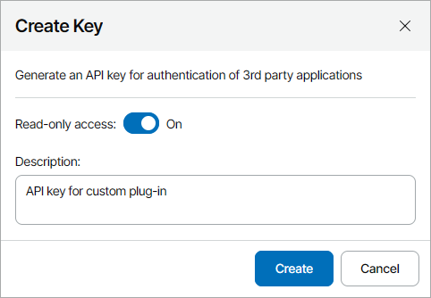
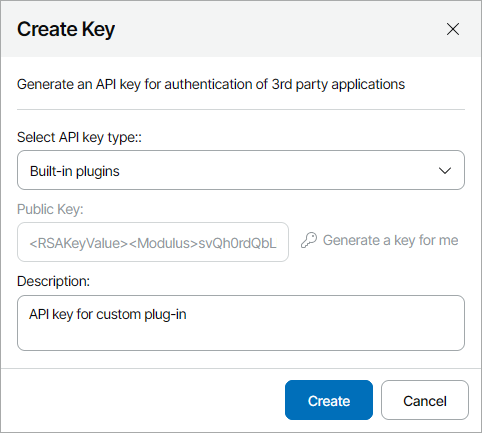
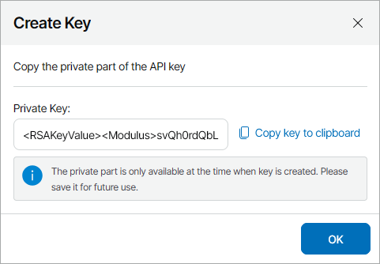

# Configuring API Keys

To configure Veeam Service Provider Console integration with third party solutions or Veeam Service Provider Console plugins, you must generate API keys. Veeam Service Provider Console uses API keys to authenticate requests from third party solutions to Veeam Service Provider Console server.

In Veeam Service Provider Console, you can configure the following API keys:

* [Simple Key](#simple) — this API key is recommended for configuring Veeam Service Provider Console REST API authentication. For details, see section [API Key-Based Authorization](https://helpcenter.veeam.com/references/vac/9.2/rest/3.6.2/tag/SectionAbout) of the REST API Reference.
* [Advanced Key](#rsa) — this API key is recommended for configuring Veeam Service Provider Console internal integrations. For details, see [Plugins and Integration](plugins.md).

Required Privileges

To perform this task, a user must have the following role assigned: Portal Administrator.

Configuring Simple API Key

To generate simple API key:

1. Log in to Veeam Service Provider Console.

For details, see [Accessing Veeam Service Provider Console](access_vac.md).

1. At the top right corner of the Veeam Service Provider Console window, click Configuration.
2. In the configuration menu on the left, click Access Management and navigate to the REST API Keys tab.
3. At the top of the list, click New > Simple Key (Recommended).
4. In the Create Key window, enter a description for the API key.
5. If you want to enable read-only access to the API key, set the Read-only access toggle to On.
6. Click Create.

The Private API key will display.

1. Click Copy key to clipboard to copy the Private API key.

The Private key is only available at the time when it is created. Make sure that you save the key externally for future use.

1. Click OK.

Configuring Advanced API Keys

To generate public and private API keys:

1. Log in to Veeam Service Provider Console.

For details, see [Accessing Veeam Service Provider Console](access_vac.md).

1. At the top right corner of the Veeam Service Provider Console window, click Configuration.
2. In the configuration menu on the left, click Access Management and navigate to the REST API Keys tab.
3. At the top of the list, click New > Advanced Key.
4. In the Create Key window, select API key type:

* Built-in plugins — choose this option to create an API key for Veeam Service Provider Console internal integrations. For details on Veeam Service Provider Console integrations, see [Plugins and Integration](plugins.md).
* 3rd party integrations — choose this option to create an API key for third party integrations.

1. Click Generate a key for me.

The Public API key will display.

1. In the Description field, enter a description for the API key.
2. Click Create.

The Private API key will display.

1. Click Copy key to clipboard to copy the Private API key.

The Private key is only available at the time when it is created. Make sure that you save the key externally for future use.

1. Click OK.

Related Topics

* [Modifying API Keys](edit_api_key.md)
* [Disabling and Enabling API Keys](enable_disable_api_key.md)
* [Deleting API Keys](delete_api_key.md)

