# Configuring SSO for Microsoft Entra ID

To configure SSO authentication with Microsoft Entra ID:

1. Log in to Veeam Service Provider Console.

For details, see [Accessing Veeam Service Provider Console](access_vac.md).

1. At the top right corner of the Veeam Service Provider Console window, click Configuration.
2. In the configuration menu on the left, click Roles & Users.
3. On the Single Sign-On tab, click New and select Custom from the drop-down list.

The identity provider configuration wizard will open.

1. Access the Microsoft Azure web portal.
2. Navigate to the Enterprise Applications tab.
3. In the menu on the left, select All applications.
4. At the top of the list, click New application.
5. In the Browse Microsoft Entra Gallery window, click Create your own application.

[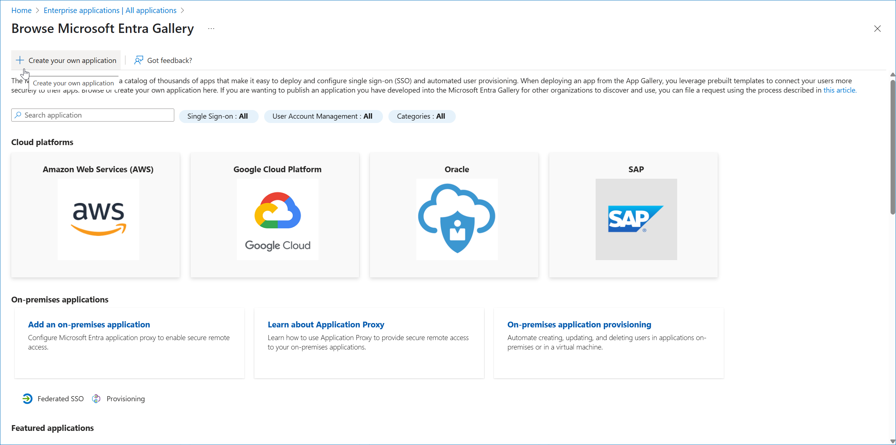](images/azure_sso_new_application.webp "Create New Application")

1. In the Create your own application side window, specify the name of the integration with Veeam Service Provider Console and select Integrate any other application you don't find in the gallery (Non-gallery).

[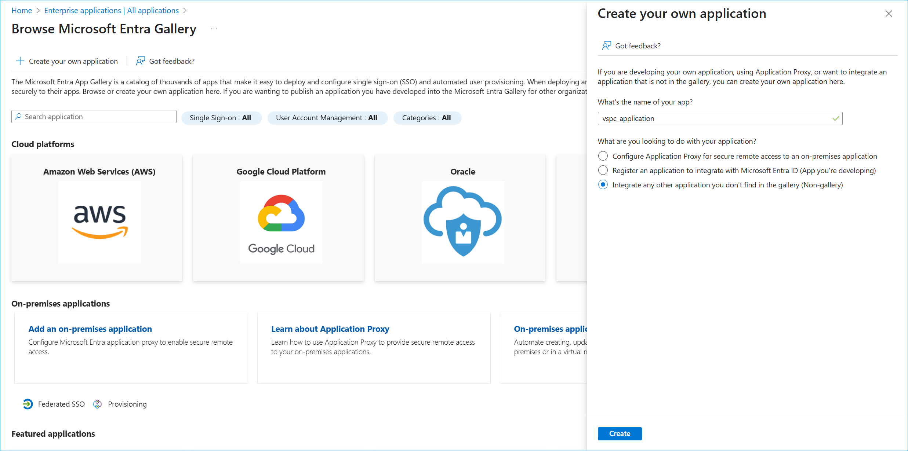](images/azure_sso_app_name.webp "Specify Application Name")

1. In Veeam Service Provider Console, specify general information on the IdP:

* In the Display name field, specify the IdP name that will be displayed in the IdP list on the Single Sign-On tab.
* In the Client ID field, insert the application name specified at step 10.

* Click Create SP entity ID link to generate entity ID URL based on the Client ID value.

Save the link locally.

If you apply changes to Client ID value after link generation, click New link.

* Click Create Assertion consumer link to generate assertion consumer service URL based on the Client ID value.

Save the link locally.

If you apply changes to Client ID value after link generation, click New link.

[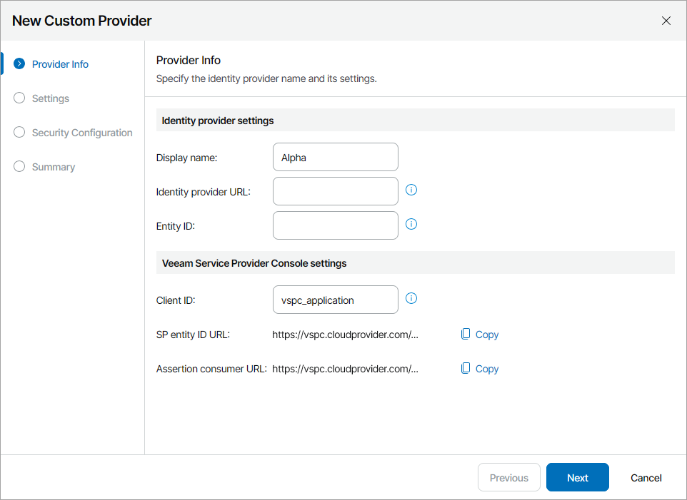](images/azure_idp_client.webp "Insert Client ID")

1. In Microsoft Entra ID, open the created application.
2. In the menu on the left, click Single sign-on and select SAML.

The SAML-based Sign-on page will open.

1. Copy the App Federation Metadata URL link.

[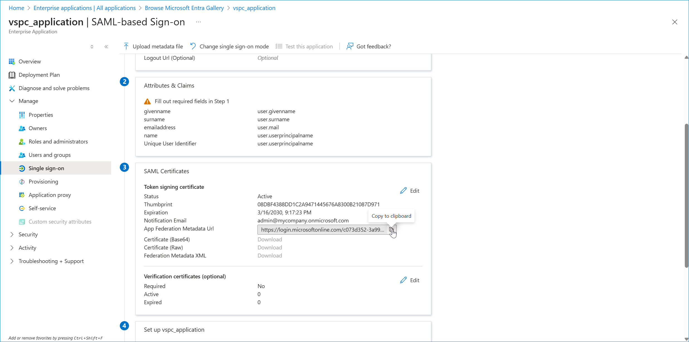](images/azure_sso_copy_app_url.webp "Copy App Metadata URL")

1. In Veeam Service Provider Console, insert the URL into the Identity Provider URL field.

[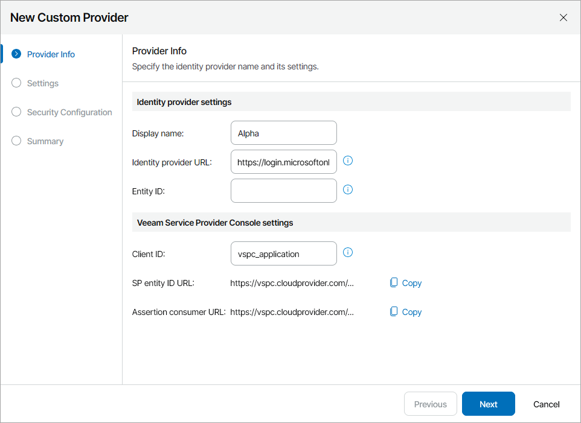](images/azure_idp_url.webp "Insert Identity Provider URL")

1. In Microsoft Entra ID, from the Set up ... widget, copy the Microsoft Entra Identifier link.

[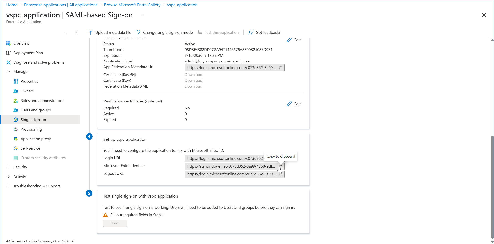](images/azure_sso_copy_identifier.webp "Copy Microsoft Identifier")

1. In Veeam Service Provider Console, paste the link into the Entity ID field.

[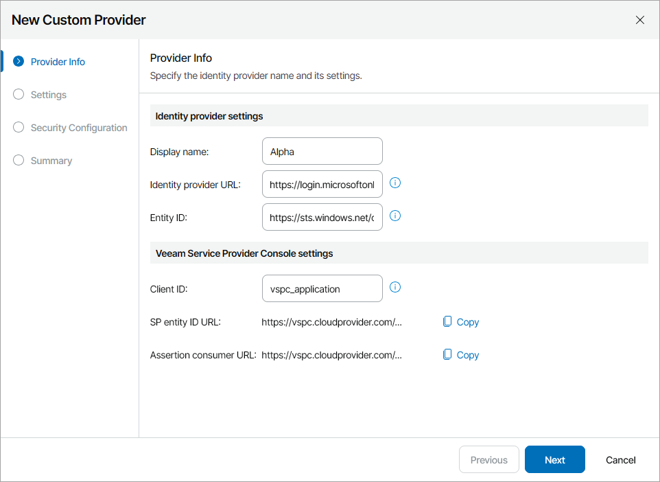](images/azure_entity_id.webp "Insert Entity ID")

1. Follow steps 6-8 described in the [Adding Identity Providers](sso_idp.md#add_idp) section.
2. In Microsoft Entra ID, in the top right corner of the Basic SAML Configuration widget, click Edit.
3. In the Identifier (Entity ID) section, insert the URL generated in the SP entity ID URL field at step 11 into the empty field.
4. In the Reply URL (Assertion Consumer URL) section, insert the URL generated in the Assertion consumer URL field at step 11 into the empty field.

[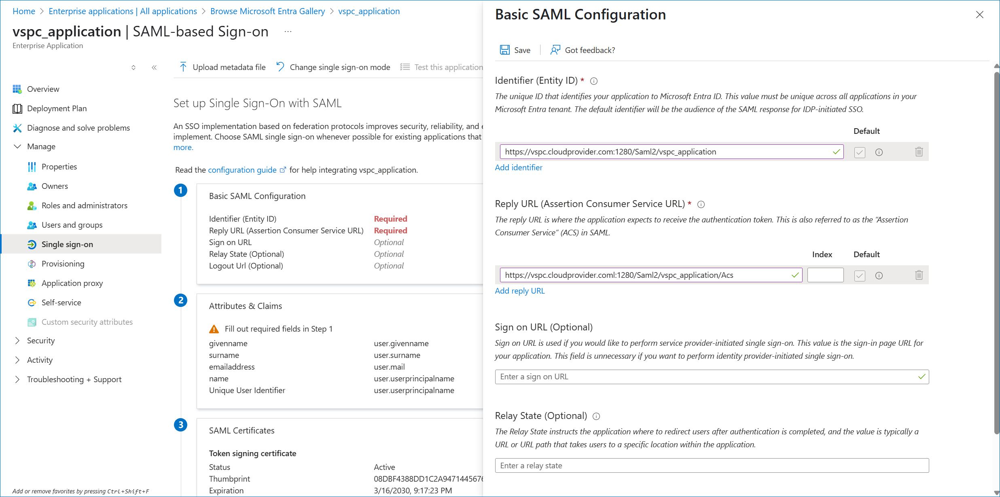](images/azure_sso_saml.webp "Configure SAML")

1. Click Save.
2. In the top right corner of the Attributes & Claims widget, click Edit.
3. Click the Unique User Identifier (Name ID) claim to modify claim settings.
4. From the Source attribute list, select user.mail.

[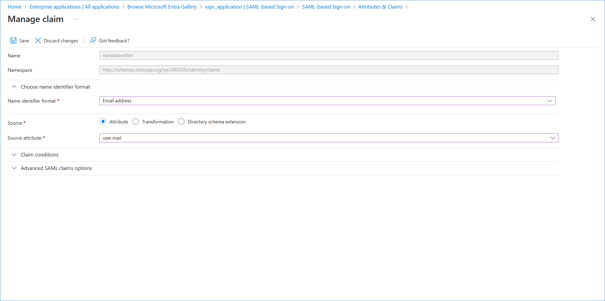](images/azure_sso_required_claim.webp "Modify Required Claim")

1. Click Save.
2. At the top of the claims list, click Add new claim.
3. In the Manage claim window, specify a claim name and from the Source attribute list, select user.companyname.

This claim will identify the company name specified in the user properties.

1. Click Save.
2. If you want to add more claims, repeat steps 27–29 for all claims you want to add.

For example, you can add a claim to identify the department specified in the user properties.

[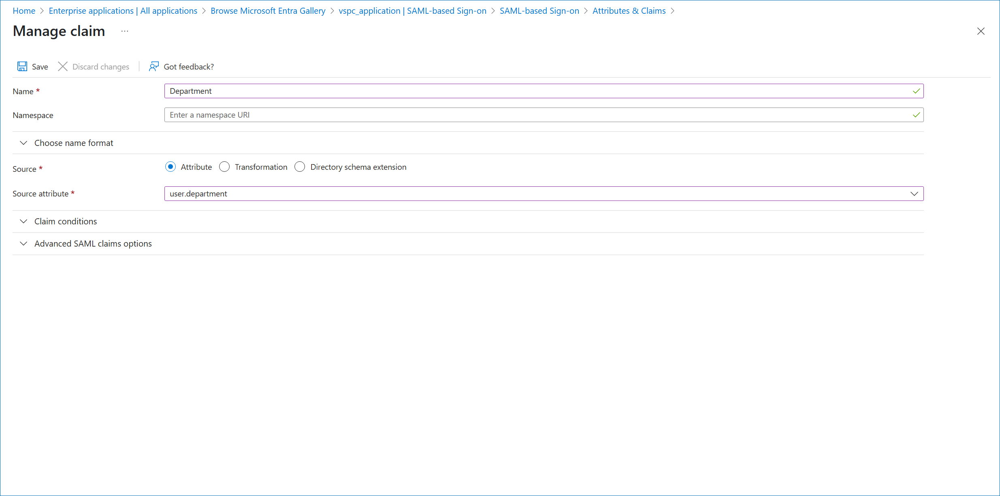](images/azure_sso_additional_claim.webp "Add Claim")

1. Close the Attributes & Claims window.
2. Create users that you want to assign to the application.

Make sure to specify your Veeam Service Provider Console company name in the user properties.

[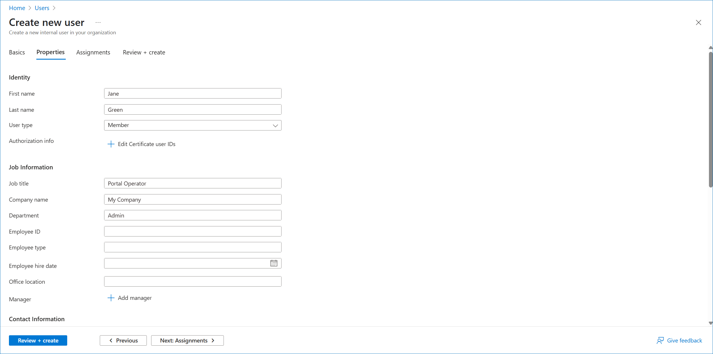](images/azure_sso_user.webp "Specify User Properties")

1. In the menu on the left, select Users and Groups.
2. At the top of the list, click Add user/group.
3. In the Add Assignment window, click a link in the Users and groups section.
4. Select the necessary user in the list and click Select.

[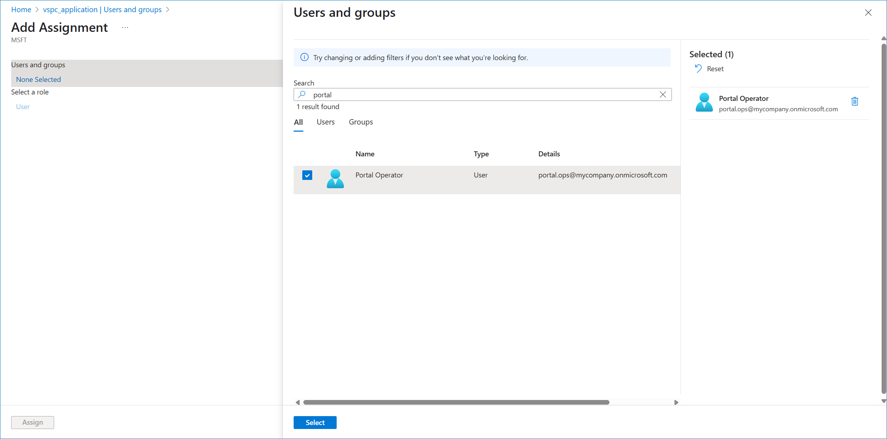](images/azure_sso_select_user.webp "Select User")

1. Click Assign.
2. In Veeam Service Provider Console, follow steps 1–8 of the New Authorization Rule wizard as described in [Managing Mapping Rules](sso_rules.md#create_rule) section.
3. At the Conditions step of the wizard, specify the claim name of the claim configured on step 28 and configure mapping conditions.

[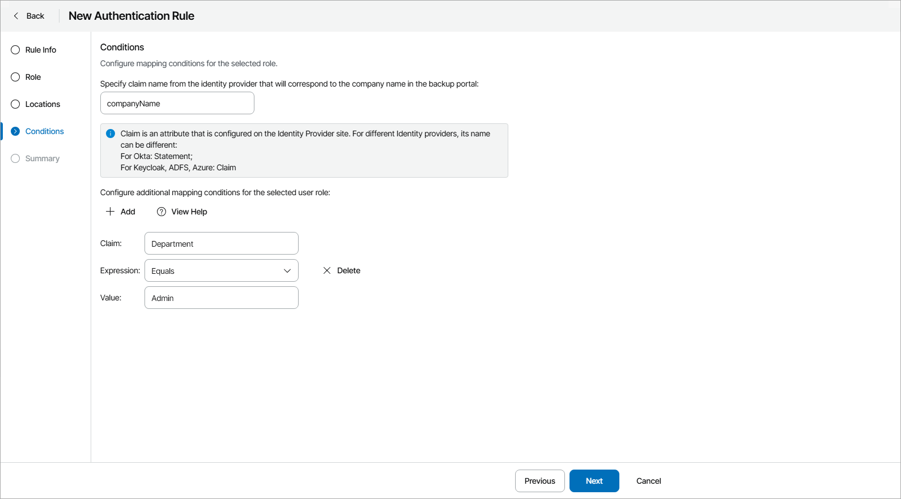](images/azure_mapping_rule.webp "Configure Mapping Rule")

1. Review the configured mapping rule and click Finish.
2. In the configuration menu on the left, click Security and open the Single Sign-On tab.
3. From the Configuration drop-down list, select Test Login.

Veeam Service Provider Console will complete the identity provider configuration and perform a trial authorization.

