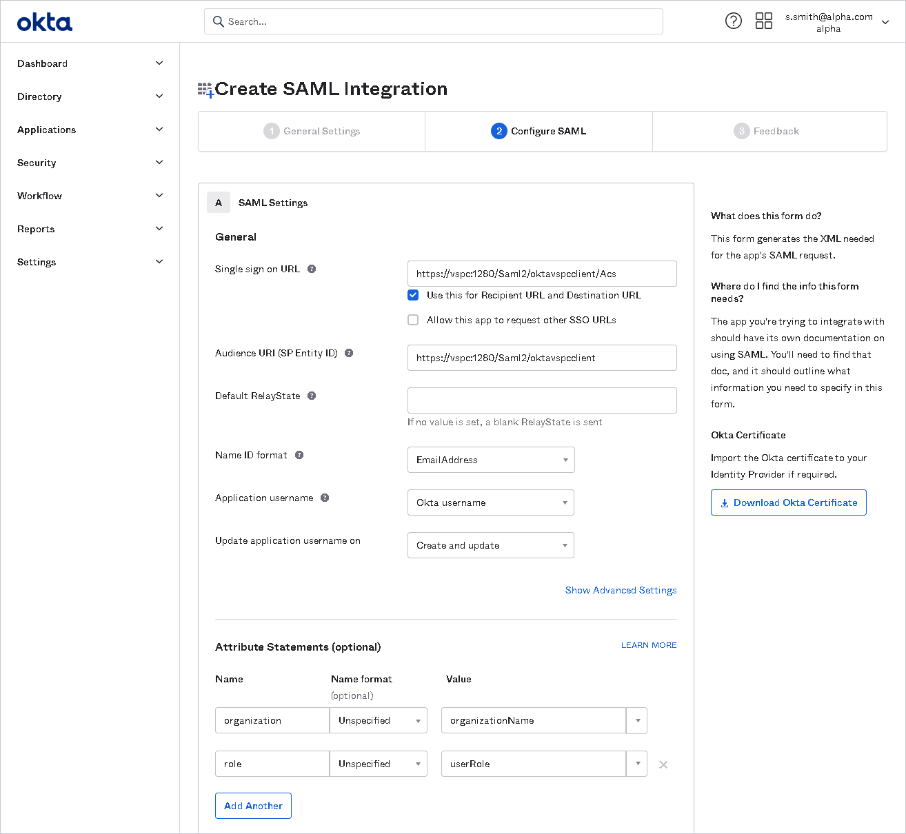
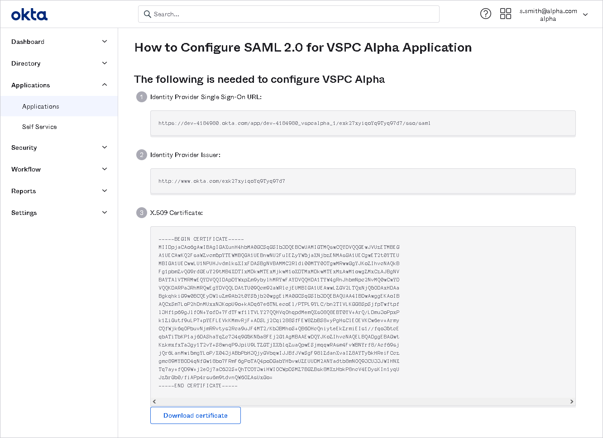
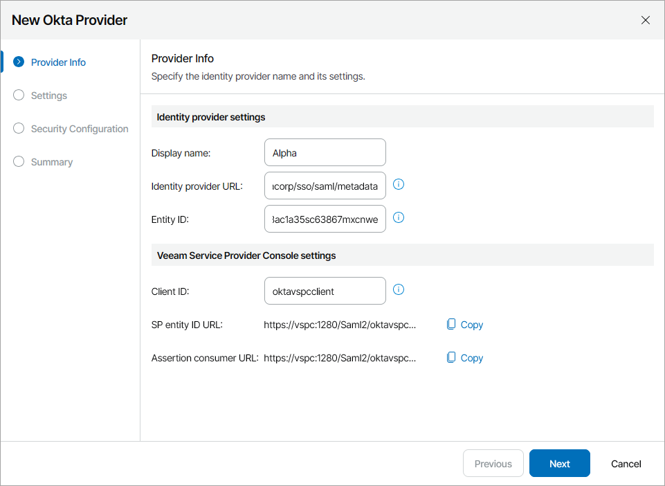

# Configuring SSO for Okta Workforce Identity

To configure SSO authentication with Okta Workforce Identity:

1. Log in to Veeam Service Provider Console.

For details, see [Accessing Veeam Service Provider Console](access_vac.md).

1. At the top right corner of the Veeam Service Provider Console window, click Configuration.
2. In the configuration menu on the left, click Roles & Users.
3. On the Single Sign-On tab, click New and select Okta from the drop-down list.

The identity provider configuration wizard will open.

1. At the Provider Info step of the wizard, specify general information on the IdP:

* In the Display name field, specify the IdP name that will be displayed in the IdP list on the Single Sign-On tab.
* Click SP entity ID link to generate entity ID URL based on the Client ID value.

Save the link locally.

If you apply changes to Client ID value after link generation, click New link.

* Click Create Assertion consumer link to generate assertion consumer service URL based on the Client ID value.

Save the link locally.

If you apply changes to Client ID value after link generation, click New link.

1. Access Okta Workforce Identity console.
2. In the menu on the left, click Applications and select Applications.

The Applications page will open.

1. Click Create App Integration.

The Create a new app integration window will open.

1. Select SAML 2.0.

The Create SAML Integration wizard will open.

1. At the General Settings step of the wizard, in the App Name field, specify the name of the integration with Veeam Service Provider Console.
2. At the Configure SAML step of the wizard, specify the SAML integration settings:

* In the Single sign on URL field, insert the URL generated in the Assertion Consumer URL field at step 5.

* In the Audience URI (SP Entity ID) field, insert the URL generated in the SP Entity ID URL field at step 5.
* From the Name ID Format drop-down list, select EmailAddress.
* In the Attribute Statements section, configure user attributes:

* In the Name field, specify the name of the attribute.
* In the Value field, specify the attribute name that will be used to map the attribute to a Veeam Service Provider Console mapping rule claim.

User organization name attribute is required for Veeam Service Provider Console SSO authentication.You can add more attributes if needed.

1. At the Feedback step of the wizard, select I'm a software vendor. I'd like to integrate my app with Okta and click Finish.

The configuration page of the created integration will open.

1. On the Sign On tab, right click the Identity Provider metadata link and select Copy Link.
2. In Veeam Service Provider Console, insert the link into the Identity provider URL field.

1. In Okta, click View Setup Instructions.

The How to Configure SAML 2.0 page for <App Name> Application page will open.

1. Copy the Identity Provider Issuer link.
2. In Veeam Service Provider Console, insert the URL into the Entity ID field.

1. Follow steps 6-10 described in the [Adding Identity Providers](sso_idp.md#add_idp) section.
2. In Okta, navigate to the Assignments tab and add users that will have access to Veeam Service Provider Console.

