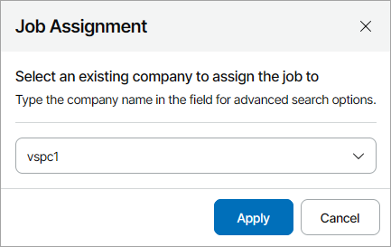

# Assigning Jobs to Companies

If a client company does not have a Veeam Backup & Replication server and you do not want to allocate hosted Veeam Backup & Replication server resources to the company, you can assign a configured Veeam Backup & Replication job to the company. After you assign the job to the company, the company users will be able to manage the job in the Client Portal. Note that the company and the reseller managing the company will be able to modify the assigned job settings only if the Veeam Backup & Replication server on which the job is configured and the repository to which the job is targeted are both assigned to the company.

If you assign to company a job that has a child job (such as a SQL database log backup, Oracle database log backup or PostgreSQL database log backup), both the parent and the child jobs will be assigned to the selected company.

Note that if a job processes only workloads that belong to one VMware Cloud Director organization and the organization is mapped to a Veeam Service Provider Console company, this job will be assigned to the mapped company automatically.

Assigning Jobs to Companies

To assign a Veeam Backup & Replication job to a client company:

1. Log in to Veeam Service Provider Console.

For details, see [Accessing Veeam Service Provider Console](access_vac.md).

1. In the menu on the left, click Backup Jobs.
2. Open the necessary tab:

* Virtual Machines > Virtual Infrastructure — select this tab to assign VM protection jobs (Backup, Replication, SureBackup, Backup copy, Backup to tape, VM copy, Storage snapshot, CDP policy)
* Data Backup > Virtual Infrastructure — select this tab to assign file protection jobs (File share backup, File share backup copy, File copy, File to tape)
* Data Backup > Object Storage — select this tab to assign object storage jobs (Object storage data backup, Object storage data backup copy)
* Computers > Managed by Backup Server — select this tab to assign monitored Veeam backup agent jobs

1. Select the necessary jobs in the list.
2. At the top of the jobs list, click Assign to Company.

Alternatively, you can right-click the necessary job and select Assign to Company.

1. In the Job Assignment window, select a client company to which you want to assign the job.

1. Click Apply.

