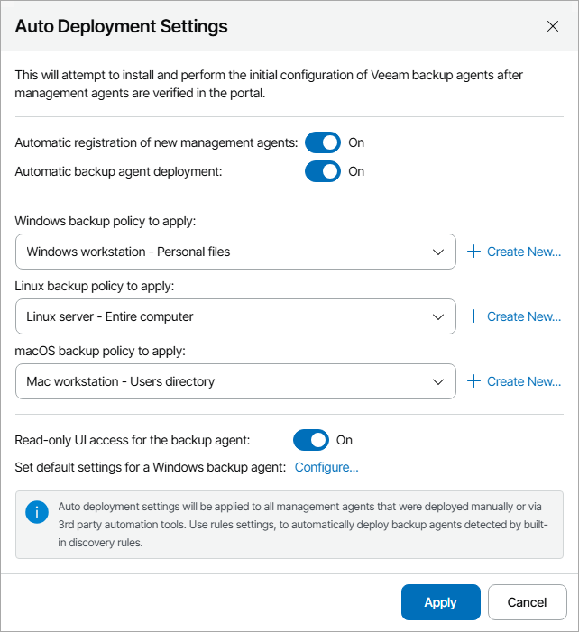

# Installing Veeam Backup Agents Automatically

If you install Veeam Service Provider Console management agents outside Veeam Service Provider Console ([manually](deploy_management_agents.md) or [using 3rd party automation tools](deploy_management_agents_gpo.md)), you can configure auto deployment settings. Auto deployment settings define whether Veeam Service Provider Console must automatically register new management agents, and whether registered management agents must automatically install Veeam backup agent on hosting computers and assign a backup policy.

|  |
| --- |
| Note: |
| * If the computer on which you install Veeam Service Provider Console management agent has Veeam backup agent running in Unmanaged mode (Free mode), Veeam Service Provider Console will automatically switch this Veeam backup agent to Managed mode, assign the required number of licensing units to it and assign a backup policy. The number of used and total licensing units in the Veeam Service Provider Console license pool will be updated. * You can install Veeam Agent for Microsoft Windows version 13 or later only on computers running 64-bit version of the Microsoft Windows OS. For computers running 32-bit version of the Microsoft Windows OS, the latest available version of Veeam Agent for Microsoft Windows is 6.1. * You cannot install Veeam Agent for Linux on a computer where Linux Veeam Backup & Replication is deployed. |

Prerequisites

Before you install Veeam backup agents, make sure that:

* The computers on which you plan to install Veeam backup agents are powered on.
* The computers on which you plan to install Veeam backup agent have access to the Internet.
* [For Veeam Agent for Microsoft Windows] The computers on which you plan to install Veeam backup agents are configured to allow installation: the File and Printer Sharing (SMB-In) firewall rule must allow inbound traffic.
* [For Veeam Agent for Linux and Veeam Agent for Mac] You have the root account or any user account with super user privileges on all hosted and client computers.

Required Privileges

To perform this task, a user must have the following role assigned: Portal Administrator.

Configuring Auto Deployment Settings

To configure auto deployment settings:

1. Log in to Veeam Service Provider Console.

For details, see [Accessing Veeam Service Provider Console](access_vac.md).

1. In the menu on the left, click Discovery.
2. Open the Discovered Computers tab and navigate to Computers.
3. Click Change Settings to open the Auto Deployment Settings window.
4. Use the Automatic registration of new management agents toggle to specify whether Veeam Service Provider Console must accept connections from new Veeam Service Provider Console management agents.

* Set the toggle to On if Veeam Service Provider Console must accept connections from new management agents.

In this case, when a new management agent connects to Veeam Service Provider Console, Veeam Service Provider Console will automatically register this agent.

* Set the toggle to Off if Veeam Service Provider Console must not accept connections from new management agents.

In this case, when a new management agent connects to Veeam Service Provider Console, Veeam Service Provider Console will display this agent in the list of discovered computers but will not register it. To register the agent, you must manually accept the agent connection. For details, see [Accepting and Rejecting Management Agent Connections](accept_reject_connections.md).

1. [For Veeam Agent for Microsoft Windows and Veeam Agent for Linux]Use the Automatic backup agents deployment toggle to specify whether management agents must automatically install Veeam backup agent after registration with Veeam Service Provider Console.

* Set the toggle to On if after registration (either automatic or manual) management agents must download from the Veeam Installation Server the Veeam backup agent setup file, install Veeam backup agent and assign the backup policy specified in the auto deployment settings.
* Set the toggle to Off if after registration management agents must not automatically install Veeam backup agent.

1. In the Windows/Linux/macOS backup policy to apply lists, select backup policies that must be assigned to configure Veeam backup agent job settings after automatic software deployment. Note that for automatic deployment you can assign only public and predefined backup policies.

If you do not want to configure backup job settings after installation, choose No policy from the list.

To create a new backup policy, click the Create New link. For details on backup policies, see [Configuring Backup Policies](configure_backup_policies.md).

Note that you cannot assign a backup policy targeted to a Veeam Cloud Connect repository to a hosted Veeam backup agent.

1. Use the Read-only UI access for the backup agent toggle to enable read-only access mode for Veeam backup agents.

* Set the toggle to On if the read-only access mode must be enabled immediately after deploying Veeam backup agents.
* Set the toggle to Off if the read-only access mode must not be enabled after deploying Veeam backup agents.

For details on the read-only access mode for Veeam backup agents, see [Enabling Read-Only Access Mode](enable_read_only_mode.md).

1. [For Veeam Agent for Microsoft Windows]To push global settings for Veeam backup agents, click Configure and specify default global settings for Veeam backup agents. For details on the global settings for Veeam backup agents, see [Configuring Global Settings for Veeam Agent for Microsoft Windows](configure_backup_agent_settings.md).
2. Click Apply.

Configuration Example

Consider the following configuration example for automatic deployment:

* Automatic registration of new management agents: On
* Automatic backup agents deployment: On
* Windows backup policy to apply: Windows server - Entire computer
* Read-only User access: Off
* Default Veeam backup agent settings: Disable Control Panel notifications, Disable backup over metered connection

With this automatic deployment configuration, as soon as a new management agent is installed and configured to communicate with Veeam Service Provider Console, the agent will be registered with Veeam Service Provider Console, and will attempt to install Veeam Agent for Microsoft Windows.

If installation is successful, the agent will configure the Veeam Agent for Microsoft Windows job settings in accordance with the Windows server - Entire computer backup policy. Read-only access mode will not be enabled. Control Panel notifications will be disabled. Backup over metered Internet connection will be disabled.

