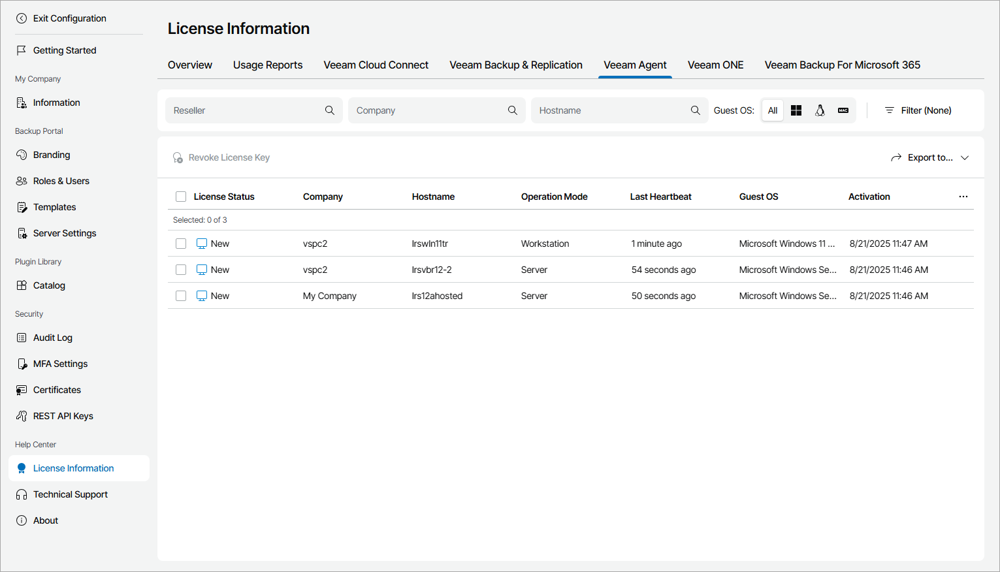

# Veeam Agent

The Veeam Agent view provides a list of Veeam backup agents managed in Veeam Service Provider Console, and information about their license status.

To narrow down the list of Veeam backup agents, you can use the following filters:

* Reseller — search the list of Veeam backup agents servers by name of a reseller who manages the company.
* Company — search Veeam backup agents by company name.
* Hostname — search Veeam backup agents by host name.
* Guest OS — limit the list of Veeam backup agents by OS type (Windows, Linux, macOS).
* License status — limit the list of Veeam backup agents by license status (Licensed, New (Trial), Licensed (Grace period)).
* Operation mode — limit the list of Veeam backup agents by operation mode (Server, Workstation).
* Platform — limit the list of Veeam backup agents by platform type (Physical, Virtual, Cloud).
* Connection status — limit the list of Veeam backup agents by connection status (Online, Offline).

Each Veeam backup agent in the list is described with a set of properties. By default, some properties in the list are hidden. To display additional properties, click More details on the right of the list header and choose properties that must be displayed.

* License Status — license status of Veeam backup agent (Licensed, Licensed (Grace period), New (Trial)).

For details on Veeam backup agent license statuses, see [Veeam Backup Agent License Statuses](exceeding_license_limit.md#status).

* Reseller — name of a reseller who manages the company to which Veeam backup agent belongs.
* Company — name of a company to which Veeam backup agent belongs.
* Site — name of the Veeam Cloud Connect site on which the company is registered.
* Location — name of a location to which Veeam backup agent belongs.
* Status — connection status of Veeam backup agent (Online, Offline).
* Hostname — name of a computer on which Veeam backup agent is deployed.
* Operation Mode — backup job operation mode (Workstation, Server).
* Platform — computer platform on which Veeam backup agent is deployed (Physical, Virtual, Cloud).
* Last Heartbeat — time period since a Veeam Service Provider Console management agent sent the latest heartbeat to Veeam Service Provider Console.
* Backup Agent Version — version of Veeam backup agent deployed on a managed computer.
* Guest OS — guest OS on a managed computer.
* Activation — date and time when Veeam backup agent was activated.

Exporting Veeam Backup Agent License Details

You can export Veeam backup agent license details to a a CSV or XML file:

1. Apply the necessary filters to display in the list Veeam backup agents you want to export.
2. Click Export to and choose a format of the exported data:

* CSV — choose this option to structure exported data as a CSV file.
* XML — choose this option to structure exported data as an XML file.

The file with exported data will be saved to the default download location on your computer.

