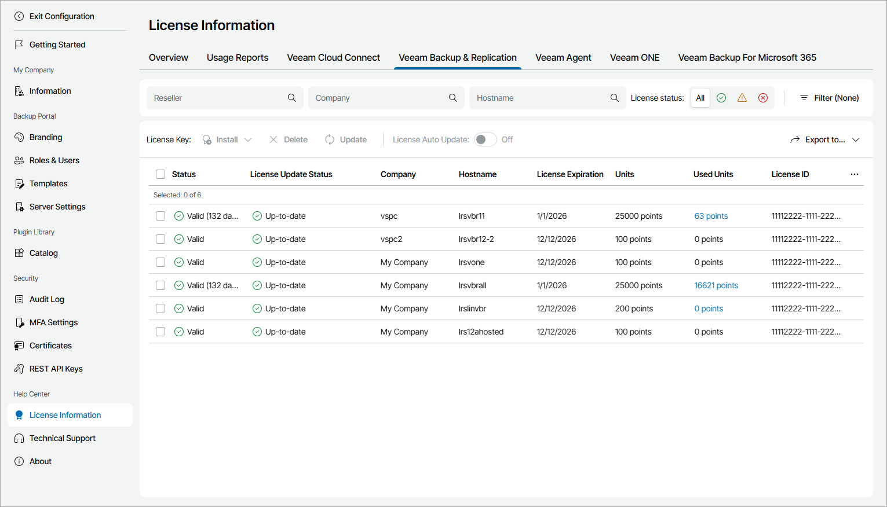

# Veeam Backup & Replication

The Veeam Backup & Replication view provides a list of Veeam Backup & Replication servers managed in Veeam Service Provider Console, and information about their license status.

To narrow down the list of Veeam Backup & Replication servers, you can use the following filters:

* Reseller — search Veeam Backup & Replication servers by name of a reseller who manages the server.
* Company — search Veeam Backup & Replication servers by company name.
* Hostname — search Veeam Backup & Replication servers by host name.
* License status — limit the list of Veeam Backup & Replication servers by license status (Valid, Warning, Error).

* Type — limit the list of Veeam Backup & Replication servers by type of license installed on the server (Community, Rental, Subscription, Perpetual).
* Format — limit the list of Veeam Backup & Replication servers by format of a licensed unit (Instances, Sockets).

Each Veeam Backup & Replication server in the list is described with a set of properties. By default, some properties in the list are hidden. To display additional properties, click the ellipsis on the right of the list header and choose properties that must be displayed.

* Status — status of license installed on the Veeam Backup & Replication server (Valid, Warning, Error).

* License Update Status — status of the latest license update.

* Reseller — name of a reseller who manages the company to which Veeam Backup & Replication server belongs.

* Company — client company to which a backup server belongs.

* Site — name of the Veeam Cloud Connect site on which the company is registered.

* Location — location to which a backup server belongs.
* Hostname — name of a backup server for which license details are provided.
* Backup Server Version — version of Veeam Backup & Replication installed on a server.
* License Edition — license edition (Standard, Enterprise, Enterprise Plus).
* License Expiration — date when a license will expire.

* Units — number of instances or points included in a license file.
* Used Units — number of instances or points consumed by client backups and replicas.

Click a link in the Used Units column to view detailed information on licensed workloads, used instances or points and new workloads count.

* (For Per-Socket licenses) Sockets — total number of sockets covered by a license that is installed on a backup server.

* (For Per-Socket licenses) Used Sockets — total number of used sockets.

* Licensee Company — name of the user or company to which the license was issued.
* Email — email address of the contact person in a company.

* License Type — license type (Rental, Subscription, Evaluation, NFR, Perpetual).

* Support ID — support ID required for contacting Veeam Customer Technical Support.

* Support Expiration — date when support contract will expire.

* Package — license package.

* License ID — ID of the license file.
* Capacity — amount of file share data (in TB) that the license allows protecting.
* Used Capacity — amount of file share data (in TB) protected by the backup server.

* License Auto Update — indicates if license auto update is enabled.

Exporting Veeam Backup & Replication License Details

You can export Veeam Backup & Replication license details to a CSV or XML file:

1. Apply the necessary filters to display in the list Veeam Backup & Replication servers you want to export.
2. Click Export to and choose a format of the exported data:

* CSV — choose this option to structure exported data as a CSV file.
* XML — choose this option to structure exported data as an XML file.

The file with exported data will be saved to the default download location on your computer.

