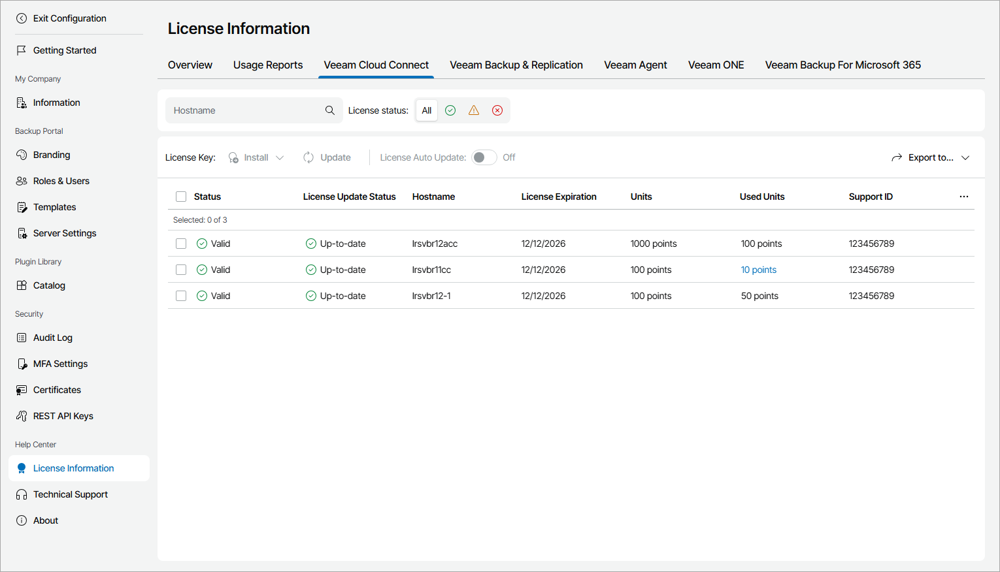

# Veeam Cloud Connect

The Veeam Cloud Connect view provides a list of Veeam Cloud Connect servers connected to Veeam Service Provider Console, and information about their license status.

To narrow down the list of Veeam Cloud Connect servers, you can use the following filters:

* Hostname — search the list of Veeam Cloud Connect servers by the name of the server.
* License status — limit the list of Veeam Cloud Connect servers by status of the installed license (Valid, Warning, Error).

Each Veeam Cloud Connect server in the list is described with a set of properties. By default, some properties in the list are hidden. To display additional properties, click the ellipsis on the right of the list header and choose properties that must be displayed.

* Status — status of license installed on the Veeam Cloud Connect server (Valid, Warning, Error).

* License Update Status — status of the latest license update.
* Hostname — name of the Veeam Cloud Connect server.
* Cloud Connect — indicates if the Cloud Connect functionality is enabled in the license file.

* Edition — license edition (Standard, Enterprise, Enterprise Plus).

* License Expiration — date when a license will expire.
* Units — number of instances or points included in a license file.
* Used Units — number of instances or points consumed by client backups and replicas.

Click a link in the Used Units column to view detailed information on licensed workloads, used instances or points and new workloads count.

* Licensee Company — name of the user or company to which the license was issued.
* Email — email address of the contact person in a company.
* License Type — license type (Rental, Subscription, Evaluation, NFR).

* Support Expiration — date when support will expire.

* Support ID — support ID required for contacting Veeam Customer Technical Support.

* Package — license package.

* License ID — id of the license file.
* License Auto Update — indicates if license auto update is enabled.
* Version — build version of Veeam Cloud Connect server.

Exporting Veeam Cloud Connect License Details

You can export Veeam Cloud Connect license details to a a CSV or XML file:

1. Apply the necessary filters to display in the list Veeam Cloud Connect servers you want to export.
2. Click Export to and choose a format of the exported data:

* CSV — choose this option to structure exported data as a CSV file.
* XML — choose this option to structure exported data as an XML file.

The file with exported data will be saved to the default download location on your computer.

