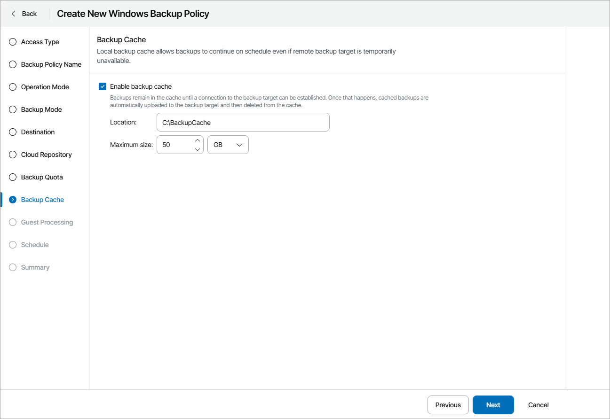

# Step 16. Choose Local Backup Cache Location

The Backup Cache step of the wizard is available if you have chosen to save backup files on a remote storage: in a network shared folder, on a Veeam Backup & Replication repository or cloud repository.

Specify backup cache settings:

1. Select the Enable backup cache check box.
2. In the Location field, specify a path to the folder on the protected computer in which backup cache files must be stored.
3. In the Maximum size field, specify the size for the backup cache.

When defining the size of the backup cache, consider the following:

* Each full backup file may consume about 50% of the backed-up data size.
* Each incremental backup file may consume about 10% of the backed-up data size.

|  |
| --- |
| Tip: |
| For the backup cache, you can use a dedicated removable storage device, for example, a USB key or an SD card. In this case, the backup cache will not consume disk space on the local drive of the managed computer. |

For details on backup cache, see section [Backup Cache](https://helpcenter.veeam.com/docs/agentforwindows/userguide/backup_cache.html) of the Veeam Agent for Microsoft Windows User Guide.

