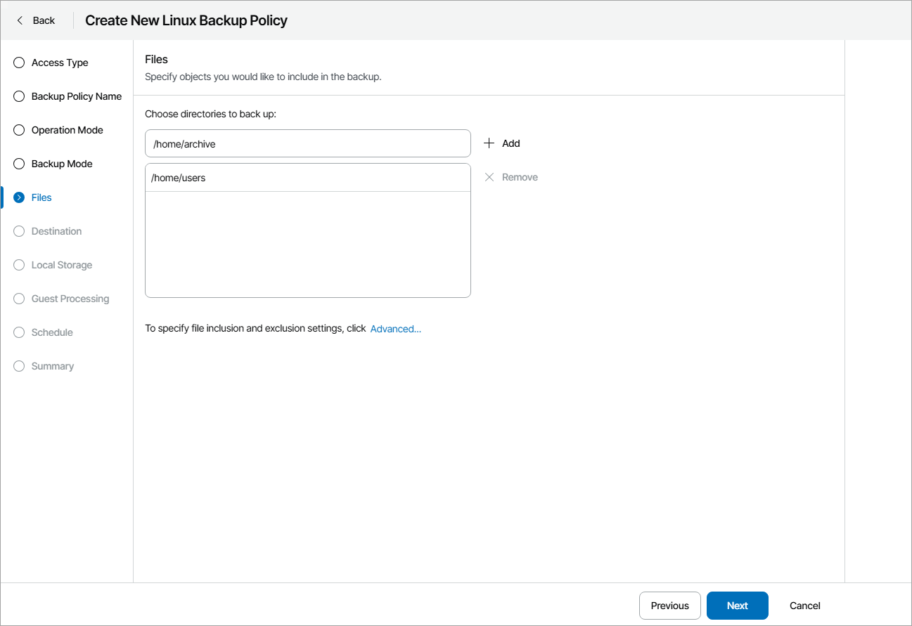
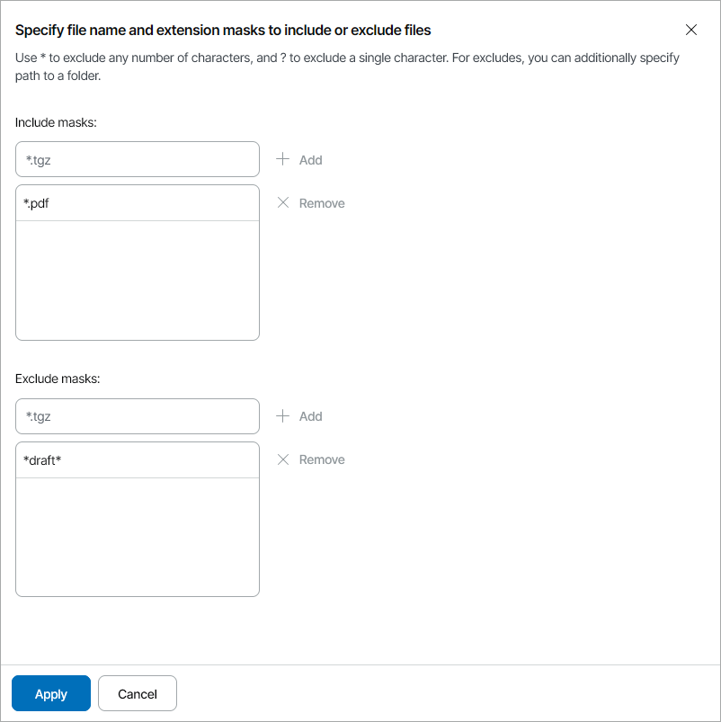

# Step 7. Choose Directories to Back Up

The Files step of the wizard is available if at the [Backup Mode](choose_backup_mode_lin.md) step you have chosen to create a file-level backup.

At this step of the wizard, you can define which directories with files you want to include in the backup. The specified backup scope settings will apply to all computers that are added to the backup job.

To specify directories to back up:

1. In the Choose directories to back up field, type the path to a directory that you want to back up and click Add.
2. Repeat step 1 for all directories that you want to back up.

Configuring Filters

To include or exclude files of a specific type in/from the backup scope, you can configure filters:

1. At the Files step of the wizard, click Advanced.
2. Specify include and exclude filters for files you want to back up:

* In the Include masks field, specify file name or mask for file types that you want to back up, for example, Report.pdf or \*filename\*. Veeam backup agent will create a backup only for selected files. Other files will not be backed up.
* In the Exclude masks field, specify directory path or a file name or mask for file types that you do not want to back up, for example, OldReports.tar.gz or \*.odt. Veeam backup agent will back up all files except files of the specified type.

1. Click Add.
2. Repeat steps 2–3 for each mask that you want to add.

You can use a combination of include and exclude masks. Note that exclude masks have a higher priority than include masks. For example, you can specify masks in the following way:

* Include mask: \*.pdf
* Exclude mask: \*draft\*

Veeam backup agent will include in the backup all files of the PDF format that do not contain 'draft' in their names.

