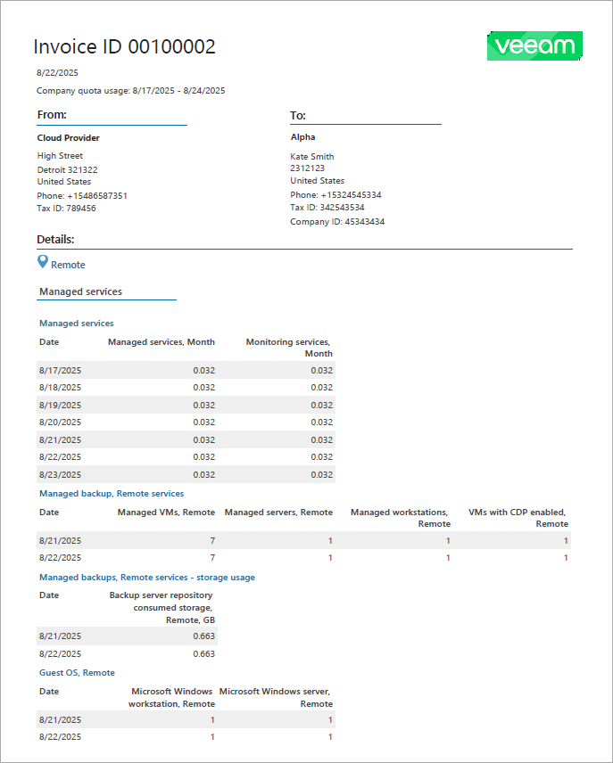

# Choosing Invoice Type

Veeam Service Provider Console offers three types of invoices:

* Summary invoice provides information about consumed services and their cost.
* Detailed invoice provides information about consumed services and their cost. In addition, a detailed invoice provides information about services consumed by each company location on each day of a specified period.
* Quota usage report provides information about services consumed by each company location on each day of a specified period. A quota usage report does not include cost details.

By default, Veeam Service Provider Console generates summary invoices for all companies. Before sending or scheduling invoices, you can choose what type of invoices must be generated for each company.

Required Privileges

To perform this task, a user must have one of the following roles assigned: Portal Administrator, Site Administrator, Portal Operator.

Choosing Invoice Type

To choose the invoice type for one or more companies:

1. Log in to Veeam Service Provider Console.

For details, see [Accessing Veeam Service Provider Console](access_vac.md).

1. In the menu on the left, click Invoices.
2. Open the Configurations tab.
3. Select the necessary companies in the list and click Invoice Parameters.
4. In the Invoice Parameters window, choose what type of invoices must be generated for selected companies.

* Summary only — choose this option to generate summary invoices.
* Detailed report — choose this option to generate detailed invoices.

1. Click Apply.

Summary Invoice

A summary invoice provides information about consumed services and their cost.

An example of a summary invoice is shown below.

A summary invoice includes the following information:

* Invoice ID — number that uniquely identifies an invoice.
* Generation date — date when an invoice was generated. Date format depends on the date and time settings of the Veeam Service Provider Console server.
* Company quota usage — billing period.
* Payment due by — date by which a company must make a payment. The payment date is one month after the invoice generation date. If an invoice is not paid by the due date, its status is changed to Overdue.
* From — name and contact details of the service provider.
* To — name and contact details of a managed company.
* Summary — charge rate information specified in the subscription plan, total gross cost, tax and discount, as well as the invoice total. This section also includes the cost breakdown for all types of provided services, breakdown for services consumed by each company location and the amount of services provided free of charge.
* License usage — license charge rate information specified in the subscription plan, total gross cost, tax and discount, as well as the invoice total. This section also includes the cost breakdown for all types of consumed licenses, breakdown for services consumed by each company location and the amount of services provided free of charge.

Detailed Invoice

A detailed invoice provides information about consumed services and their cost. In addition, a detailed invoice provides information about services consumed by each company location on each day of a specified period.

An example of a detailed invoice is shown below.

A detailed invoice includes the following information:

* Invoice ID — number that uniquely identifies an invoice.
* Generation date — date when an invoice was generated. Date format depends on the date and time settings of the Veeam Service Provider Console server.
* Company quota usage — billing period.
* Payment due by — date by which a company must make a payment. The payment date is one month after an invoice generation date. If an invoice is not paid by the due date, its status is changed to Overdue.
* From — name and contact details of the service provider.
* To — name and contact details of a managed company.
* Summary — charge rate information specified in the subscription plan, total gross cost, tax and discount, as well as the invoice total. This section also includes the cost breakdown for all types of provided services, breakdown for services consumed by each company location and the amount of services provided free of charge.
* License usage — license charge rate information specified in the subscription plan, total gross cost, tax and discount, as well as the invoice total. This section also includes the cost breakdown for all types of consumed licenses, breakdown for services consumed by each company location and the amount of services provided free of charge.
* Details — information about services consumed by each company location on each day of the quota usage period.

Quota Usage Report

A quota usage report provides information about services consumed by each company location on each day of a specified period. A quota usage report does not include service cost details.

An example of a quota usage report is shown below.

A quota usage report includes the following information:

* Generation date — date when a report was generated. Date format depends on the date and time settings of the Veeam Service Provider Console server.
* Company quota usage — period for which quota usage details are provided.
* From — name and contact details of the service provider.
* To — name and contact details of a managed company.
* Details — information about services consumed by each company location on each day of the quota usage period.

