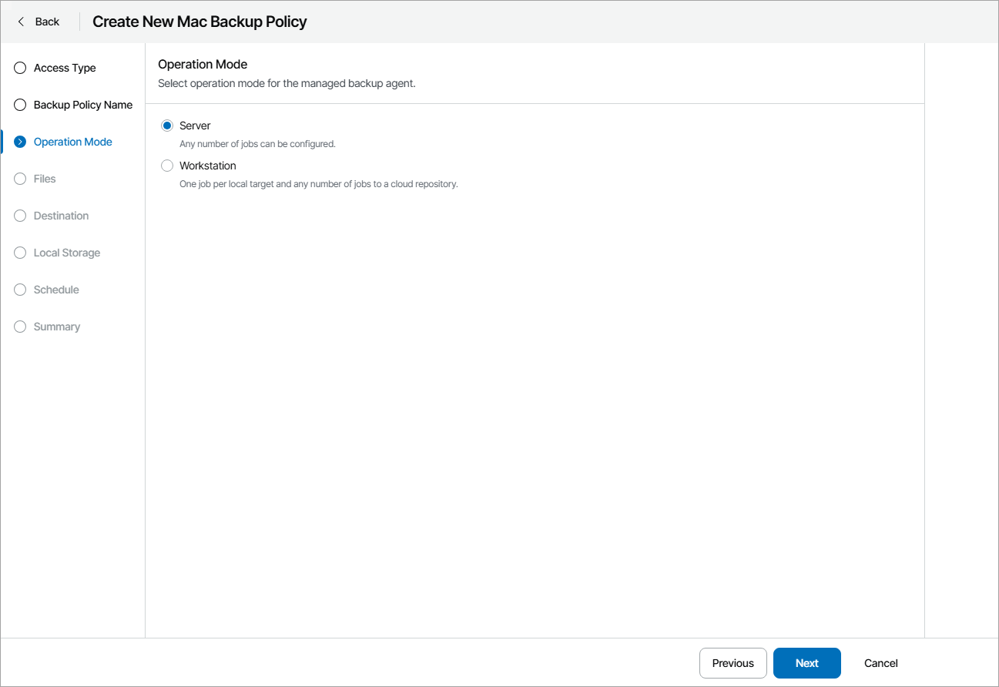

# Step 4. Choose Backup Agent Operation Mode

At the Operation Mode step of the wizard, select the operation mode:

* Server — allows you to configure any number of backup jobs.
* Workstation — allows you to create one backup job with local target and any number of backup jobs with cloud target.

