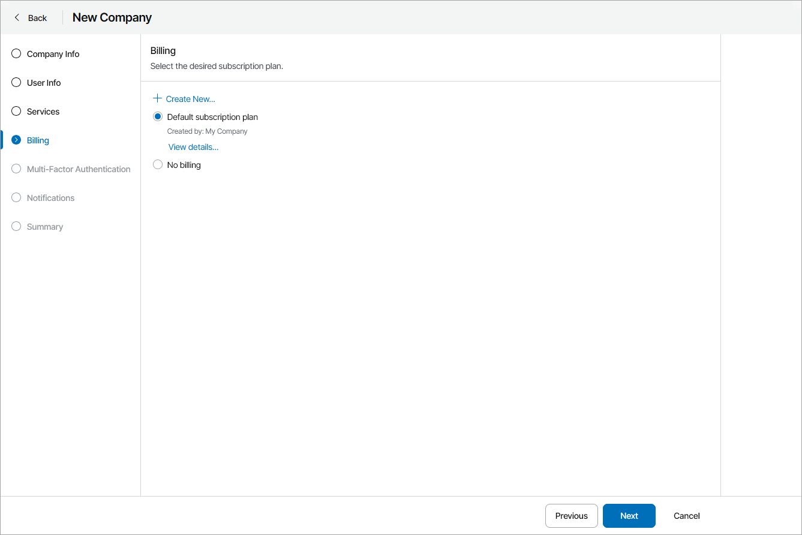

# Step 5. Choose Subscription Plan

At the Billing step of the wizard, select a subscription plan that must be assigned to a company. To see details of the selected subscription plan, click the View details link.

The costs of services provided to the company will be calculated based on this subscription plan. You can select an existing subscription plan in the list, select the No billing option to set zero prices for all products, or click Create New to create a new subscription plan. For details on creating subscription plans, see [Creating Subscription Plans](create_subscriptions.md).

