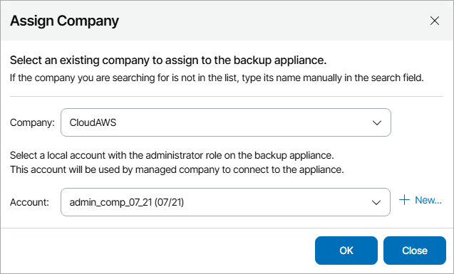

# Assigning Company to Appliance

If you want to allow client company to store protected Veeam Backup for Public Clouds workloads in your cloud backup infrastructure, you can assign an appliance to a managed client company. Company to which the appliance is assigned will be able to create and manage Veeam Backup for Public Clouds jobs and perform restore of backed up files.

Note that you can assign company only to verified appliances. For details, see [Verifying Appliances](clouds_verify_certificate.md).

To assign a company to appliance:

1. Log in to Veeam Service Provider Console.

For details, see [Accessing Veeam Service Provider Console](access_vac.md).

1. At the top right corner of the Veeam Service Provider Console window, click Configuration.
2. In the configuration menu on the left, click Catalog.
3. Click the Veeam Backup for Public Clouds plugin tile.
4. In the menu on the left, click Appliances.
5. Select the necessary appliance in the list.
6. At the top of the list, click Assign Company.
7. In the Company list, select company which you want to assign to the appliance.

To revoke appliance assignment from a client company, select Revoke.

1. In the Account list, select user account that will be assined Company Administrator permissions on the selected appliance.

To create a new user account, click New and specify account credentials.

1. Click OK.

