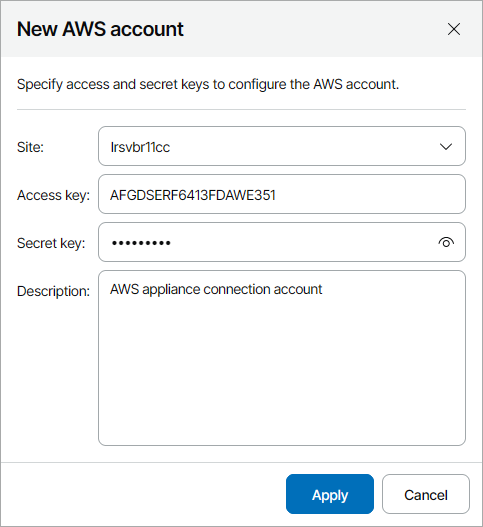

# Adding Amazon Web Services Accounts

In plugin, you can add Amazon Web Services connection accounts.

Prerequisites

Before you start adding Amazon Web Services accounts, consider requirements specified in the [Plug-In Permissions](https://helpcenter.veeam.com/docs/vbaws/guide/req_permissions.html) section of the Veeam Backup for AWS User Guide.

Creating Amazon Web Services Account

To create a new Amazon Web Services account:

1. Log in to Veeam Service Provider Console.

For details, see [Accessing Veeam Service Provider Console](access_vac.md).

1. At the top right corner of the Veeam Service Provider Console window, click Configuration.
2. In the configuration menu on the left, click Catalog.
3. Click the Veeam Backup for Public Clouds plugin tile.
4. In the menu on the left, click Accounts and navigate to Public Cloud.
5. At the top of the list, click New > Amazon Web Services.
6. In the New AWS Account window, specify account settings:

* In the Site field, select Veeam Cloud Connect site on which you want to register the account.
* In the Access key and Secret key fields, specify key ID and secret key for the account.
* In the Description field, specify account description.

1. Click Apply.

