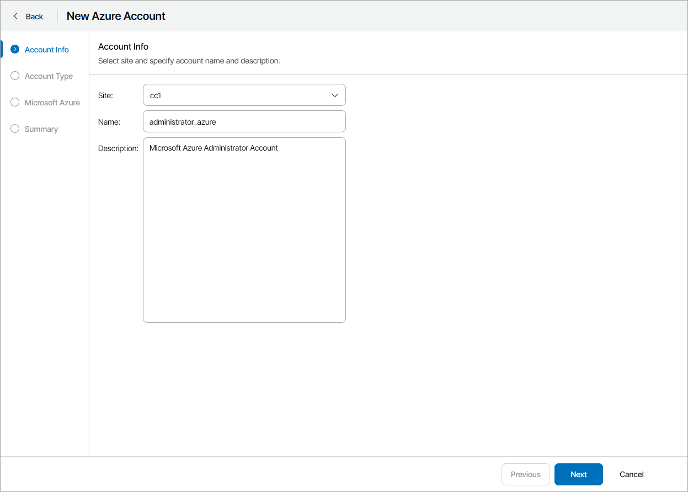
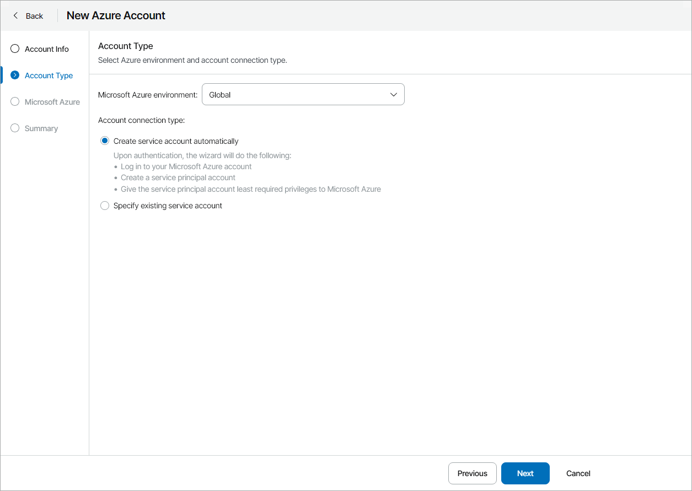
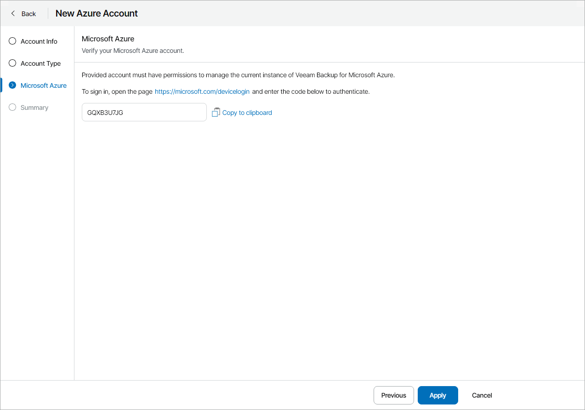
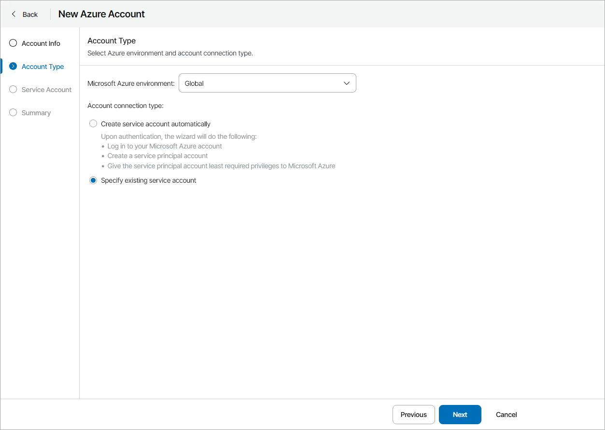
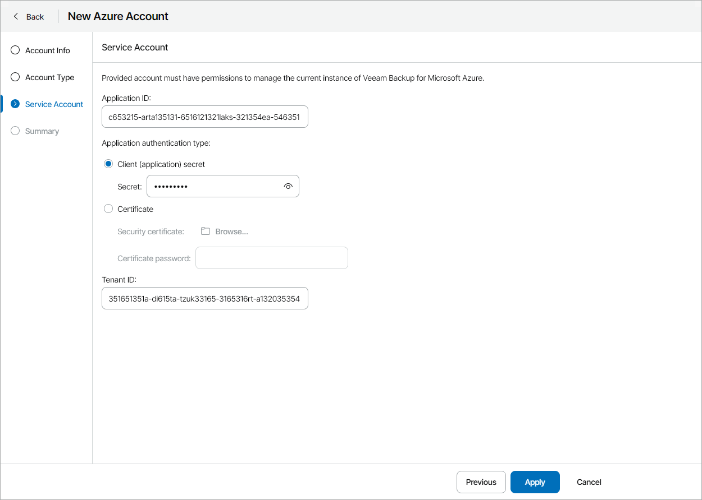

# Adding Microsoft Azure Accounts

In plugin, you can add Microsoft Azure connection accounts using one of the following ways:

* [Create new Microsoft Azure account](#vspc)
* [Connect an existing Microsoft Azure account](#exist_azure)

Prerequisites

Before you start adding Microsoft Azure accounts, consider requirements specified in the [Plug-In Permissions](https://helpcenter.veeam.com/docs/vbazure/guide/plugin_permissions.html) section of the Veeam Backup for Microsoft Azure User Guide.

Creating Microsoft Azure Account

To create a new Microsoft Azure account:

1. Log in to Veeam Service Provider Console.

For details, see [Accessing Veeam Service Provider Console](access_vac.md).

1. At the top right corner of the Veeam Service Provider Console window, click Configuration.
2. In the configuration menu on the left, click Catalog.
3. Click the Veeam Backup for Public Clouds plugin tile.
4. In the menu on the left, click Accounts and navigate to Public Cloud.
5. At the top of the list, click New > Microsoft Azure.

Veeam Service Provider Console will open the New Azure Account wizard.

1. At the Account Info step of the wizard, specify account settings:

* In the Site field, select Veeam Cloud Connect site on which you want to register the account.
* In the Name field, specify account name.
* In the Description field, specify account description.

1. At the Account Type step of the wizard, select the Microsoft Azure environment where the account will reside and choose Create service account automatically.

1. At the Microsoft Azure step of the wizard, log in to your Microsoft Azure account:

1. Click Copy to clipboard to copy an authentication code.
2. Click the Microsoft authentication portal link.

A web browser window will open.

1. On the Microsoft Azure device authentication page, paste the code that you have copied and sign in to Microsoft Azure.

Make sure to sign in with the user account that has the User Access Administrator or the Owner role. For details, see [Microsoft Docs](https://docs.microsoft.com/en-us/azure/active-directory/users-groups-roles/directory-assign-admin-roles).

1. Return to the wizard and click Next.

1. On the Summary step of the wizard, review the account settings and click Finish.

Adding Existing Microsoft Azure Account

You can connect an existing Microsoft Azure service account in Veeam Service Provider Console plugin:

1. Log in to Veeam Service Provider Console.

For details, see [Accessing Veeam Service Provider Console](access_vac.md).

1. At the top right corner of the Veeam Service Provider Console window, click Configuration.
2. In the configuration menu on the left, click Catalog.
3. Click the Veeam Backup for Public Clouds plugin tile.
4. In the menu on the left, click Accounts and navigate to Public Cloud.
5. At the top of the list, click New > Microsoft Azure.

Veeam Service Provider Console will open the New Azure Account wizard.

1. At the Account Info step of the wizard, specify account settings:

1. In the Site field, select Veeam Cloud Connect site for which you want to create the account.
2. In the Name field, specify account name.
3. In the Description field, specify account description.

1. At the Account Type step of the wizard, select the Microsoft Azure environment where the account will reside and choose Specify existing service account.

1. At the Service Account step of the wizard, specify account credentials:

1. In the Application ID field, enter the application identifier. You can find the identifier in the application settings of your Azure Active Directory. For more information, see [Microsoft Docs](https://learn.microsoft.com/en-us/azure/active-directory/develop/howto-create-service-principal-portal#get-values-for-signing-in).

The specified Azure AD application must have either a custom role or the Contributor and Key Vault Crypto Officer Azure built-in roles assigned. If the AD application has a custom role assigned, make sure the role has the [permissions required to perform backup and restore operations](https://helpcenter.veeam.com/docs/vbazure/guide/service_account_permissions.html). For details on how to create Azure custom roles, see [Microsoft Docs](https://docs.microsoft.com/en-us/azure/role-based-access-control/tutorial-custom-role-powershell).

1. Choose authentication type for the account:

* To configure a password-based authentication, select the Client (application) secret option and provide the secret string. For details on obtaining the secret string, see [Microsoft Docs](https://docs.microsoft.com/en-us/azure/active-directory/develop/howto-create-service-principal-portal#certificates-and-secrets).
* To configure a certificate-based authentication, select the Certificate option, upload the required security certificate and provide the certificate password.

1. In the Tenant ID field, enter a tenant ID of the Azure AD application.

You can find the tenant ID in the application settings of your Azure Active Directory. For details, see [Microsoft Docs](https://docs.microsoft.com/en-us/azure/active-directory/develop/howto-create-service-principal-portal#get-values-for-signing-in).

1. At the Summary step of the wizard, review the account settings and click Finish.

