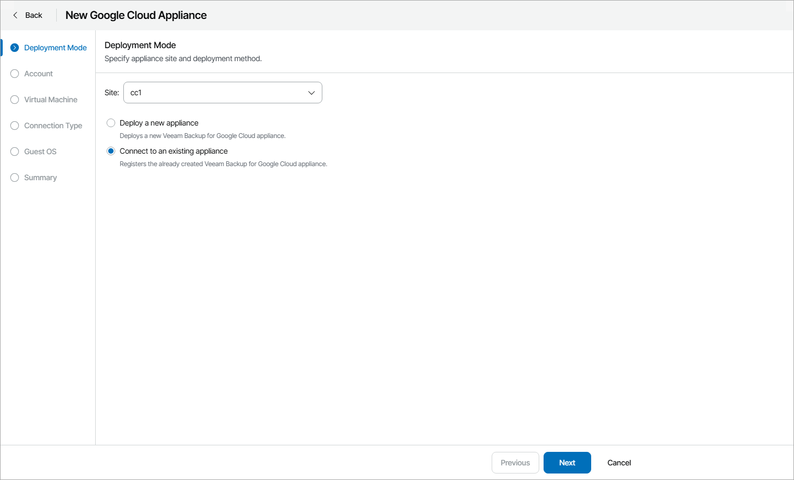
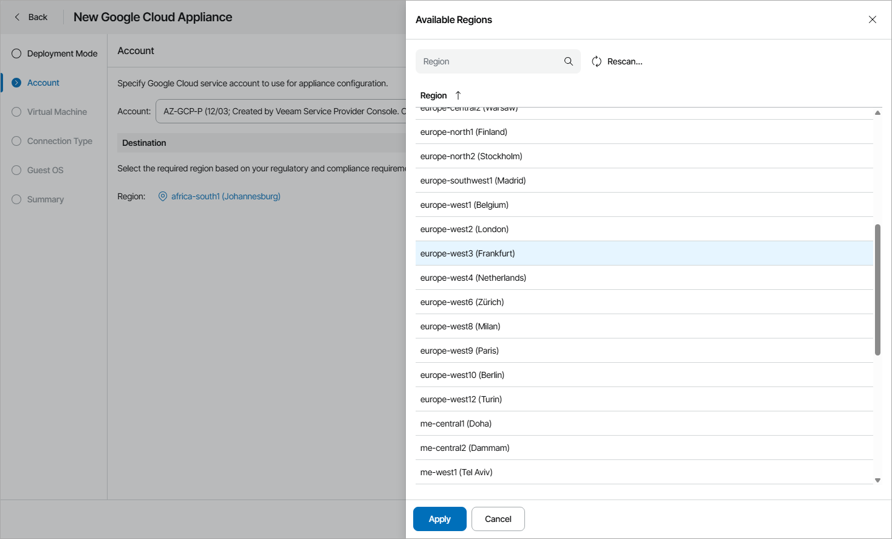
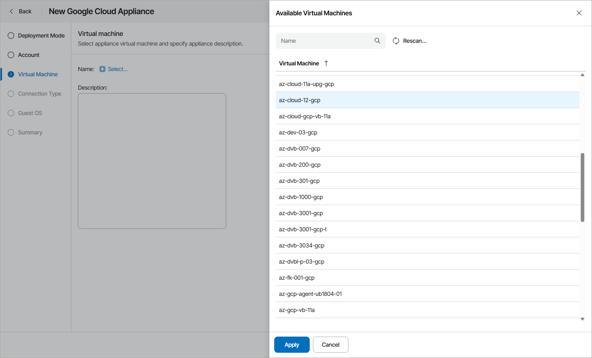
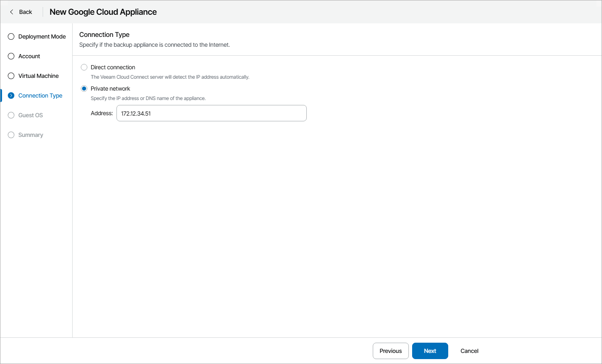
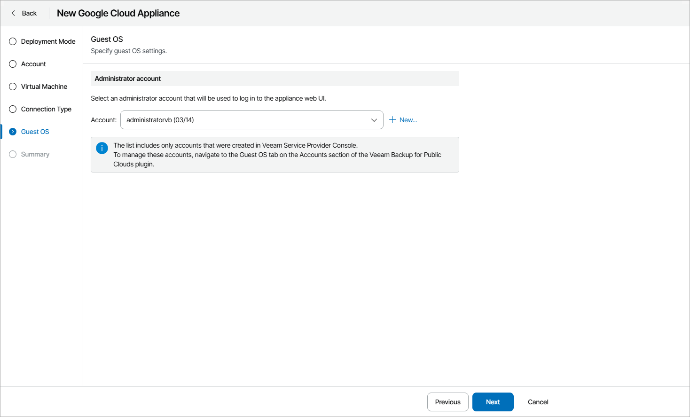

# Connecting to Existing Veeam Backup for Google Cloud Appliances

To connect Veeam Service Provider Console to an existing Veeam Backup for Google Cloud appliance:

1. Log in to Veeam Service Provider Console.

For details, see [Accessing Veeam Service Provider Console](access_vac.md).

1. At the top right corner of the Veeam Service Provider Console window, click Configuration.
2. In the configuration menu on the left, click Catalog.
3. Click the Veeam Backup for Public Clouds plugin tile.
4. In the menu on the left, click Appliances.
5. At the top of the list, click New and select Google Cloud.

Veeam Service Provider Console will open the New Google Cloud Appliance wizard.

1. At the Deployment Mode step of the wizard, specify Veeam Cloud Connect site on which you want to register the appliance and select Connect to an existing appliance.

1. At the Account step of the wizard, specify Google Cloud account settings:

1. From the Account list, select a Google Cloud deployment account that will be used for appliance configuration.

If you want to add a new account, click New. Veeam Service Provider Console will open the New Google Cloud Account wizard. For details, see [Adding Google Cloud Accounts](clouds_google_accounts.md).

1. In the Destination section, select Google Cloud region where the appliance resides.

1. At the Virtual Machine step of the wizard, select the virtual machine on which Veeam Backup for Google Cloud appliance is deployed:

1. Click Select.
2. In the Available Virtual Machines window, select the necessary VM and click Apply.
3. In the Description field, specify VM description.

1. At the Connection Type step of the wizard, choose whether the appliance is connected directly to the internet or located in a private network:

* If the appliance is connected directly to the internet, and you want the Veeam Cloud Connect server to be connected to the appliance also through the internet, select Direct connection. In this case, Veeam Cloud Connect server will detect the IP address of the Veeam Backup for Google Cloud appliance automatically.
* If the appliance is located in a private network and the Veeam Cloud Connect server is located in the same private network, or you want Veeam Cloud Connect server to connect to the appliance over Veeam PN, select Private network.

In the Address field, specify the private IP or DNS name of the Veeam Backup for Google Cloud appliance.

1. At the Guest OS step of the wizard, select account of a user with administrative privileges on the Veeam Backup for Google Cloud appliance (Service Provider Global Administrator account).

Note that the accounts list includes only accounts created in Veeam Service Provider Console. For details on creating guest OS accounts, see [Adding Guest OS Accounts](clouds_guest_accounts.md).

To create a new Service Provider Administrator account, click New. In the New Account window, specify account credentials and click Apply.

1. If the certificate installed on the Veeam Backup for Google Cloud appliance is not trusted, Veeam Service Provider Console will display a warning.

* To view detailed information about the certificate, click View.
* Click Connect to trust the certificate.

After the appliance is deployed, you will have to verify the certificate manually. For details, see [Verifying Appliances](clouds_verify_certificate.md).

* If you do not trust the certificate, click No. In this case, you will not be able to connect to the appliance.

1. At the Summary step of the wizard, review the appliance settings and click Finish.

Checking Deployment Results

To make sure that appliance deployment has completed successfully, complete the following steps:

1. Log in to Veeam Service Provider Console.

For details, see [Accessing Veeam Service Provider Console](access_vac.md).

1. At the top right corner of the Veeam Service Provider Console window, click Configuration.
2. In the configuration menu on the left, click Catalog.
3. Click the Veeam Backup for Public Clouds plugin tile.
4. In the menu on the left, click Appliances and find the necessary appliance in the list.
5. Check the value in the Deployment Status column.

If deployment was successful, the Deployment Status status must be Success.

1. Click a link in the Deployment Status column to display session details of the deployment procedure.

If the appliance was connected successfully but the Deployment Status status is Error, click Clear Logs to update the status.

