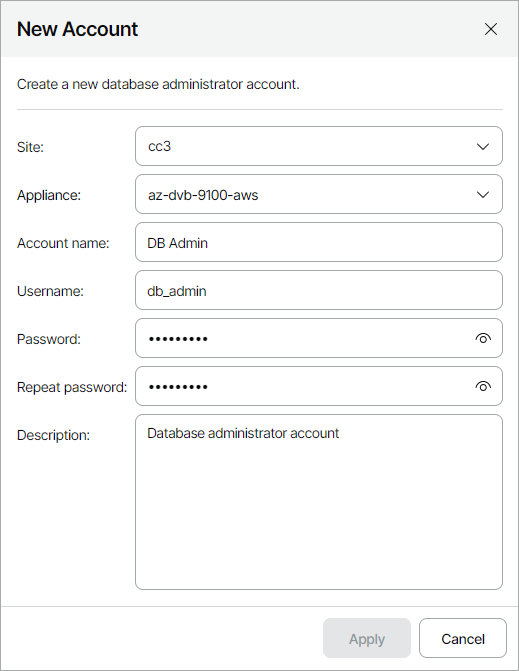

# Adding Databases Accounts

To add a new database administrator account:

1. Log in to Veeam Service Provider Console.

For details, see [Accessing Veeam Service Provider Console](access_vac.md).

1. At the top right corner of the Veeam Service Provider Console window, click Configuration.
2. In the configuration menu on the left, click Catalog.
3. Click the Veeam Backup for Public Clouds plugin tile.
4. In the menu on the left, click Accounts and navigate to Databases.
5. At the top of the list, click New.
6. In the New Account window, specify account settings:

* From the Site and Appliance drop-down lists, select Veeam Cloud Connect site and Veeam Backup for Public Clouds appliance on which you want to register the account.
* [For Google Cloud appliances] From the Database type drop-down list, select type of the database for which you want to register the account (PostgreSQL, MySQL (SQL Built-In)).
* In the Account name field, specify account friendly name.
* In the Username, Password and Repeat password fields, specify account credentials.
* In the Description field, specify account description.

1. Click Apply.

