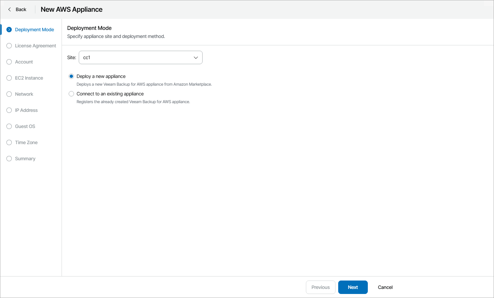
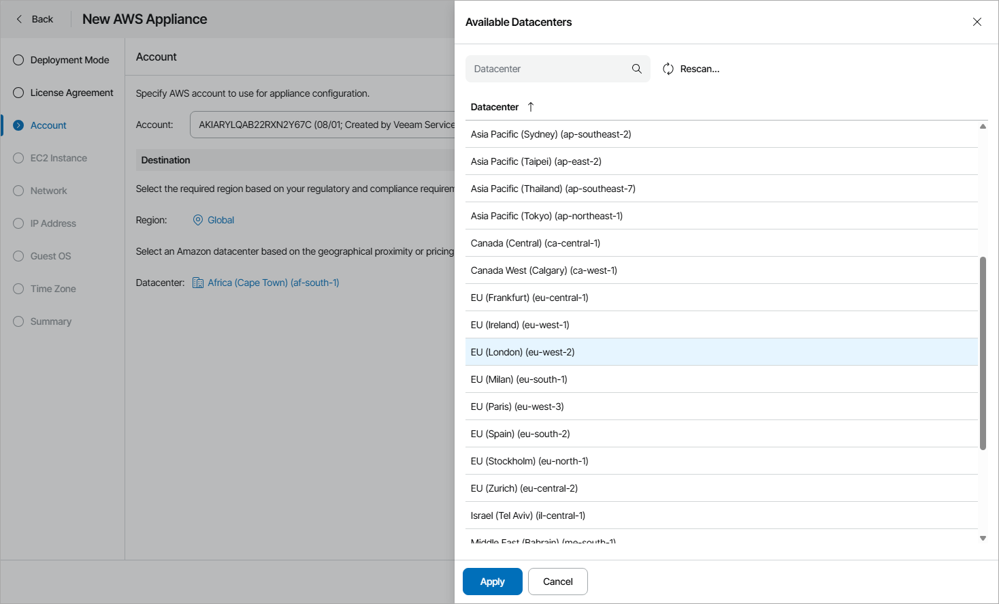
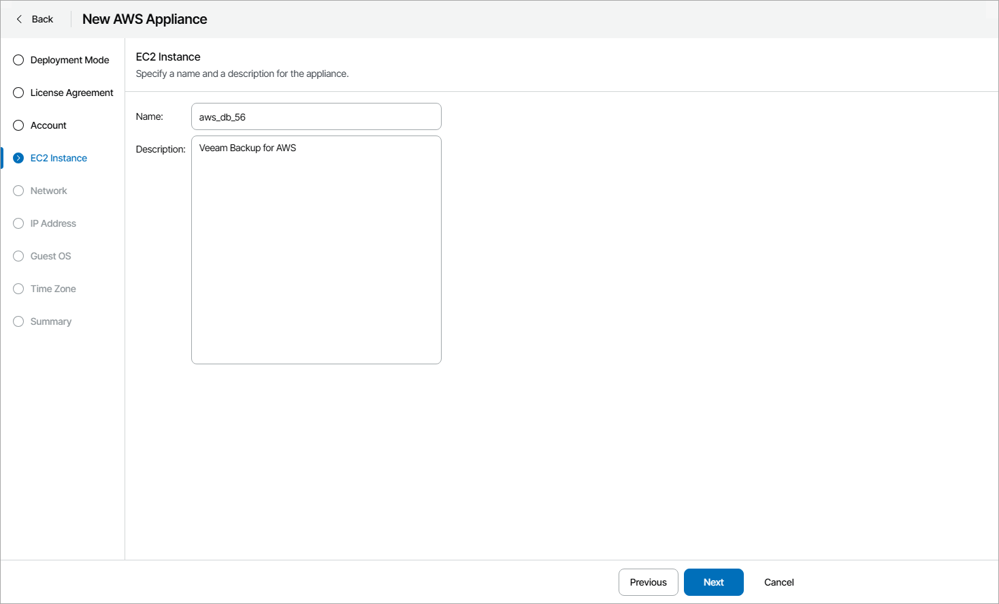
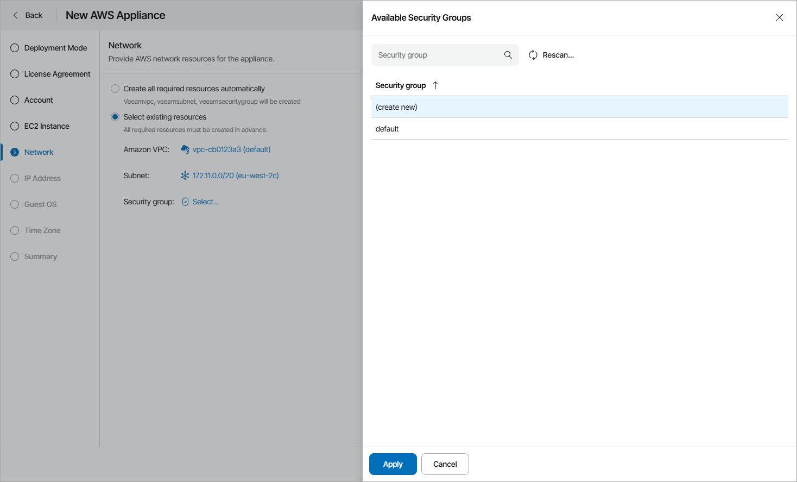
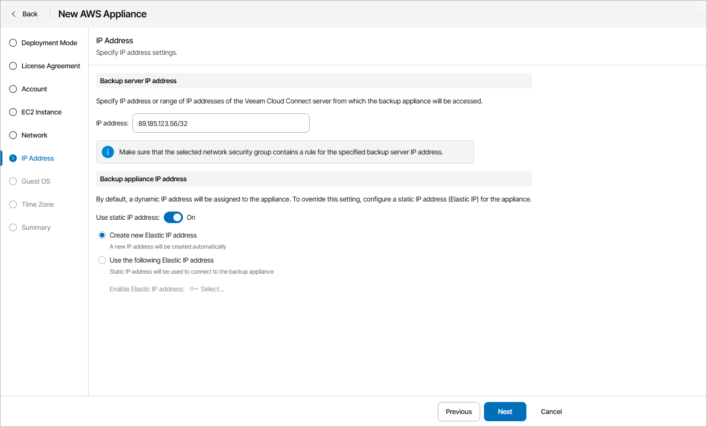
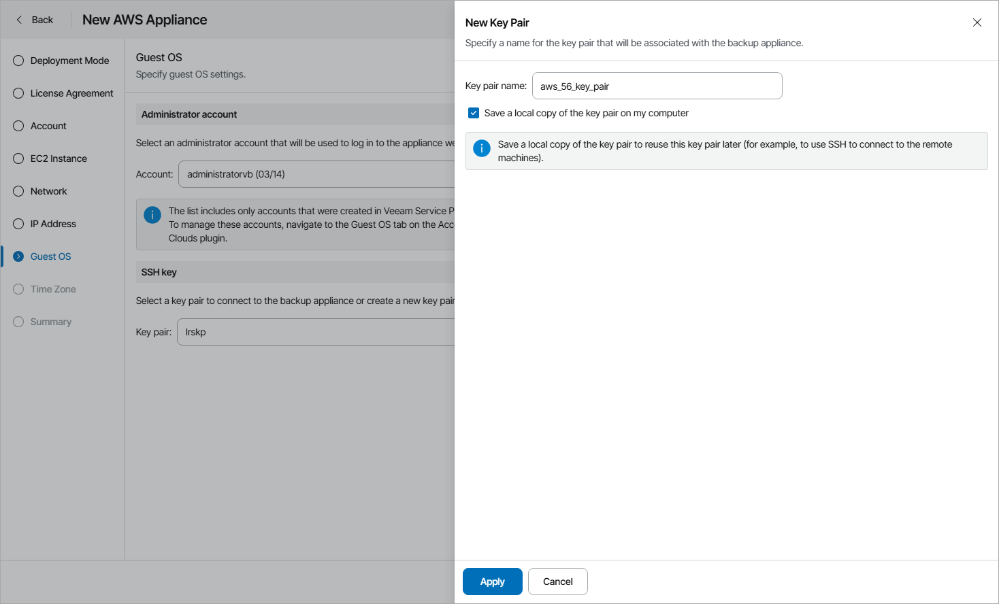
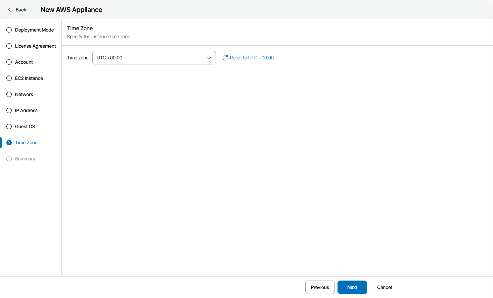

# Deploying New Veeam Backup for AWS Appliances

To deploy a new Veeam Backup for AWS appliance:

1. Log in to Veeam Service Provider Console.

For details, see [Accessing Veeam Service Provider Console](access_vac.md).

1. At the top right corner of the Veeam Service Provider Console window, click Configuration.
2. In the configuration menu on the left, click Catalog.
3. Click the Veeam Backup for Public Clouds plugin tile.
4. In the menu on the left, click Appliances.
5. At the top of the list, click New and select Amazon Web Services.

Veeam Service Provider Console will open the New AWS Appliance wizard.

1. At the Deployment Mode step of the wizard, specify Veeam Cloud Connect site on which you want to register the appliance and select Deploy a new appliance.

1. At the License Agreement step of the wizard, read the license agreements and licensing policy and click I Accept.
2. At the Account step of the wizard, specify Amazon Web Services account settings:

1. In the Account list, select an account that will be used for appliance configuration.

If you want to add a new account, click New. In the New AWS account window, specify the access key ID and the secret access key of the AWS account.

|  |
| --- |
| Important! |
| The AWS account that will be used to deploy Veeam Backup for AWS must be subscribed to Veeam Backup for AWS FREE Trial & BYOL Edition in AWS Marketplace. |

1. In the Destination section, select AWS region and datacenter where the appliance will reside.

1. At the EC2 Instance step of the wizard, specify name and description for the EC2 instance where Veeam Backup for AWS will be deployed.

1. At the Network step of the wizard, specify the AWS network resource settings:

* If you want Veeam Service Provider Console to create the necessary resources automatically, select the Create all required resources automatically option.
* If you want to set the necessary resources manually, select the Select existing resources option.

In the Amazon VPC, Subnet and Security group fields, click Select, choose the necessary resource and click Apply. If you want to create a new resource automatically, choose (select new).

1. At the IP Address step of the wizard, specify IP address settings:

* In the Backup server IP address section, specify an IP address or a range of IP addresses of the Veeam Cloud Connect server from which the appliance will be accessed.

If you want to specify several IP addresses, you can separate them with semicolon (;) or use a subnet mask.

If you installed Veeam Service Provider Console using a distributed deployment scenario, you must also specify an address of the machine where Veeam Service Provider Console Web UI component runs.

* If you want to set a static IP address for the appliance, in the Backup appliance IP address section set the Use static IP address toggle to On and specify an IP address:

1. To create an IP address automatically, select the Create new Elastic IP address option.
2. To set an IP address manually, select the Use the following Elastic IP address option and click Select.

In the Available Elastic IP addresses window, select an IP address and click Apply.

Note that the list includes only previously allocated Elastic IP addresses. For details, see [Amazon VPC Documentation](https://docs.aws.amazon.com/vpc/latest/userguide/vpc-eips.html#allocate-eip).

1. At the Guest OS step of the wizard, specify connection settings:

* In the Administrator account section, select account of a user that has administrative privileges on the Veeam Backup for AWS appliance (Service Provider Administrator account).

The account list includes only accounts created in Veeam Service Provider Console. For details on creating guest OS accounts, see [Adding Guest OS Accounts](clouds_guest_accounts.md).

To create a new Service Provider Administrator account, click New. In the New Account window, specify account credentials and click Apply.

* In the SSH key section, select a EC2 key pair to connect to the appliance.

To create a new key pair:

1. Click New.
2. In the New Key Pair window, specify the key pair name.
3. To save the key pair to your computer, select the Save a local copy of the key pair on my computer check box.

Veeam Service Provider Console will save a TXT file with the private key to the default download location on your computer.

1. Click Apply.

1. At the Time Zone step of the wizard, specify the EC2 instance time zone.

1. At the Summary step of the wizard, review the appliance settings and click Finish.

Checking Deployment Results

To make sure that appliance deployment has completed successfully, complete the following steps:

1. Log in to Veeam Service Provider Console.

For details, see [Accessing Veeam Service Provider Console](access_vac.md).

1. At the top right corner of the Veeam Service Provider Console window, click Configuration.
2. In the configuration menu on the left, click Catalog.
3. Click the Veeam Backup for Public Clouds plugin tile.
4. In the menu on the left, click Appliances and find the necessary appliance in the list.
5. Check the value in the Deployment Status column.

If deployment was successful, the Deployment Status status must be Success.

1. Click a link in the Deployment Status column to display session details of the deployment procedure.

If the appliance was connected successfully but the Deployment Status status is Error, click Clear Logs to update the status.

