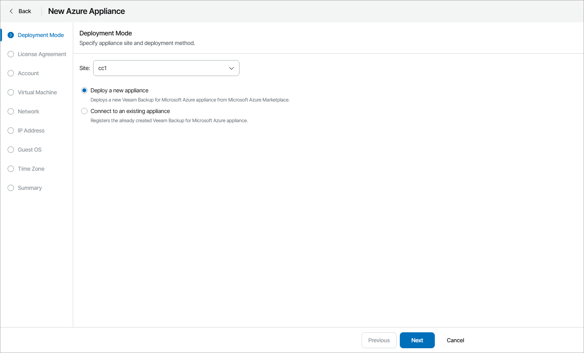
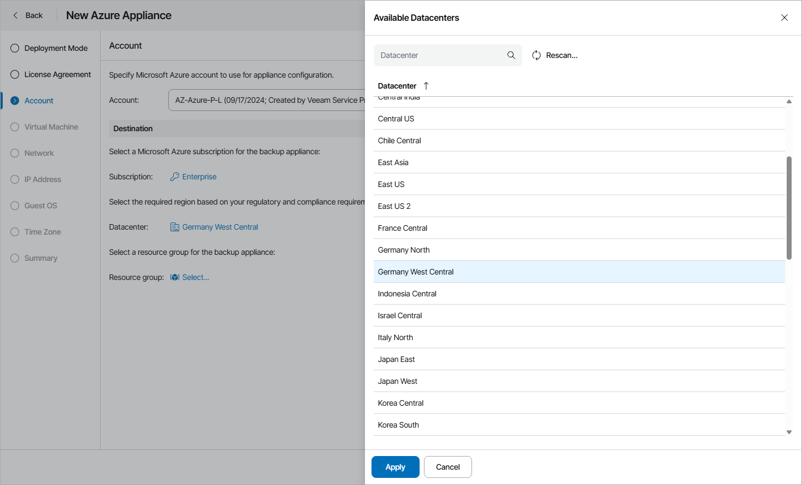
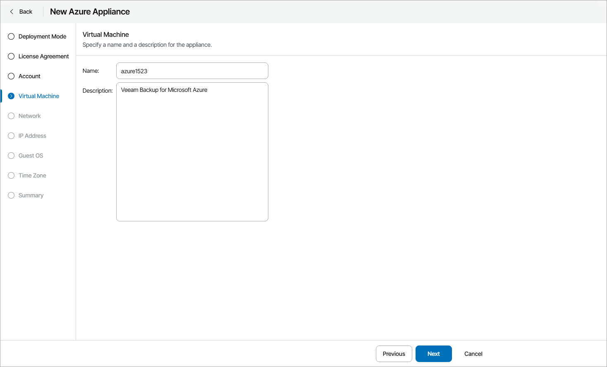
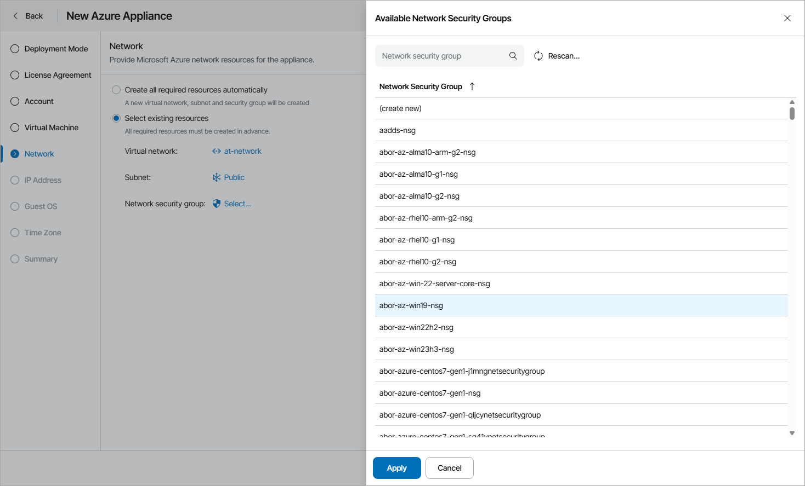
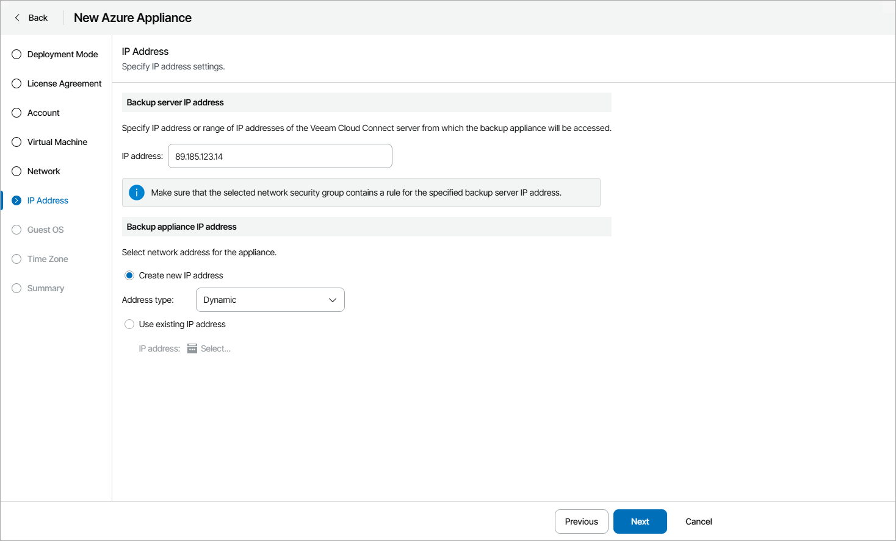
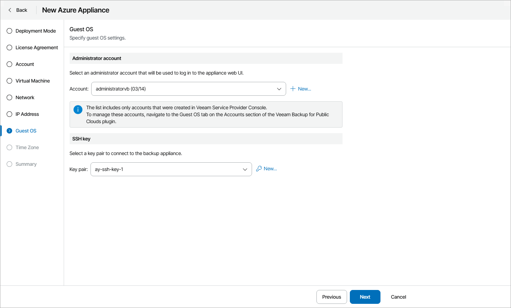
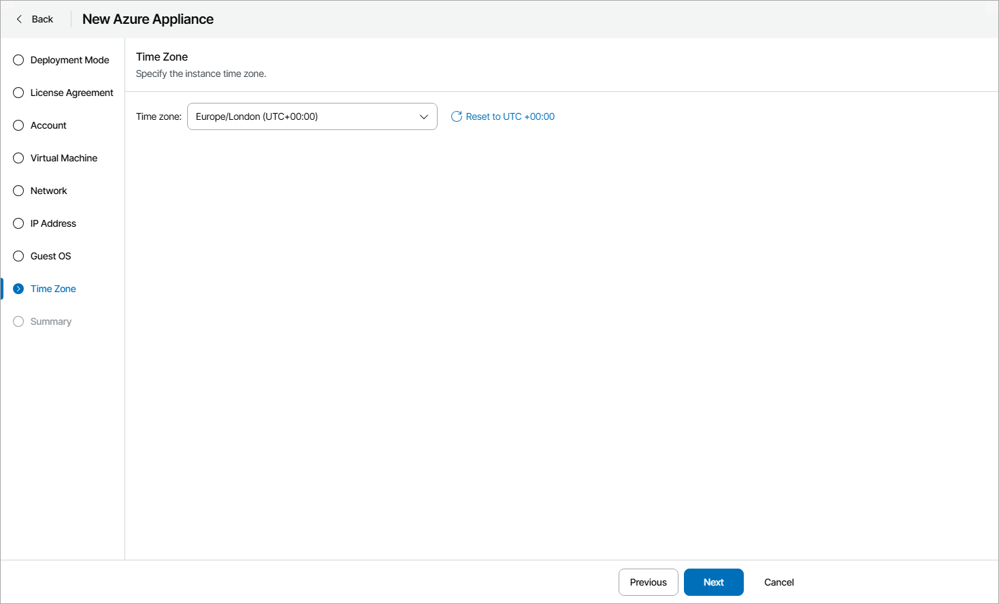

# Deploying New Veeam Backup for Microsoft Azure Appliances

To deploy a new Veeam Backup for Microsoft Azure appliance:

1. Log in to Veeam Service Provider Console.

For details, see [Accessing Veeam Service Provider Console](access_vac.md).

1. At the top right corner of the Veeam Service Provider Console window, click Configuration.
2. In the configuration menu on the left, click Catalog.
3. Click the Veeam Backup for Public Clouds plugin tile.
4. In the menu on the left, click Appliances.
5. At the top of the list, click New and select Microsoft Azure.

Veeam Service Provider Console will open the New Azure Appliance wizard.

1. At the Deployment Mode step of the wizard, specify Veeam Cloud Connect site on which you want to register the appliance and select Deploy a new appliance.

1. At the License Agreement step of the wizard, read the license agreements and licensing policy and click I Accept.
2. At the Account step of the wizard, specify Microsoft Azure account settings:

1. In the Account list, select a Microsoft Azure account that will be used for appliance configuration.

If you want to add a new account, click New. Veeam Service Provider Console will open the New Microsoft Azure Account wizard. For details, see [Adding Microsoft Azure Accounts](clouds_azure_accounts.md).

1. In the Destination section, select Microsoft Azure subscription, datacenter and resource group where the appliance will reside.

1. At the Virtual Machine step of the wizard, specify name and description for the virtual machine on which Veeam Backup for Microsoft Azure appliance will be deployed.

1. At the Network step of the wizard, specify the Microsoft Azure network resource settings:

* If you want Veeam Service Provider Console to create the necessary resources automatically, select the Create all required resources automatically option.

* If you want to set the necessary resources manually, select the Select existing resources option.

In the Virtual Network, Subnet and Network security group fields, click Select, choose the necessary resource and click Apply. If you want to create a new resource automatically, choose (select new).

1. At the IP Address step of the wizard, configure Veeam Cloud Connect and Veeam Backup for Public Clouds appliance IP addresses:

* In the Backup server IP address section, specify an IP address or a range of IP addresses of the Veeam Cloud Connect server from which the appliance will be accessed.

If you want to specify several IP addresses, you can separate them with semicolon (;) or use a subnet mask.

If you installed Veeam Service Provider Console using a distributed deployment scenario, you must also specify an address of the machine where Veeam Service Provider Console Web UI component runs.

* In the Backup appliance IP address section, specify appliance IP address settings:

* To create a new IP address for the appliance, select the Create new IP address option and select a type of IP address that you want to assign to the appliance (Static, Dynamic).
* To assign to the appliance an existing IP address, select the Use existing IP address option and click Select. In the Available IP Addresses window, select the necessary IP address and click Apply.

For an IP to be displayed in the list of available IP addresses, it must be added as described in [Microsoft Docs](https://docs.microsoft.com/en-us/azure/virtual-network/virtual-network-network-interface-addresses#add-ip-addresseseips.html#allocate-eip).

1. At the Guest OS step of the wizard, specify connection settings:

* In the Administrator account section, select account of a user that has administrative privileges on the Veeam Backup for Microsoft Azure appliance (Service Provider Administrator account).

The account list includes only accounts created in Veeam Service Provider Console. For details on creating guest OS accounts, see [Adding Guest OS Accounts](clouds_guest_accounts.md).

To create a new Service Provider Administrator account, click New. In the New account window, specify account credentials and click Apply.

* In the SSH key section, select a key pair to connect to the appliance.

To create a new key pair:

1. Click New.
2. In the New Key Pair window, specify the key pair name.
3. To save the key pair to your computer, select the Save a local copy of the key pair to my computer check box.
4. Click Apply.

1. At the Time Zone step of the wizard, specify the instance time zone.

1. At the Summary step of the wizard, review the appliance settings and click Finish.

Checking Deployment Results

To make sure that appliance deployment has completed successfully, complete the following steps:

1. Log in to Veeam Service Provider Console.

For details, see [Accessing Veeam Service Provider Console](access_vac.md).

1. At the top right corner of the Veeam Service Provider Console window, click Configuration.
2. In the configuration menu on the left, click Catalog.
3. Click the Veeam Backup for Public Clouds plugin tile.
4. In the menu on the left, click Appliances and find the necessary appliance in the list.
5. Check the value in the Deployment Status column.

If deployment was successful, the Deployment Status status must be Success.

1. Click a link in the Deployment Status column to display session details of the deployment procedure.

If the appliance was connected successfully but the Deployment Status status is Error, click Clear Logs to update the status.

