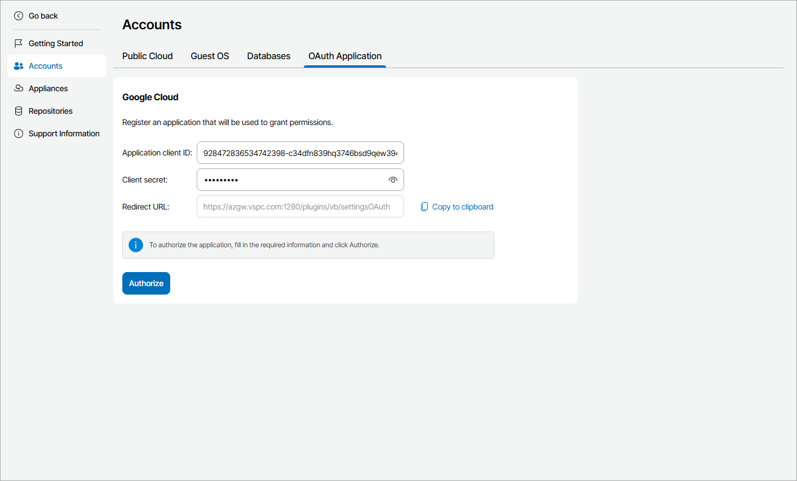
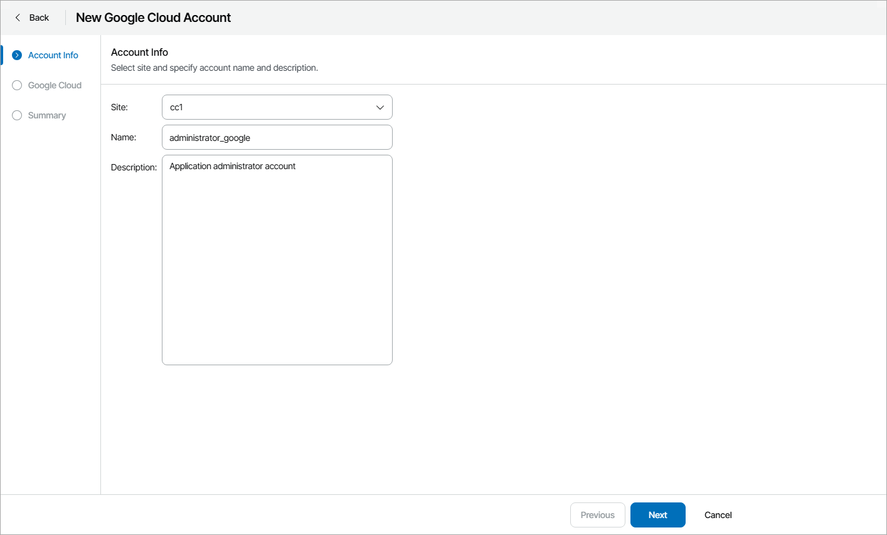
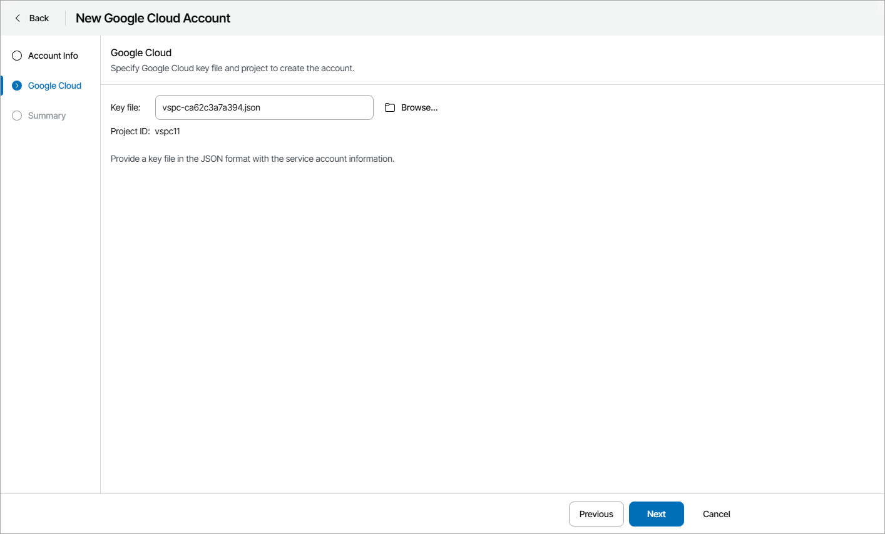

# Adding Google Cloud Accounts

In plugin, you can add Google Cloud connection accounts.

Prerequisites

Before you start adding Google Cloud accounts:

* Consider requirements specified in the [Plug-In Permissions](https://helpcenter.veeam.com/docs/vbgc/guide/plugin_permissions.html) section of the Veeam Backup for Google Cloud User Guide.
* Configure the OAuth consent screen in the Google Cloud console.

For details, see [Google Cloud documentation](https://developers.google.com/workspace/guides/configure-oauth-consent).

Consider that Veeam Service Provider Console requires identification of the https://www.googleapis.com/auth/cloud-platform scope in the OAuth consent screen. For details on OAuth 2.0 Scopes for Google APIs, see [Google Cloud documentation](https://developers.google.com/identity/protocols/oauth2/scopes).

Registering Application in Google Cloud Console

Before you add Google Cloud accounts, you must register Veeam Service Provider Console in Google Cloud console:

1. Log in to Veeam Service Provider Console.

For details, see [Accessing Veeam Service Provider Console](access_vac.md).

1. At the top right corner of the Veeam Service Provider Console window, click Configuration.
2. In the configuration menu on the left, click Catalog.
3. Click the Veeam Backup for Public Clouds plugin tile.
4. In the menu on the left, click Accounts and navigate to OAuth Application.
5. Copy Veeam Service Provider Console redirect address displayed in the Redirect URL field.
6. In the Google Cloud console, create OAuth client ID credentials as described in [Google Cloud documentation](https://developers.google.com/workspace/guides/create-credentials#oauth-client-id).

In the Authorized redirect URLs section of the Create OAuth client ID page, add the address copied at step 6.

1. In Veeam Service Provider Console, specify the configured credentials in the Application client ID and Client secret fields.
2. Click Authorize.

You will be redirected to OAuth consent screen authorization page. Sign in using a Google account with permissions to create applications to validate the configured settings. After you complete the authentication, you will be redirected to Veeam Service Provider Console portal and the application will be registered automatically.

Creating Google Cloud Account

To create a new Google Cloud account:

1. Log in to Veeam Service Provider Console.

For details, see [Accessing Veeam Service Provider Console](access_vac.md).

1. At the top right corner of the Veeam Service Provider Console window, click Configuration.
2. In the configuration menu on the left, click Catalog.
3. Click the Veeam Backup for Public Clouds plugin tile.
4. In the menu on the left, click Accounts and navigate to Public Cloud.
5. At the top of the list, click New > Google Cloud.

Veeam Service Provider Console will open the New Google Cloud Account wizard.

1. On the Account Info step of the wizard, specify account settings:

* In the Site field, select Veeam Cloud Connect site on which you want to register the account.
* In the Name field, specify account name.
* In the Description field, specify account description.

1. On the Google Cloud step of the wizard, click Browse and select the service account key in the JSON format.

For details on how to create the service account key, see [Google Cloud documentation](https://cloud.google.com/iam/docs/creating-managing-service-account-keys).

Veeam Service Provider Console will display ID of the Google Cloud project in which the account will be created.

1. On the Summary step of the wizard, review the account settings copy the account data if necessary, and click Finish.

