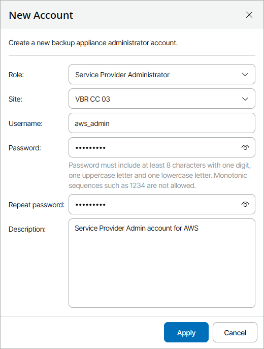

# Adding Guest OS Accounts

To add a new guest OS administrator account:

1. Log in to Veeam Service Provider Console.

For details, see [Accessing Veeam Service Provider Console](access_vac.md).

1. At the top right corner of the Veeam Service Provider Console window, click Configuration.
2. In the configuration menu on the left, click Catalog.
3. Click the Veeam Backup for Public Clouds plugin tile.
4. In the menu on the left, click Accounts and navigate to Guest OS.
5. At the top of the list, click New.
6. In the New Account window, specify account settings:

* From the Type drop-down list, select user role for the account (Service Provider Administrator, Company Administrator).

Service Provider Administrator accounts are used for deploying and managing Veeam Backup for Public Clouds appliances. Company Administrator accounts are used for managing appliances that are assigned to client companies.

* [For Service Provider Administrator account] From the Site drop-down list, select Veeam Cloud Connect site on which you want to register the account.
* In the Username, Password and Repeat password fields, specify account credentials.
* In the Description field, specify account description.

1. Click Apply.

