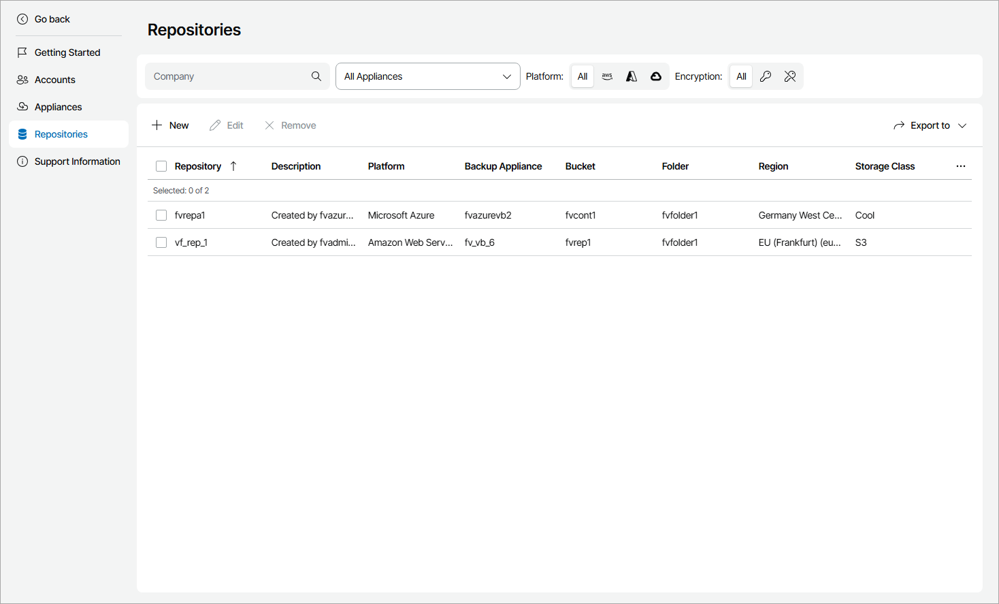

# Managing Veeam Backup for Public Clouds Repositories

To create and manage Veeam Backup for Public Clouds repositories, you can access Veeam Backup for Public Clouds portal directly from Veeam Service Provider Console plugin.

Prerequisites

Before you start working with repositories, make sure that:

* You have approved security certificate for the appliance on which you want to create a repository. For details, see [Verifying Appliances](clouds_verify_certificate.md).
* You have configured guest OS credentials for the appliance on which you want to create a repository. For details, see [Adding Guest OS Accounts](clouds_guest_accounts.md).

Adding Repositories

To create new Veeam Backup for Public Clouds repositories:

1. Log in to Veeam Service Provider Console.

For details, see [Accessing Veeam Service Provider Console](access_vac.md).

1. At the top right corner of the Veeam Service Provider Console window, click Configuration.
2. In the configuration menu on the left, click Catalog.
3. Click the Veeam Backup for Public Clouds plugin tile.
4. In the menu on the left, click Repositories.
5. At the top of the list, click New.
6. In the Create Repository window, select Veeam Backup for Public Clouds appliance for which you want to create a repository.
7. Click Create.

Veeam Service Provider Console will open a Veeam Backup for Public Clouds repository creation wizard.

For details on creating Veeam Backup for Veeam Backup for Public Clouds repositories, see the following sections of the Veeam Backup for Veeam Backup for Public Clouds guides:

* [Adding Backup Repositories Using Console](https://helpcenter.veeam.com/docs/vbaws/guide/repositories_add_console.html) and [Adding Backup Repositories Using Web UI](https://helpcenter.veeam.com/docs/vbaws/guide/repositories_add_ui.html) of the Veeam Backup for AWS User Guide.
* [Adding Backup Repositories](https://helpcenter.veeam.com/docs/vbazure/guide/adding_repositories.html) of the Veeam Backup for Microsoft Azure User Guide.
* [Adding Backup Repositories](https://helpcenter.veeam.com/docs/vbgc/guide/adding_repositories.html) of the Veeam Backup for Google Cloud User Guide.

Modifying Repositories

To modify Veeam Backup for Public Clouds repository settings:

1. Log in to Veeam Service Provider Console.

For details, see [Accessing Veeam Service Provider Console](access_vac.md).

1. At the top right corner of the Veeam Service Provider Console window, click Configuration.
2. In the configuration menu on the left, click Catalog.
3. Click the Veeam Backup for Public Clouds plugin tile.
4. In the menu on the left, click Repositories.

To narrow down the list of appliances, you can apply the following filters:

* Company — search the list of repositories by company name.
* Appliance — search the list of repositories by appliance name.
* Platform — limit the list of repositories by platform (Amazon Web Services, Microsoft Azure, Google Cloud).
* Encryption — limit the list of repositories by encryption status (Enabled, Disabled).

1. Select the necessary repository in the list.
2. At the top of the list, click Edit.

Veeam Service Provider Console will open a Veeam Backup for Public Clouds repository edition wizard.

Removing Repositories

When you remove a Veeam Backup for Public Clouds repository, the repository will be automatically removed from the Veeam Backup for Public Clouds appliance. All created backups and restore points will not be affected.

Note that you cannot remove a repository that is assigned to a Veeam Backup for Public Clouds policy.

To remove Veeam Backup for Public Clouds repositories:

1. Log in to Veeam Service Provider Console.

For details, see [Accessing Veeam Service Provider Console](access_vac.md).

1. At the top right corner of the Veeam Service Provider Console window, click Configuration.
2. In the configuration menu on the left, click Catalog.
3. Click the Veeam Backup for Public Clouds plugin tile.
4. In the menu on the left, click Repositories.

To narrow down the list of appliances, you can apply the following filters:

* Company — search the list of repositories by company name.
* Appliance — limit the list of repositories by appliance name.
* Platform — limit the list of repositories by platform (Amazon Web Services, Microsoft Azure, Google Cloud).
* Encryption — limit the list of repositories by encryption status (Enabled, Disabled).

1. Select the necessary repositories in the list.
2. At the top of the list, click Remove.
3. In the confirmation window, click Yes.

Viewing and Exporting Repository Details

To view and export Veeam Backup for Public Clouds repository details:

1. Log in to Veeam Service Provider Console.

For details, see [Accessing Veeam Service Provider Console](access_vac.md).

1. At the top right corner of the Veeam Service Provider Console window, click Configuration.
2. In the configuration menu on the left, click Catalog.
3. Click the Veeam Backup for Public Clouds plugin tile.
4. In the menu on the left, click Repositories.

To narrow down the list of appliances, you can apply the following filters:

* Company — search the list of repositories by company name.
* Appliance — limit the list of repositories by appliance name.
* Platform — limit the list of repositories by appliance platform (Amazon Web Services, Microsoft Azure, Google Cloud).
* Encryption — limit the list of repositories by encryption status (Enabled, Disabled).

1. To export repository details, click Export to and choose a format of the exported data:

* CSV — choose this option to structure exported data as a CSV file.
* XML — choose this option to structure exported data as an XML file.

The file with exported data will be saved to the default download location on your computer.

Each repository in the list is described with the following properties:

* Repository — repository name.
* Description — repository description.
* Platform — appliance platform (Amazon Web Services, Microsoft Azure, Google Cloud).
* Backup Appliance — name of an appliance to which the repository belongs.
* Bucket — Amazon S3 bucket or Microsoft Azure container that is used as a backup target.
* Folder — folder used to group backup files in a bucket or container.
* Region — appliance region.
* Storage Class — repository storage class.
* Encryption — encryption status (Enabled, Disabled).
* Immutability — immutability status (Enabled, Disabled).
* Company — name of a company to which the appliance belongs.
* Site — name of the Veeam Cloud Connect site on which the appliance is registered.

