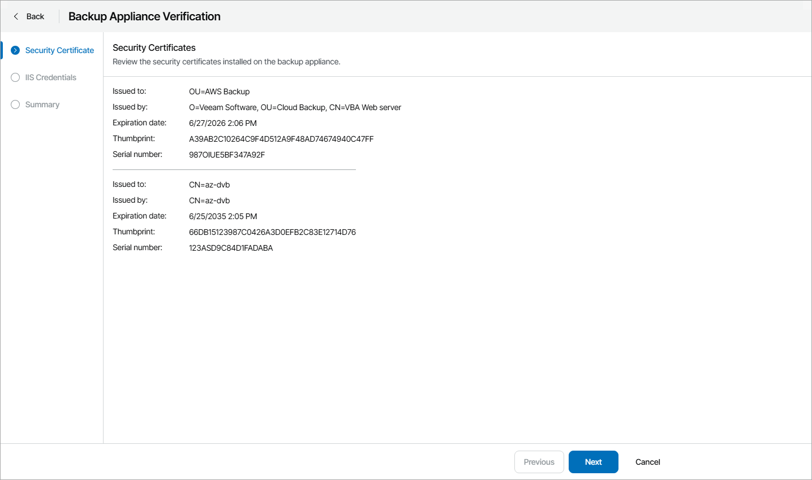
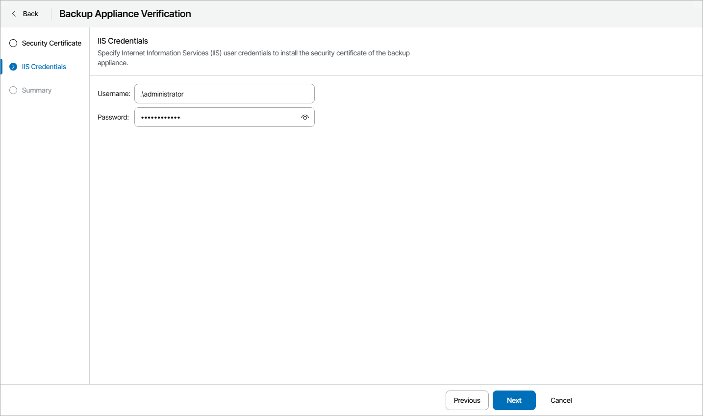

# Verifying Appliances

To establish secure data communications between the backup appliance and web browsers running on user workstations, Veeam Backup for Public Clouds appliances use Transport Layer Security (TLS) certificates.

When you or your managed resellers install Veeam Backup for Public Clouds appliance, it automatically generates a default self-signed certificate. For you or managed resellers to be able to manage the appliance with Veeam Service Provider Console and access appliance web portal, you must verify the appliance certificate.

When your managed reseller requests appliance verification, Veeam Service Provider Console notification bell will show a notification including reseller name and the name of the appliance that requires verification.

To verify deployed appliance:

1. Log in to Veeam Service Provider Console.

For details, see [Accessing Veeam Service Provider Console](access_vac.md).

1. At the top right corner of the Veeam Service Provider Console window, click Configuration.
2. In the configuration menu on the left, click Catalog.
3. Click the Veeam Backup for Public Clouds plugin tile.
4. In the menu on the left, click Appliances.

To show only appliances with unverified certificates, click Filter, in the Appliance certificate section select Unverified, and click Apply.

1. Select the necessary appliance in the list.
2. At the top of the list, click Verify Appliance.

Veeam Service Provider Console will open the Backup Appliance Verification wizard.

1. At the Security Certificate step of the wizard, review the certificate parameters.

1. At the Credentials step of the wizard, specify credentials of a local administrator of a machine on which Veeam Service Provider Console Web UI runs.

1. At the Summary step of the wizard, review certificate settings and click Finish.

