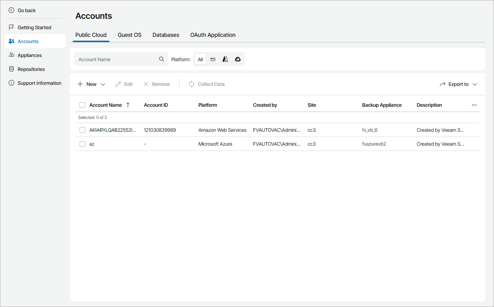

# Viewing and Exporting Account Details

To view and export details of public cloud and guest OS accounts:

1. Log in to Veeam Service Provider Console.

For details, see [Accessing Veeam Service Provider Console](access_vac.md).

1. At the top right corner of the Veeam Service Provider Console window, click Configuration.
2. In the configuration menu on the left, click Catalog.
3. Click the Veeam Backup for Public Clouds plugin tile.
4. In the menu on the left, click Accounts.
5. Open the necessary tab:

* Public Cloud — select this tab to view Amazon Web Services, Microsoft Azure and Google Cloud accounts.
* Guest OS — select this tab to view guest OS accounts.
* Databases — select this tab to view database administrator accounts.

1. To export account details, click Export to and choose a format of the exported data:

* CSV — choose this option to structure exported data as a CSV file.
* XML — choose this option to structure exported data as an XML file.

The file with exported data will be saved to the default download location on your computer.

Each Veeam Backup for Public Clouds account in the list is described with the following properties:

* Account Name — Veeam Backup for Public Clouds account name.
* Account ID — Amazon Web Services account ID.

* Platform — appliance platform (Amazon Web Services, Microsoft Azure, Google Cloud).
* Created by — name of the user who created the account.
* Company — company to which the account is assigned.
* Site — Veeam Cloud Connect site on which the account is registered.
* Backup Appliance — Veeam Backup for Public Clouds appliances to which the account is assigned.
* Description — account description.

Each guest OS account in the list is described with the following properties:

* Account Name — user name of the account.
* Company — company to which the account is assigned.
* Site — Veeam Cloud Connect site on which the account is registered.
* Role — account role (Service Provider Global Administrator, Company Administrator).
* Appliances — Veeam Backup for Public Clouds appliances to which the account is assigned.
* Last Modified — amount of time since the last account modification.
* Description — account description.

Each database administrator account in the list is described with the following properties:

* Account Name — friendly name of the account.
* Username — user name of the account.
* Database Type — type of the database to which the account is assigned.

* Company — company to which the account is assigned.

* Site — Veeam Cloud Connect site on which the account is registered.
* Backup Appliance — Veeam Backup for Public Clouds appliance to which the account is assigned.
* Description — account description.

