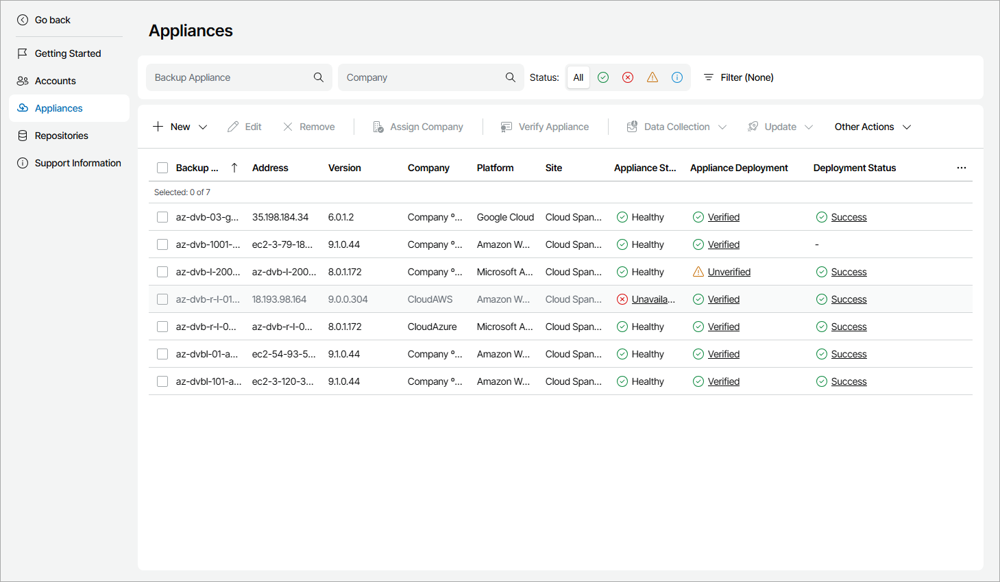

# Viewing and Exporting Appliance Details

To view and export managed appliance details:

1. Log in to Veeam Service Provider Console.

For details, see [Accessing Veeam Service Provider Console](access_vac.md).

1. At the top right corner of the Veeam Service Provider Console window, click Configuration.
2. In the configuration menu on the left, click Catalog.
3. Click the Veeam Backup for Public Clouds plugin tile.
4. In the menu on the left, click Appliances.

To narrow down the list of appliances, you can apply the following filters:

* Backup Appliance — search the list of appliances by server name.
* Company — search the list of appliances by company name.
* Status — limit the list of appliances by status (Healthy, Unavailable, Warning, Unknown).
* Platform — limit the list of appliances by platform (Amazon Web Services, Microsoft Azure, Google Cloud).
* Appliance deployment — limit the list of appliances by certificate status (Verified, Unverified).
* Managed company — limit the list of appliances by configured client company (Assigned, Not assigned).

1. To export appliance details, click Export to and choose a format of the exported data:

* CSV — choose this option to structure exported data as a CSV file.
* XML — choose this option to structure exported data as an XML file.

The file with exported data will be saved to the default download location on your computer.

Each appliance in the list is described with a set of properties:

* Backup Appliance — name of a computer on which an appliance is deployed.
* Address — DNS or IP address of an appliance.
* Version — appliance version.

* Site — name of the Veeam Cloud Connect site on which the appliance is registered.

* Company — name of a company to which the appliance belongs.
* Platform — appliance platform (Amazon Web Services, Microsoft Azure, Google Cloud).
* Appliance Status — status of an appliance (Healthy, Warning, Unavailable, Unknown).

You can click the Warning or Unavailable link to view error details.

* Appliance Deployment — deployment status of the appliance security certificate.

You can click the status link to view appliance certificate details.

* Deployment Status — status of appliance deployment.

* Description — appliance description.

To view and export details on Veeam Backup for Public Clouds appliances managed by Veeam Backup & Replication servers, go to the Discovery > Cloud Backup Appliances tab. For details, see [Viewing and Exporting Cloud Backup Appliance Details](export_cloud_appliance_details.md).

