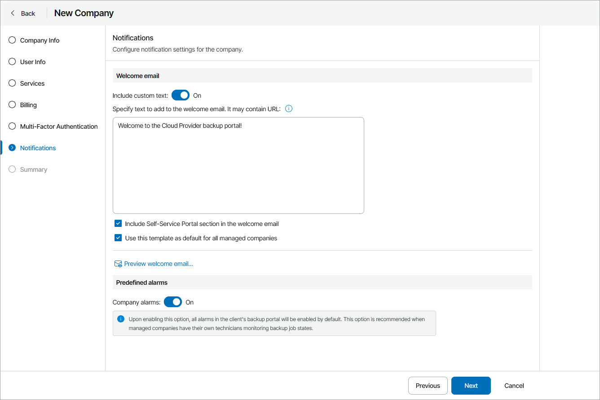

# Step 7. Configure Notification Settings

At the Notifications step of the wizard, customize welcome email and configure alarm notification settings for the company:

1. In the Welcome email section, customize an email that will be sent to client companies:

* Set the Include custom text toggle to On and specify custom text that will be included into welcome email body.

Custom text section supports plain text and HTML tags.

* To include the Self-Service Portal section with instructions for company users, select the Include Self-Service Portal section in the welcome email check box.

To see how the welcome email will look, click the Preview welcome email link.

* To save welcome email settings as a template and use it for all managed companies, select the Use this template as default for all managed companies check box.

If you change the default welcome email and clear the check box, the welcome email settings will be modified only for the created company.

1. In the Predefined alarms section, set the Company alarms toggle to On to enable alarms for the company in the client portal.

With this option enabled, alarms in the company client portal will be enabled automatically. For details on working with alarms in the Client Portal, see section [Working with Alarms](https://helpcenter.veeam.com/docs/vac/provider_user/alarms.html?ver=9.2) of the Guide for End Users.

