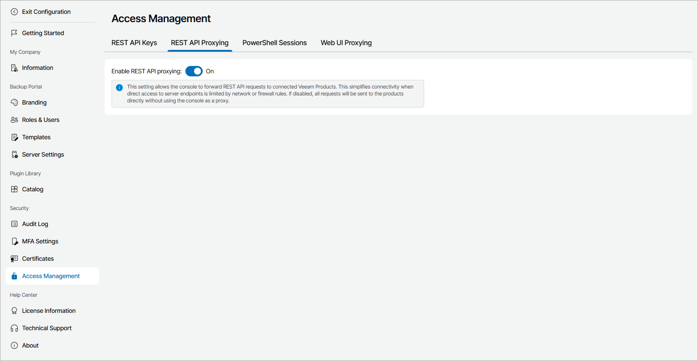

# Configuring Remote Access

In Veeam Service Provider Console, you can configure remote access to managed computers and Veeam products through REST API, PowerShell or Veeam Backup & Replication Web UI.

Required Privileges

To perform this task, a user must have the following role assigned: Portal Administrator.

Configuring Remote Access

To set up remote access:

1. Log in to Veeam Service Provider Console.

For details, see [Accessing Veeam Service Provider Console](access_vac.md).

1. At the top right corner of the Veeam Service Provider Console window, click Configuration.
2. In the configuration menu on the left, click Access Management.
3. Configure the necessary remote access type:

* On the REST API Proxying tab, select if you want to allow Veeam Service Provider Console to send REST API requests to managed products.

For details, see [REST API Reference](https://helpcenter.veeam.com/references/vac/9.2/rest/3.6.2/tag/SectionAbout).

* On the PowerShell Sessions tab, select if you want to allow Veeam Service Provider Console to launch PowerShell console on remote computers.

For details, see [Accessing Remote PowerShell Console](access_ps.md).

* On the Web UI Proxying tab, select if you want to allow Veeam Service Provider Console to open remote Veeam Backup & Replication wizards.

|  |
| --- |
| Important! |
| If you want to forbid REST API calls from Veeam Service Provider Console to remote Veeam Backup & Replication servers, make sure that Enable redirecting to Veeam Backup & Replication web UI wizards and Enable REST API Proxying toggles are set to Off. |

