# Configuring Active Directory Discovery Rules

Active Directory discovery rules allow you to discover computers being part of an AD domain.

This method is recommended for environments with Active Directory domains of any size. Active Directory discovery rules target AD containers, which helps perform dynamic discovery: if new computers join a domain, a new run of an AD-based rule will discover these computers.

Prerequisites

Before you configure an Active Directory discovery rule:

* Deploy a master agent on a machine in the  infrastructure. The machine must be included in a domain within which computers will be discovered.

For details, see [Deploying Management Agents Manually](deploy_management_agents.md).

* Make sure you have an account with local Administrator permissions on all computers that you want to discover.

This prerequisite is not required if you have specified a discovery account in the master agent configuration settings. For details, see [Deploying Windows Management Agents](deploy_management_agents_win.md).

* Make sure that  computers are powered on and configured to allow discovery: the Remote Scheduled Tasks Management (RPC and RPC-EPMAP) firewall rules must allow inbound traffic.

* On computers that run a Windows desktop OS, the Windows Management Instrumentation (WMI-In) firewall rule must be configured to allow inbound traffic.

* If you plan to install Veeam backup agents as part of the discovery procedure, make sure that  computers are configured to allow installation: the File and Printer Sharing (SMB-In) firewall rule must allow inbound traffic.

* If you plan to assign a backup policy as part of the discovery procedure, create a new backup policy or check and if necessary customize one of the predefined policies.

For details, see [Configuring Backup Policies](configure_backup_policies.md).

Configuring Active Directory Discovery Rule

To configure an Active Directory discovery rule:

1. Log in to Veeam Service Provider Console.

For details, see [Accessing Veeam Service Provider Console](access_vac.md).

1. In the menu on the left, click Discovery > Discovered Computers > Rules.
2. At the top of the list, click New and select Windows.

Veeam Service Provider Console will launch the New Windows Discovery Rule wizard.

1. At the Rule Name step of the wizard, specify a discovery rule name.

[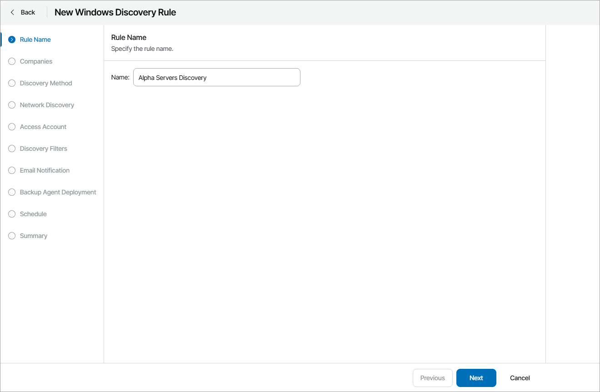](images/discovery_rule_name.webp "Specify Discovery Rule Name")

1. At the Companies step of the wizard, choose one or more companies for which the discovery rule is configured. Use the search field at the top of the list to find the necessary companies.

You can select more than one company at this step. In this case, after you complete the wizard steps, Veeam Service Provider Console will create a separate discovery rule for each company. To configure discovery rule for hosted infrastructure, select your company name in the list.

[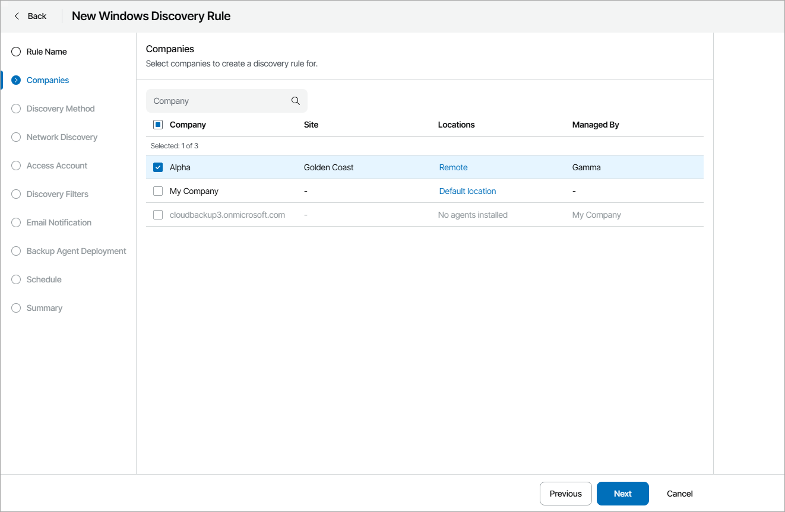](images/discovery_rule_company.webp "Choose Company")

1. Click a link in the Locations column, then click a link in the Master Agent column, and select a management agent that will be used as the master agent for discovery in each company location.

By default, discovery is performed in all company locations where you deployed a master agent. If you choose to perform discovery in multiple locations, after you complete the wizard steps, Veeam Service Provider Console will create a separate discovery rule for each location. If you do not want to perform discovery in some company locations, clear check boxes next to these locations.

For details on working with company locations, see [Managing Locations](manage_locations.md).

[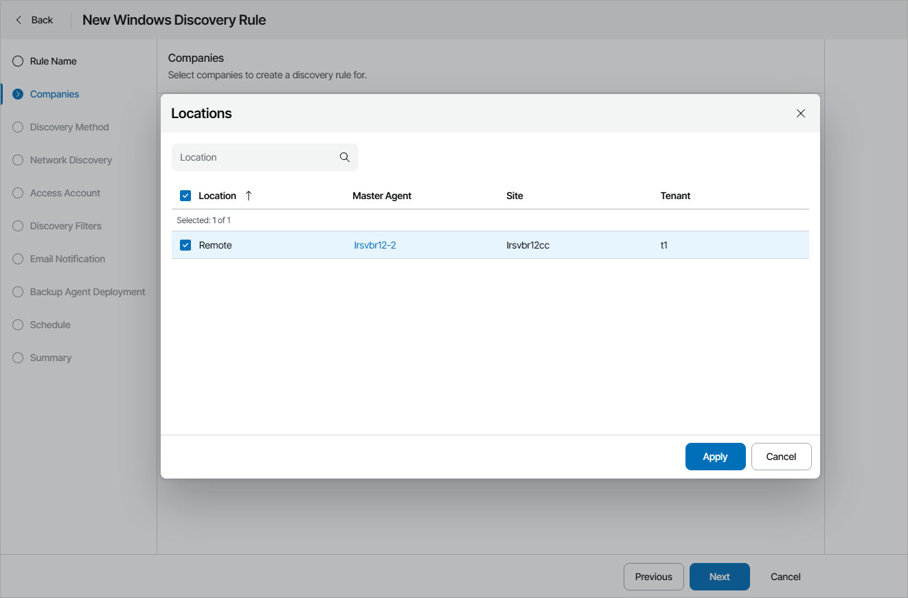](images/discovery_rule_agent_sp.webp "Choose Master Agent")

1. At the Discovery Method step of the wizard, select Microsoft Active Directory discovery.

[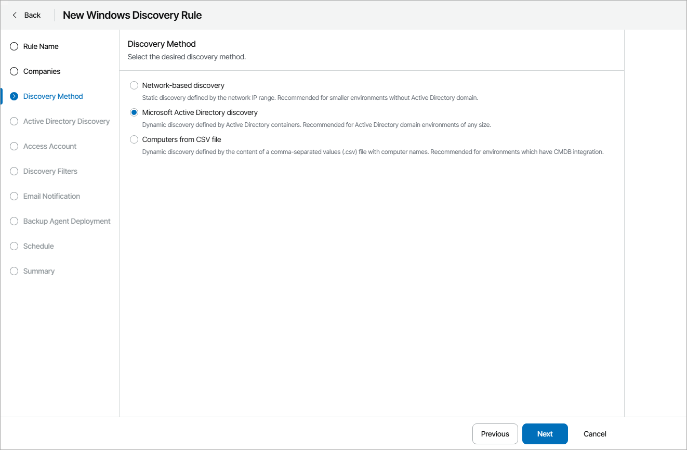](images/discovery_rule_method_ad.webp "Choose Discovery Method")

1. At the Active Directory Discovery step of the wizard, select the necessary method for Active Directory discovery:

* Select Search through all Active Directory containers to discover all computers that are included in the Domain Controllers and Computers organizational units.
* Select Select from organizational units to discover computers that are included in selected organizational units only.

If this option is selected, the Organizational Units step will become available in the wizard.

* Select Run custom query to discover computers based on results of a custom query. In the text field at the bottom, specify a LDAP query that must return a list of computers to scan.

In the Exclusion mask field, specify a mask for names of computers that must be excluded from discovery. The mask can contain an asterisk (\*) that stands for zero or more characters. You can specify multiple masks separated with commas.

Select the Ignore offline computers check box to exclude from discovery computers that did not contact a domain controlled for 30 days or longer.

[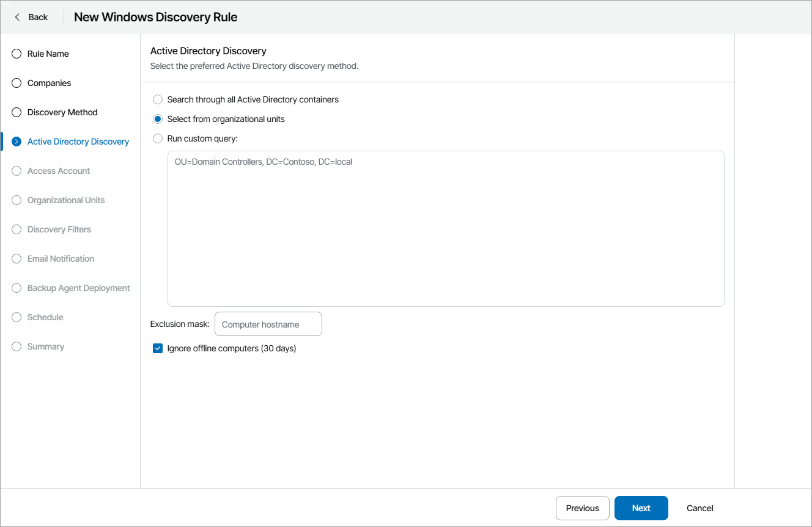](images/discovery_rule_ad_query.webp "Choose Active Directory Discovery Method")

1. At the Access Account step of the wizard, specify credentials of an account that the master agent will use to connect to computers within the discovery scope. The account must have local Administrator permissions on all discovered computers.

If you have specified a discovery account in the master agent configuration settings, select the Use credentials specified in the master management agent configuration check box. For details on specifying master agent configuration settings, see [Deploying Windows Management Agents](deploy_management_agents_win.md).

Credentials specified in the master agent configuration take precedence over credentials specified in the discovery rule. For discovery, the master agent will use an account specified in its configuration settings. In case this account is not valid or not set, the master agent will use an account specified in the discovery rule.

[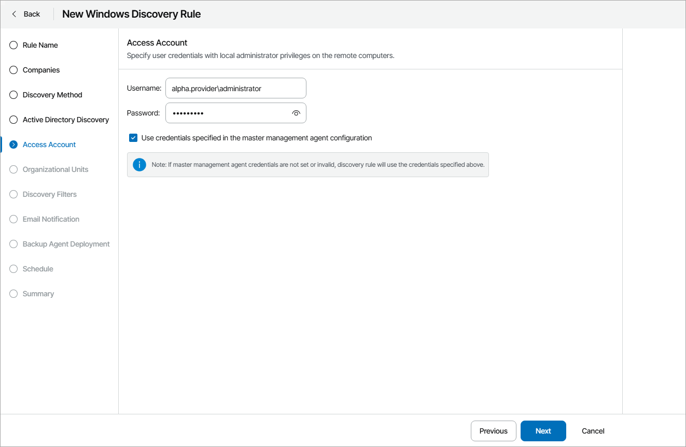](images/discovery_rule_account_ad.webp "Specify Discovery Account")

1. At the Organizational Units step of the wizard, select organizational units that must be scanned for discovered computers.

This step of the wizard is available if at the Active Directory Discovery step you have selected the Select from organizational units option.

1. Click a link in the Locations column for the necessary company.
2. In the Locations window, click a link in the Organizational Units column for the necessary company location.
3. In the Organizational Units window, select check boxes next to units that must be included to the discovery scope.

If you want to include a folder and all underlying subfolders to the discovery scope, right-click the check box and click Select all.

1. In the Organizational Units window, click OK.
2. In the Locations window, click OK.

[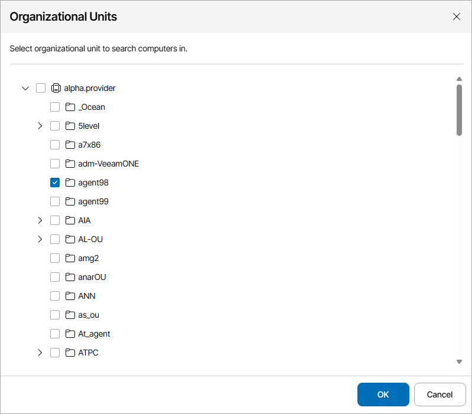](images/discovery_rule_ou_ad.webp "Choose Organizational Units")

1. At the Discovery Filters step of the wizard, choose what filters you want to enable for discovery.

* To filter computers by OS type, select By OS type in the list and click Edit. In the Operating System window, select the type of OS that must run on discovered computers (Server operating system, Client operating system). Click OK.
* To filter computers by application, select By application in the list and click Edit. In the Application window, select applications that must run on discovered computers (Microsoft Exchange Server, Microsoft SQL Server, Microsoft Active Directory, Microsoft SharePoint, Oracle database, Other applications). Click OK.
* To filter computers by platform, select By platform in the list and click Edit. In the Platform window, select platforms on which discovered computers must run (Virtual infrastructure, Physical computers, Microsoft Azure, Amazon Web Services, Google Cloud, Other). Click OK.

* If you want to perform discovery among accessible computers only, select the Do not show inaccessible computers check box.

|  |
| --- |
| Note: |
| Different types of filter conditions are joined using Boolean AND operator. For example, if you enable filters Server operating system, Microsoft SQL Server and Virtual infrastructure, the list of discovered computers will include only VMs that run Windows Server OS and Microsoft SQL Server. |

[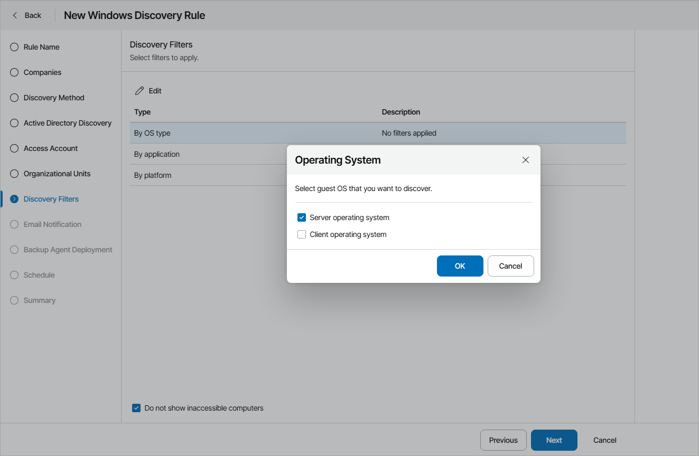](images/discovery_rule_filters_ad.webp "Choose Discovery Filters")

1. At the Email Notification step of the wizard, you can enable notifications about discovery results by email.

1. Select the Send notifications check box and specify a schedule according to which email notifications must be sent.
2. In the To field, specify an email address at which the email notification must be sent.
3. In the Subject field, specify the subject of the notification.
4. Select the Send notification email after the first run check box if a notification about discovery results must be sent after the first run of the discovery rule, regardless of the specified schedule.

For details on discovery email notifications, see [Configuring Email Notifications About Discovery Results](configure_discovery_notification.md).

[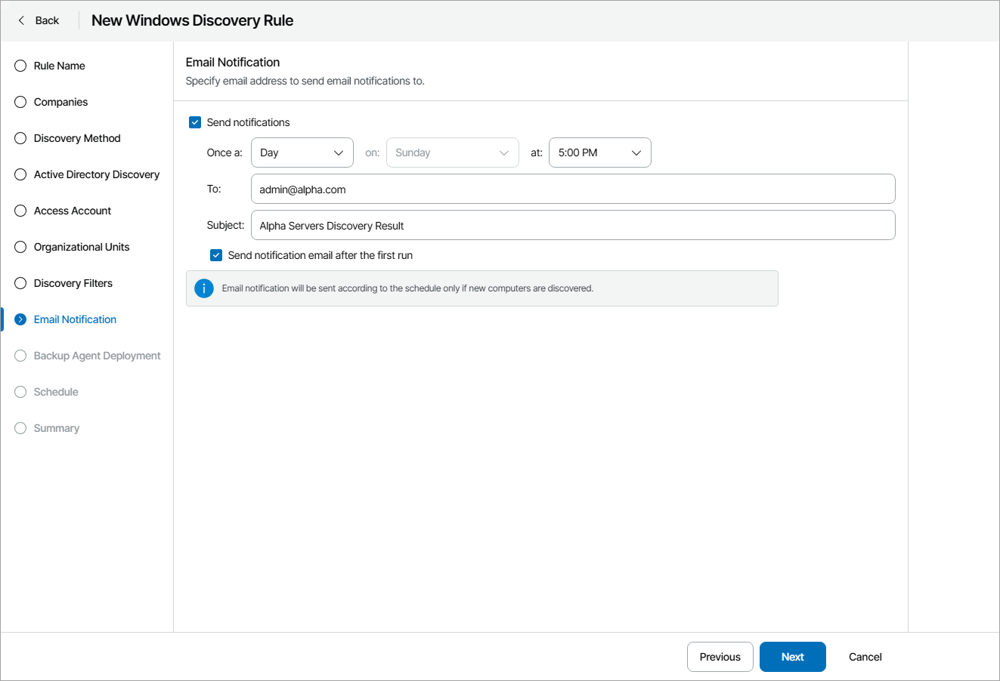](images/discovery_rule_email_ad.webp "Specify Notification Settings")

1. At the Backup Agent Deployment step of the wizard, specify whether you want to install Veeam backup agents on discovered computers:

1. If you do not want to install Veeam backup agents as part of the discovery process, leave the Discover remote computer without installing backup agent option selected.

Note that if you select this option, Veeam Service Provider Console will not deploy management agents on discovered computers.

1. If after discovery Veeam backup agents must be installed automatically, select the Discover remote computer, install backup agent and assign the selected backup policy option.

From the Backup policy to apply list, choose a backup policy that must be assigned immediately after installation. To view the selected policy details, click the Show link. If you do not want to assign any backup policy after installation, choose No Policy from the list.

If you do not have the necessary backup policy configured yet, you can click the Create New link to create a new policy, without exiting the New Rule wizard. For details on backup policies, see [Configuring Backup Policies](configure_backup_policies.md).

Note that you cannot assign a backup policy targeted to a Veeam Cloud Connect repository to a hosted Veeam backup agent.

1. By default, the read-only access mode is enabled for all Veeam backup agents installed as part of discovery. To disable the read-only access mode for Veeam backup agents on discovered computers, set the Read-only UI access for the backup agent toggle to Off.

For details on the read-only access mode for Veeam backup agents, see [Enabling Read-Only Access Mode](enable_read_only_mode.md).

1. To push global settings for Veeam backup agents, click Configure and specify default global settings for Veeam backup agents. For details on the global settings for Veeam backup agents, see [Configuring Global Settings for Veeam Agent for Microsoft Windows](configure_backup_agent_settings.md).

[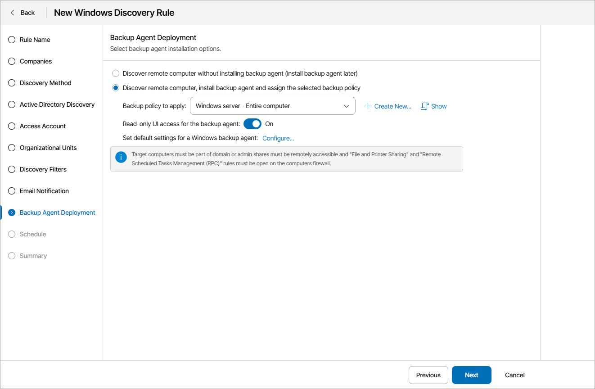](images/discovery_rule_vaw_ad.webp "Configure Backup Agent Deployment")

1. At the Schedule step of the wizard, specify schedule according to which discovery must be performed:

1. Select the Run this rule automatically check box, if you want to enable scheduling for the discovery rule.
2. Define scheduling settings:

* To run discovery at specific time daily, on defined week days or with specific periodicity, select the Daily at option. Use the fields on the right to configure the necessary schedule.
* To run discovery once a month on specific days, select the Monthly at option. Use the fields on the right to configure the necessary schedule.
* To run discovery repeatedly throughout a day with a specific time interval, select the Periodically every option. In the field on the right, select the necessary time unit: Days, Hours or Minutes.

* To run discovery continuously, select the Periodically every option and choose Continuously from the list on the right. A new discovery session will start as soon as the previous discovery session finishes.

1. From the Time zone drop-down list, select the time zone in which daily and monthly schedule must be run.

[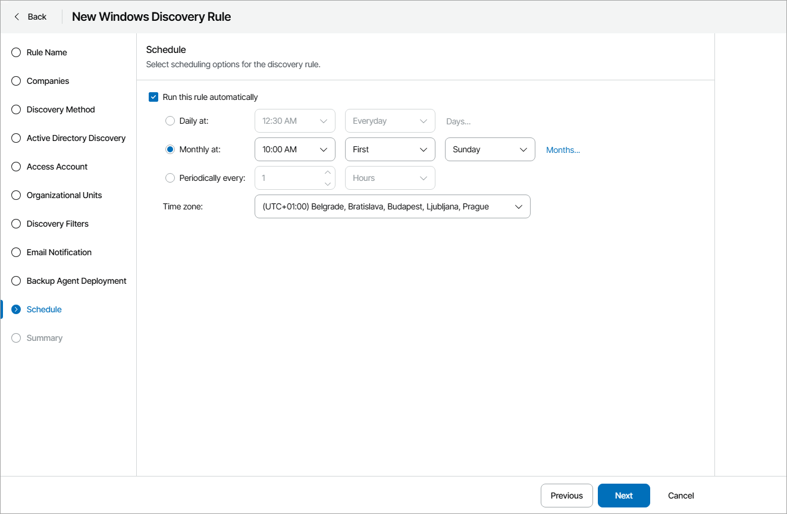](images/discovery_rule_schedule_ad.webp "Confugure Discovery Rule Schedule")

1. At the Summary step of the wizard, review discovery rule settings and click Finish.

To start discovery after you save the rule, in the pop-up window, click Yes.

[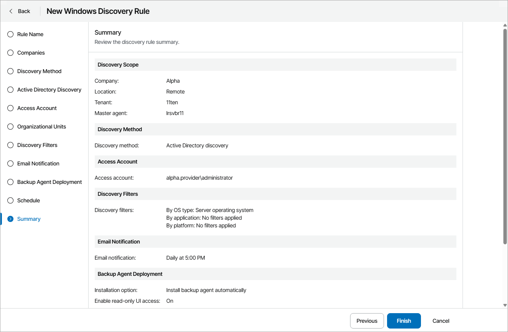](images/discovery_rule_review_ad.webp "Review Discovery Settings")

