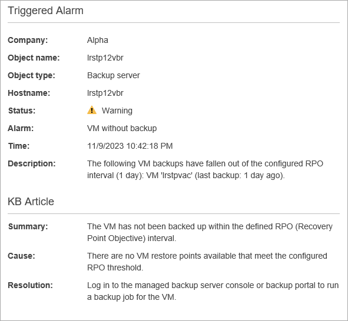
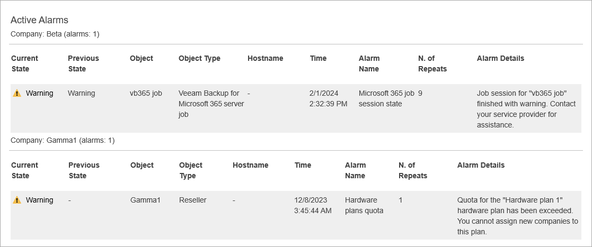

# Configuring Alarm Email Notifications

To stay informed about potential problems in client backup infrastructures, and issues with Veeam Service Provider Console, you can configure Veeam Service Provider Console to send email notifications about alarms.

Veeam Service Provider Console can send two types of email notifications about alarms:

* Veeam Service Provider Console can send an email notification with alarm details when a new alarm is triggered or when the alarm status changes.
* Veeam Service Provider Console can send summary daily email notifications with information about all alarms triggered for the past 24 hours.

Before you can receive alarm notifications, make sure you completed configuration steps described in the following procedures.

Configuring Email Notifications with Alarm Details

You can receive email notifications when a new alarm is triggered or when alarm status changes.

To configure Veeam Service Provider Console to send email notifications with alarm details:

1. [Fill in the company profile](fill_company_profile.md).

Specify your company name and contact details in the company profile. This information will be displayed in the email notification footer.

1. [Customize portal branding](customize_branding.md).

Upload a custom portal logo, report logo and specify the portal web address. The portal logo will be displayed in the email notification header. The report logo and portal web address will be displayed in the email notification footer.

1. [Configure SMTP server settings](configure_email_settings.md#smtpServer).

Specify settings of an SMTP server that will be used to send email notifications.

1. [Configure alarm notification frequency](configure_email_settings.md#global).

Specify a sender and subject of alarm email notifications.

1. Specify email notification recipients.

1. [Specify Portal Administrator email address](fill_user_profile.md).

To notify a Portal Administrator about alarms, in the Administrator user profile, specify an email address at which alarm notifications must be sent.

1. [Specify additional email notification recipients](modify_alarm_settings.md#alarmActions).

You can configure Veeam Service Provider Console to send email notifications to users other than Portal Administrators. To do so, you can add an alarm response action that will send an email to the necessary recipient.

1. [Specify when email notifications must be sent](modify_alarm_settings.md#alarmActions).

By default, Veeam Service Provider Console sends email notifications every time when a new alarm is triggered, or when the status of an existing alarm changes to Error or Warning. You can configure alarm response actions to send email notifications when an alarm acquires a specific status only. For example, you can choose to receive email notifications about errors and warnings only, and skip notifications about informational and resolved alarms.

The following image illustrates an email notification with alarm details.

Configuring Summary Daily Email Notifications

You can receive summary daily email notifications with information about all alarms triggered for the past 24 hours. Summary alarm notifications are sent instead of regular alarm notifications.

To configure Veeam Service Provider Console to send summary daily alarm notifications:

1. [Fill in the company profile](fill_company_profile.md).

Specify your company name and contact details in the company profile. This information will be displayed in the email notification footer.

1. [Customize portal branding](customize_branding.md).

Upload a custom portal logo, report logo and specify the portal web address. The portal logo will be displayed in the email notification header. The report logo and portal web address will be displayed in the email notification footer.

1. [Configure SMTP server settings](configure_email_settings.md#smtpServer).

Specify settings of an SMTP server that will be used to send email notifications.

1. [Configure alarm notification settings](configure_email_settings.md#global).

In the global notification settings, enable summary daily notifications, specify time of the day when these notifications must be sent, specify a notification recipient and if necessary customize the email notification subject.

The following image illustrates an email notification with alarm details.

