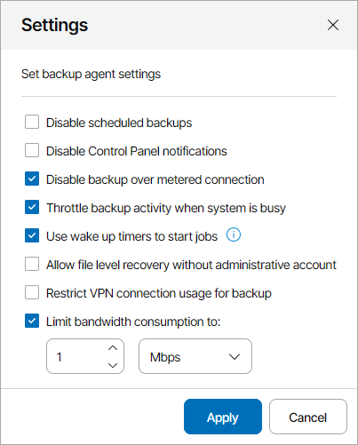

# Configuring Global Settings for Veeam Agent for Microsoft Windows

In Veeam Service Provider Console, you can configure global settings for Veeam Agent for Microsoft Windows for one or more managed computers.

Required Privileges

To perform this task, a user must have one of the following roles assigned: Portal Administrator, Site Administrator, Portal Operator.

Configuring Global Settings for Veeam Agent for Microsoft Windows

To configure global settings for Veeam Agent for Microsoft Windows:

1. Log in to Veeam Service Provider Console.

For details, see [Accessing Veeam Service Provider Console](access_vac.md).

1. In the menu on the left, click Backup Jobs.
2. Open the Computers tab and navigate to Managed by Console.
3. Select one or more Veeam backup agent jobs in the list.
4. At the top of the list, click Settings.

Alternatively, you can right-click the necessary Veeam backup agent and choose Settings.

1. In the Settings window, specify the required global settings:

* Disable scheduled backups — select this option if you do not want to run automatic backups for some period of time. For example, you may want to put backup activities on hold if you plan to perform resource consuming operations on the endpoint at the time when the backup job is scheduled.

For details, see section [Disabling and Enabling Scheduled Backups](https://helpcenter.veeam.com/docs/agentforwindows/userguide/disable_backup_job.html) of the Veeam Agent for Microsoft Windows User Guide.

* Disable Control Panel notifications — select this option if you want to disable Veeam backup agent warning and information messages on the notification bar in the control panel.

For details, see section [Disabling Control Panel Notifications](https://helpcenter.veeam.com/docs/agentforwindows/userguide/settings_disable_notifications.html) of the Veeam Agent for Microsoft Windows User Guide.

* Disable backup over metered connection — select this option if you want to disable backup over metered Internet connection to avoid extra costs. Veeam backup agents can automatically detect metered connections. If this option is enabled, Veeam backup agents will not perform backup when the endpoint is on such connection. For details, see section [Disabling Backup over Metered Connections](https://helpcenter.veeam.com/docs/agentforwindows/userguide/metered_connections.html) of the Veeam Agent for Microsoft Windows User Guide.
* Throttle backup activity when system is busy — select this option if during backup Veeam backup agents must set low priority for its components engaged in the backup process.

For details, see section [Throttling Backup Activities](https://helpcenter.veeam.com/docs/agentforwindows/userguide/settings_resources.html) of the Veeam Agent for Microsoft Windows User Guide.

* Use wake up timers to start jobs — select this option if Veeam backup agents must automatically wake up a managed computer from sleep at the time when the backup job is scheduled to start.

Some OS versions do not support wake up timers. If your OS version supports wake up timers, make sure to enable the Allow wake timers option in power settings of the managed computer. Note that Veeam backup agent will check this option support only after you configure a backup job or policy for the computer or update an existing job or policy configuration.

For details, see section [Computer Wake Up from Sleep](https://helpcenter.veeam.com/docs/agentforwindows/userguide/schedule_wakeup.html) of the Veeam Agent for Microsoft Windows User Guide.

* Allow file level recovery without administrative account — select this option if you want to allow performing file-level restore under an account that does not have administrative privileges on the computer with Veeam backup agent.

For details file-level restore, see section [Restoring Files and Folders](https://helpcenter.veeam.com/docs/vbr/userguide/integration_flr.html?ver=13) of the Veeam Agent Management Guide.

* Restrict VPN connection usage for backup — select this option if you want to disable backup over VPN connections.

For details, see section [Disabling Backup over VPN Connections](https://helpcenter.veeam.com/docs/agentforwindows/userguide/settings_network_vpn.html) of the Veeam Agent for Microsoft Windows User Guide.

* Limit bandwidth consumption to — select this option if you want to limit bandwidth consumption for Veeam backup agent jobs and specify the maximum speed for transferring data from Veeam backup agent to the target location.

For details, see section [Limiting Bandwidth Consumption](https://helpcenter.veeam.com/docs/agentforwindows/userguide/settings_network_bandwidth.html%20) of the Veeam Agent for Microsoft Windows User Guide.

1. Click Apply.

After you save changes, the specified global settings will be propagated to selected Veeam backup agents.

