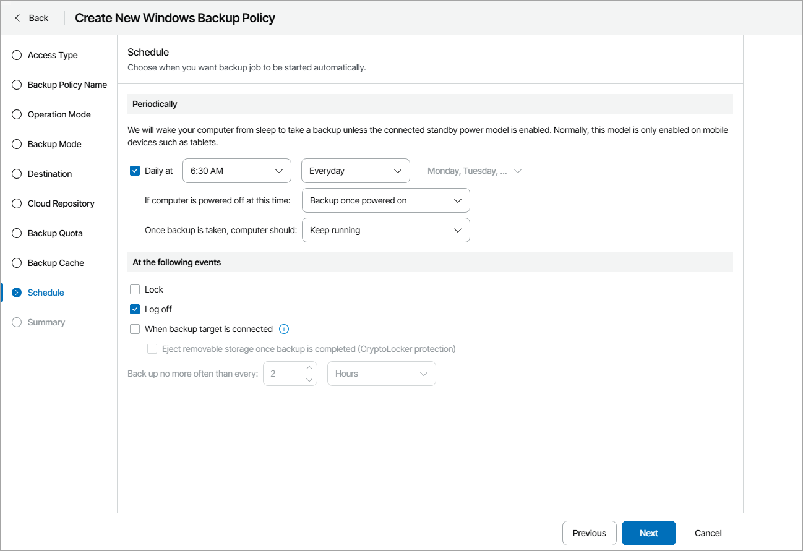
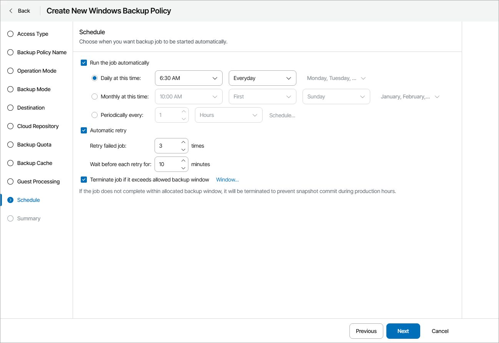

# Step 18. Configure Backup Schedule

At the Schedule step of the wizard, specify the schedule according to which backup must run. Backup job scheduling options depend on the application mode in which Veeam backup agent operates:

* [Workstation Backup Schedule](configure_backup_schedule.md#workstation)
* [Server Backup Schedule](configure_backup_schedule.md#server)

Workstation Backup Schedule

At the Schedule step of the wizard, specify the schedule according to which backup must be performed.

1. Select the Daily at check box and use the fields on the right to specify time and days when the backup job must start:

* Everyday — select this option to start the job at the specified time daily.
* On weekdays — select this option to start the job at the specified time on weekdays.
* On these days — select this option to start the job at the specified time on selected days.

You can leave the Daily at check box cleared to configure the backup job without daily schedule. In this case, you will be able to use the configured backup job to perform backup automatically [at specific events](configure_backup_schedule.md#events). You can also use the configured backup job to create ad-hoc incremental and standalone full backups. For details, see section [Performing Ad-Hoc Backups](https://helpcenter.veeam.com/docs/agentforwindows/userguide/performing_adhoc_backups.html) of the Veeam Agent for Microsoft Windows User Guide.

1. If you have selected the On these days option, in the drop-down menu, clear check boxes for the days when the job must not start.
2. Select the action that Veeam backup agent must perform in case your computer is powered off at the time when the scheduled backup job must start:

* Backup once powered on — select this option if Veeam backup agent must start the scheduled backup job when you power on the computer.
* Skip backup — select this option if Veeam backup agent must not to start the scheduled backup job when the computer is powered off. Veeam backup agent will perform backup at the next scheduled time.

1. If Veeam backup agent must perform a finalizing action after the backup job completes successfully, select the necessary action:

* Keep running — select this option if the computer must keep on working.
* Hibernate — select this option if Veeam backup agent must bring the computer to the hibernate mode. This option is available if the hibernate mode is enabled on the computer. For details, see [Microsoft Docs](https://support.microsoft.com/en-us/kb/920730).
* Sleep — select this option if Veeam backup agent must bring the computer to the standby mode.
* Shut down — select this option if Veeam backup agent must shut down the computer.

Veeam backup agent applies this setting only to scheduled backups. If you start standalone full backup or incremental backup manually, Veeam backup agent will ignore this setting, and the computer will not be shut down or brought to the standby mode when the backup job completes.

When the backup job completes, Veeam backup agent will prompt a dialog with a countdown to the selected post-job action. You can select to proceed to the action immediately or to cancel the action. For details, see section [Controlling Backup Post-Job Action](https://helpcenter.veeam.com/docs/agentforwindows/userguide/post-job_activity_prompt.html) of the Veeam Agent for Microsoft Windows User Guide.

1. In the At the following events section, specify settings for events that trigger the backup job launch:

* Select the Lock check box if the scheduled backup job must start when the user locks the computer.
* Select the Log off check box if the scheduled backup job must start when the user working with the computer performs a logout operation.
* Select the When backup target is connected check box if the scheduled backup job must start when the backup storage becomes available (for example, when the computer connects to a local network and the target shared folder is accessible).
* Select the Eject removable storage once backup is completed check box if Veeam backup agent must unmount the storage device after the backup job completes successfully. With this option selected, backup files on the removable storage will be protected from encrypting ransomware, such as CryptoLocker.
* Use the Back up no more often than every <N> <time units> field to restrict the frequency of backup job sessions. Specify a minutely, hourly or daily interval between the backup job sessions.

The Back up no more often than every <N> <time units> option is applied only to job sessions started at specific events. Daily backups are performed according to defined schedule regardless of the time interval specified for this setting.

|  |
| --- |
| Important! |
| If the power scheme on the endpoint does not allow using wake up timers, you can manually change the power scheme settings on the endpoint. To do this, navigate to Control Panel > All Control Panel Items > Power Options > Edit Plan Settings. |

Server Backup Schedule

At the Schedule step of the wizard, select to run the backup job manually or schedule the job to run on a regular basis.

To specify the job schedule:

1. Select the Run the job automatically check box.

If this check box is not selected, you will have to start the backup job manually to create backup.

1. Define scheduling settings for the job:

* To run the job at specific time daily, on defined week days or with specific periodicity, select Daily at this time. Use the fields on the right to configure the necessary schedule.
* To run the job once a month on specific days, select Monthly at this time. Use the fields on the right to configure the necessary schedule.
* To run the job repeatedly throughout a day with a specific time interval, select Periodically every. In the field on the right, select the necessary time unit: Hours or Minutes. Click Schedule and use the time table to define the permitted time window for the job.

A repeatedly run job is started by the following rules:

* Veeam backup agent always starts counting defined intervals from 12:00 AM. For example, if you configure to run a job with a 4-hour interval, the job will start at 12:00 AM, 4:00 AM, 8:00 AM, 12:00 PM, 4:00 PM and so on.
* If you define permitted hours for the job, after the denied interval is over, Veeam backup agent will immediately start the job and then run the job by the defined schedule.

For example, you have configured a job to run with a 2-hour interval and defined permitted hours from 9:00 AM to 5:00 PM. According to the rules above, the job will first run at 9:00 AM, when the denied period is over. After that, the job will run at 10:00 AM, 12:00 PM, 2:00 PM and 4:00 PM.

* To run the job continuously, select the Periodically every option and choose Continuously from the list on the right. A new backup job session will start as soon as the previous backup job session finishes.

1. In the Automatic retry section, define whether Veeam backup agent must attempt to run the backup job again if the job fails for some reason. Type the number of attempts to run the job and define time intervals between them. If you select continuous backup, Veeam backup agent will retry the job for the defined number of times without any time intervals between the job runs.
2. In the Backup window section, define the time interval within which the backup job must complete. The backup window prevents the job from overlapping with production hours and ensures that the job does not impact performance of your server.

To set up a backup window for the job:

1. Select the Terminate job if it exceeds allowed backup window check box and click Window.
2. In the Select period window, define the allowed hours and prohibited hours for backup.

If the job exceeds the allowed window, it will be automatically terminated.

