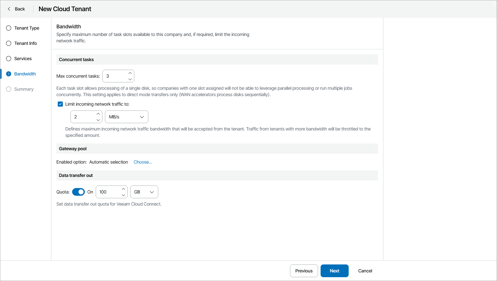

# Step 5. Configure Bandwidth Settings

At the Bandwidth step of the wizard, you can specify task and bandwidth limitations for Veeam Backup & Replication jobs that write data to cloud repositories and cloud hosts. Limiting bandwidth and parallel task processing for cloud tenants helps avoid overload of cloud gateways, backup proxies, backup repositories and network equipment on the service provider side. For details, see section [Data Encryption and Throttling](https://helpcenter.veeam.com/docs/backup/cloud/data_encryption_and_throttling.html) of the Veeam Cloud Connect Guide.

To configure bandwidth settings:

1. In the Max concurrent tasks field, specify the maximum number of concurrent tasks for the cloud tenant. If this value is exceeded, Veeam Backup & Replication will not start a new task until one of current tasks finishes.
2. To limit the data traffic coming from the cloud tenant side to the provider side, select the Limit incoming network traffic to check box. With this option enabled, you can specify the maximum speed for transferring cloud tenant data to the provider side.

1. In the Gateway pool section, you can specify what cloud gateways will be available to the cloud tenant.

By default, the company can use cloud gateways that are not added to any cloud gateway pool. If you assign specific cloud gateway pools to the cloud tenant, the first cloud gateway added to the selected pools will be used for connection. If the connection fails, the cloud tenant will fail over to the next cloud gateway from assigned gateway pools.

To select specific gateway pools:

1. Click the Choose link.
2. In the Gateway Pools window, choose the Selected gateway pool option.
3. In the list of available cloud gateway pools, select check boxes next to one or more pools that you want to assign to the cloud tenant.

The list of available cloud gateway pools contains pools that you configured on the Veeam Cloud Connect server, selected as the cloud tenant site at the [Tenant Info](specify_tenant_credentials.md) step. For details on configuring cloud gateway pools, see section [Configuring Cloud Gateway Pools](https://helpcenter.veeam.com/docs/backup/cloud/cloud_gateway_pool_add.html) of the Veeam Cloud Connect Guide.

1. To allow the cloud tenant to fail over to a cloud gateway that is not added to the selected cloud gateway pool in case all cloud gateways in the pool are unavailable, select the Failover to other cloud gateways if all gateways from the selected pool are unavailable check box.
2. Click OK.

1. In the Data transfer out section, specify the amount of data that the company is allowed to download from the cloud repository during a billing period.

The Data transfer out quota is a soft quota and puts no physical restriction on the cloud repository. When the cloud tenant reaches the specified quota, Veeam Service Provider Console triggers the Company data download quota alarm. You can customize this alarm in accordance with your requirements. For details, see [Modifying Alarm Settings](modify_alarm_settings.md).

Company users will see this quota on the Resources dashboard. For details, see section [Resources](https://helpcenter.veeam.com/docs/vac/provider_user/resources.html?ver=9.1#backup) of the Guide for End Users.

