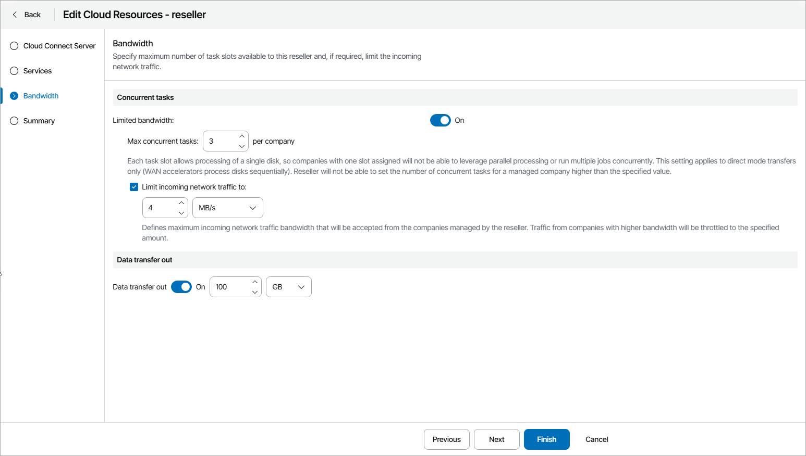

# Step 4. Configure Bandwidth Settings

At the Bandwidth step of the wizard, you can specify task and bandwidth limitations for Veeam Backup & Replication jobs that write data to cloud repositories and cloud hosts. Limiting bandwidth and parallel task processing for reseller companies helps avoid overload of cloud gateways, backup proxies, backup repositories and network equipment on the service provider side. For details, see section [Data Encryption and Throttling](https://helpcenter.veeam.com/docs/backup/cloud/data_encryption_and_throttling.html) of the Veeam Cloud Connect Guide.

To configure bandwidth settings:

1. Set the Limited bandwidth toggle to On.
2. In the Max concurrent tasks field, specify the maximum number of concurrent tasks for a reseller company. If this value is exceeded, Veeam Backup & Replication will not start a new task until one of current tasks finishes.
3. To limit the data traffic coming from the reseller company side to the provider side, select the Limit incoming network traffic to check box. With this option enabled, you can specify the maximum speed for transferring company data to the repository on the provider side.
4. To limit the amount of data that reseller companies are allowed to download from the cloud repository during a billing period, set the Data transfer out toggle to On and specify the allowed amount of data.

The Data transfer out quota is a soft quota and puts no physical restriction on the cloud repository. When the reseller reaches the specified quota, Veeam Service Provider Console triggers the Reseller data download quota alarm. You can customize this alarm in accordance with your requirements. For details, see [Modifying Alarm Settings](modify_alarm_settings.md).

Reseller users will see this quota in the Data Transfer Out widget of the Cloud Connect Backup Resources dashboard. For details, see section [Resources & Billing](https://helpcenter.veeam.com/docs/vac/reseller/summary_dashboard.html#cloud-connect-backup-resources) of the Guide for Resellers.

