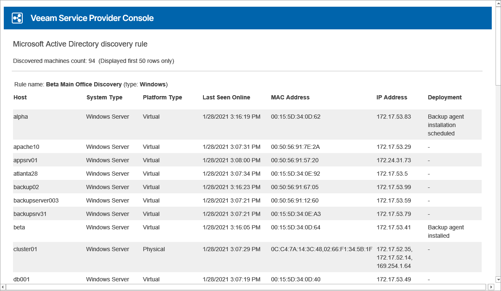

# Configuring Email Notifications About Discovery Results

To stay informed about newly discovered computers, you can enable email notifications about discovery results.

Veeam Service Provider Console can send two types of email notifications about discovery results:

* Veeam Service Provider Console can send email notifications about computers discovered by a specific discovery rule.
* Veeam Service Provider Console can send summary daily email notifications with information about all computers discovered by all discovery rules for the past 24 hours.

Discovery email notifications include a list of new computers discovered since the latest email notification. If no changes are detected since the latest email notification (no new computers are discovered), Veeam Service Provider Console will not send a new email notification about discovery results.

Before you can receive email notifications about discovery results, make sure you completed configuration steps described in the following procedures.

Configuring Email Notifications for Discovery Rules

You can enable email notifications that will inform you about computers discovered by a specific discovery rule. You can schedule these notifications to be sent on a daily or a weekly basis, at the specified time of the day, or immediately after discovery.

To configure Veeam Service Provider Console to send email notifications about discovery results:

1. [Fill in the company profile](fill_company_profile.md).

Specify your company name and contact details in the company profile. This information will be displayed in the discovery notification footer.

1. [Customize portal branding](customize_branding.md).

Upload a custom report logo and specify the portal web address. The report logo and portal web address will be displayed in the discovery notification footer.

1. [Configure SMTP server settings](configure_email_settings.md#smtpServer).

Specify settings of an SMTP server that will be used to send email notifications.

1. [Enable email notifications in discovery rule settings](configure_network_discovery.md#email).

At the Email Notification step of the necessary discovery rule, enable email notifications, specify notification settings, notification recipient and the schedule according to which notifications must be sent.

The following image illustrates how a notification about discovery results looks like. The email body includes discovery results for 50 computers. The complete list of scanned computers is included in the CSV file attached to the email message.

Configuring Notifications with Summary Discovery Results

You can enable summary email notifications that will inform you about all computers discovered by all discovery rules for the past 24 hours. Summary email notifications are sent in addition to regular email notifications configured for specific discovery rules.

To configure Veeam Service Provider Console to send summary email notifications about discovery results:

1. [Fill in the company profile](fill_company_profile.md).

Specify your company name and contact details in the company profile. This information will be displayed in the discovery notification footer.

1. [Customize portal branding](customize_branding.md).

Upload a custom report logo and specify the portal web address. The report logo and portal web address will be displayed in the discovery notification footer.

1. [Configure SMTP server settings](configure_email_settings.md#smtpServer).

Specify settings of an SMTP server that will be used to send email notifications.

1. [Configure notification settings](configure_email_settings.md#global).

In the notification settings, specify a notification sender and notification recipient, enable summary daily notifications for discovery rules, specify time of the day when these notifications must be sent.

The following image illustrates how a notification about discovery results looks like. The email body includes discovery results for 50 computers. The complete list of scanned computers is included in the CSV file attached to the email message.

